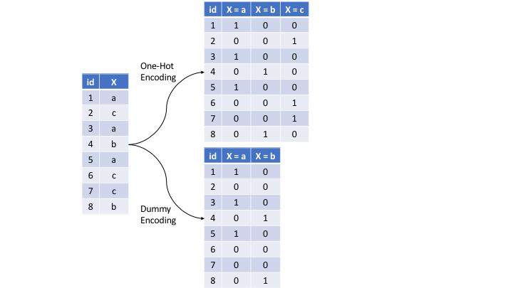

# How to Win a Data Science Competition: Learn from Top Kagglers

## Table of Contents

- [How to Win a Data Science Competition: Learn from Top Kagglers](#how-to-win-a-data-science-competition-learn-from-top-kagglers)
  - [Table of Contents](#table-of-contents)
    - [Week 1 Overview](#week-1-overview)
    - [Competition Mechanics](#competition-mechanics)
      - [Recap of Machine Learning Algorithm](#recap-of-machine-learning-algorithm)
      - [Hardware and Software](#hardware-and-software)
      - [Numeric Futures](#numeric-futures)
      - [Categorical and ordinal features](#categorical-and-ordinal-features)

### Week 1 Overview

Welcome to the first week of the "How to Win a Data Science Competition" course! This is a short summary of what you will learn.

- **Mikhail Trofimov**: will introduce you to competitive data science. You will learn about competitions' mechanics, the difference between **competitions** and a **real-life data science**, overview **hardware** and **software** that people usually use in competitions. We will also briefly recap major ML models frequently used in competitions.
- **Alexander Guschin**: will summarize approaches to work with **features**: `preprocessing`, `generation` and `extraction`. We will see, that the choice of the machine learning model impacts both preprocessing we apply to the features and our approach to generation of new ones. We will also discuss feature extraction from text with Bag Of Words and **Word2vec**, and feature extraction from images with **Convolution Neural Networks**.

### Competition Mechanics

**Data**: Data is what the organizers give us as training material. We will use it in order to produce our solution. Data can be represented in a variety of formats. **CSV** file with several columns , a **text** file, an archive with **pictures**, a **database dump**, a **disabled** code or even all together. With the data, usually there is a description. It's useful to read it in order to understand what we'll work with and which feature can be extracted.

**Model**: This is exactly what we will build during the competition. It's better to think about model not as one specific algorithm, but something that `transforms data into answers`. The model should have **two** main **properties**. It should produce **best possible prediction** and be **reproducible**. In fact, it can be very complicated and contain a lot of algorithms, handcrafted features, use a variety of libraries as this model of the winners of the Homesite competition shown on this slide. It's large and includes many components.

**Submission**: To compare our model with the model of other participants, we will send our predictions to the server or in other words, make the submission. Usually, you're asked about predictions only. Sources or models are not required. And also there are some exceptions, cool competitions, where participants submit their code. In this course, we'll focus on traditional challenges where a competitor submit only prediction outputs. Often, I can not just provide a so-called sample submission. An example of how the submission file should look like, look at the sample submission from the **Zillow** competition. In it is the first column. We must specify the ID of the object and then specify our prediction for it. This is typical format that is used in many competitions.

**Evaluation**: When you submit predictions, you need to know how good is your model. The quality of the model is defined by evaluation function. In essence and simply the function, the text prediction and correct answers and returns a score characterizes the performance of the solution. The simplest example of such a function is the accurate score. This is just a rate of correct answers. In general, there are a lot of such functions. In our course, we will carefully consider some of them. The description of the competition always indicates which evaluation function is used. I strongly suggest you to pay attention to this function because it is what we will try to optimize.

`Evaluation Functions`: **Accuracy**, **Logistic Loss**, **AUC**, **RMSE**, **MAE**.

**Leaderboards**: The ranking of your kaggle competition.

#### Recap of Machine Learning Algorithm

- **Linear Model**: `Logistic Regression`, `SVM`
  Packages: Scikit-Learn, vowpal-wabblt(for large dataset)
- **Tree Based**: `Decision Tree`, `Random Forest`, `GBDT(Gradient Boaster Decision Tree)`
  Packages: Scikit-Learn, XGBoost(faster, dmlc), lightBGM(faster, microsoft)

- **KNN**: Scikit-Learn(Allow your own custom distance function.)
- **Neural Network**: Tensorflow, Keras, Pytroch(Flexible), Lasagnes.

> **Note**: XGBoost and Neural Networks is awesome but don't underestimate others.

**Overview of methods**:

- Scikit-Learn (or sklearn) library
- Overview of k-NN (sklearn's documentation)
- Overview of Linear Models (sklearn's documentation)
- Overview of Decision Trees (sklearn's documentation)
- Overview of algorithms and parameters in H2O documentation

**Additional Tools**:

- Vowpal Wabbit repository
- XGBoost repository
- LightGBM repository
- Interactive demo of simple feed-forward Neural Net
- Frameworks for Neural Nets: Keras,PyTorch,TensorFlow,MXNet, Lasagne
- Example from sklearn with different decision surfaces
  Arbitrary order factorization machines

#### Hardware and Software

**Most Competition Except (Image Classification)**:

- High Level Laptop
- 16GB+ RAM
- 4+ Cores

**Quite Good Setup**:

- Tower PC
- 32GB+ RAM
- 6+ Cores

**Additional Material and Links**:

**StandCloud Computing**:

- AWS,
- Google Cloud
- Microsoft Azure

**AWS spot option**:

- Overview of Spot mechanism
- Spot Setup Guide

**Stack and packages**:

- Basic SciPy stack (ipython, numpy, pandas, matplotlib)
- Jupyter Notebook
- Stand-alone python tSNE package
- Libraries to work with sparse CTR-like data: LibFM, LibFFM
- Another tree-based method: RGF (implementation, paper)
- Python distribution with all-included packages: Anaconda
- Blog "datas-frame" (contains posts about effective Pandas usage)

#### Numeric Futures

Basic approach as to `feature preprocessing` and `feature generation` for **numeric** features.

**Feature Scale** are important for Non-tree based Algorithm like

- KNN
- Linear Model
- Linear SVM, SVM
- and Neural Network.

1. **Preprocessing.scaling**

**Example - 1**:

```py
# To[0,1]

from sklearn.preprocessing import MinMaxScaler
import numpy as np

X = np.array([10, 20, 30])
print(X)

# scaling
for m in X:
    print((m - X.min()) / (X.max() - X.min()))
```

**Example - 2**:

```py
data = pd.read_csv('./datasets/titanic_train.csv')

data[['Age', 'SibSp', 'Fare']].hist(figsize=(10, 4))
xtrain = scalar.fit_transform(data[['Age', 'SibSp', 'Fare']])
pd.DataFrame(xtrain).hist(figsize=(10,5))
```

> **Note**: We use preprocessing to scale all features to one scale, so that their initial impact on the model will be roughly similar. For example, as in the recent example where we used KNN for prediction, this could lead to the case where some features will have critical influence on predictions.

**Standard Scalar**:

```py
# X is numpy array.
# x is a element of X
x = (x - X.mean() / x.std())
```

2. **Outliers**:

**Clip** features values between two chosen values of `lower bound` and `upper bound`. We can choose them as some **percentiles** of that feature. For example, `1st` and `99st` percentiles. This procedure of clipping is well-known in financial data and it is called **winsorization**.

```py
# 1 to 99 percentile
# return lower and upper bound value
upper_bound, lower_bound = np.percentile(x, [1, 99])
y = np.clip(x, upper_bound, lower_bound)
pd.Series(y).hist(bins=30)
```

3. **Rank**:

If we apply a rank to the source of array, it will just change values to their indices. Now, if we apply a rank to the not-sorted array, it will sort this array, define mapping between values and indices in this source of array, and apply this mapping to the initial array. Linear models, KNN, and neural networks can benefit from this kind of transformation if we have no time to handle outliers manually. Rank can be imported as a random data function from scipy. One more important note about the rank transformation is that to apply to the test data, you need to store the creative mapping from features values to their rank values. Or alternatively, you can concatenate, train, and test data before applying the rank transformation.

```py
from scipy.stats import rankdata

x = [1,2,3,4,2,3]
print(rankdata(x))
# [1.  2.5 4.5 6.  2.5 4.5]
```

4. **Log Transformation**

You can apply log transformation through your data, or there's another possibility. You can extract a square root of the data. Both these transformations can be useful because they drive too big values closer to the features' average value. Along with this, the values near zero are becoming a bit more distinguishable. Despite the simplicity, one of these transformations can improve your neural network's results significantly. Another important moment which holds true for all preprocessings is that sometimes, it is beneficial to train a model on concatenated data frames produced by different preprocessings, or to mix models training differently-preprocessed data. Again, linear models, KNN, and neural networks can benefit hugely from this. To this end, we have discussed numeric feature preprocessing, how model choice impacts feature preprocessing, and what are the most commonly used preprocessing methods.

```py
# Log Transform
np.log(1 + x)

# Raising to the power <1
np.sqrt(x + 2/3)
```

**Feature Generation**:

If you have columns, Real Estate price and Real Estate squared area in the dataset, we can quickly add one more feature, `price per meter square`. Easy, and this seems quite reasonable.

| Squared Area | Price     | Price per m^2 (new feature) |
| ------------ | --------- | --------------------------- |
| `55 m^2`     | `107000$` | `107000 / 55 m^2`           |

```py
price_per_square_meter = price / squared_area
```

Let me give you another quick example from the Forest Cover Type Prediction dataset. If we have a `horizontal distance` to a `water source` and the `vertical difference in heights` within the **point** and the water source, we as well may add combined feature indicating the `direct distance` to the water from this point. Among other things, it is useful to know that adding, multiplications, divisions, and other features interactions can be of help not only for linear models. For example, although gradient within decision tree is a very powerful model, it still experiences difficulties with approximation of multiplications and divisions. And adding size features explicitly can lead to a more robust model with less amount of trees.

```py
def diagonal(x, y):
  # sqrt(x^2 + y^2)
  return (x**2 + y ** 2) ** .5
```

Or even, we can use our intuition and experience to create new features that significantly help our non-tree based models.

#### Categorical and ordinal features

**Ordinal Features**:

... Pclass stands for ticket class, and has three unique values: one, two, and three. It is **ordinal** or, in other words, **order categorical feature**. This basically means that it is ordered in some meaningful way. For example, if the first class was more expensive than the second, or the more the first should be more expensive than the third. **We should make an important note here about differences between ordinal and numeric features**. 

> If Pclass would have been a numeric feature, we could say that the difference between first, and the second class is equal to the difference between second and the third class, but because Pclass is ordinal, we don't know which difference is bigger. 

As these numeric features, we can't sort and integrate an ordinal feature the other way, and expect to get similar performance. Another example for ordinal feature is a driver's license type. It's either A, B, C, or D. Or another example, level of education, kindergarten, school, undergraduate, bachelor, master, and doctoral.

**Label Encoder**:

The simplest way to **encode** a `categorical feature` is to **map** it's unique values to different numbers. Usually, people referred to this procedure as **label encoding**. This method works fine with two ways because tree-methods can split feature, and extract most of the useful values in categories on its own. Non-tree-based-models, on the other side, usually can't use this feature effectively. And if you want to train linear model kNN on neural network, you need to treat a categorical feature differently. 

> **Tree based(Decision Tree)** model work fine with categorical values. But **Non-tree** based model like **Linear Models** cannot very effective with this features.

**sklearn.preprocessing.LabelEncoder**

```py
# 1. Alphabetical(sorted)
# sklearn.preprocessing.LabelEncoding(), default
# ['S', 'C', 'Q'] -> [2, 0, 1]

from sklearn.preprocessing import LabelEncoder

le = LabelEncoder()
l = ['S', 'C', 'Q']
print(le.fit_transform(l)) # return [2,0,1]
# [2,0,1]
```

**pandas.factorize**

```py
# 2. Order of Appearance
# pandas.factorize
# In [13]: factorize(l)
# Out[13]: (array([0, 1, 2]), array(['S', 'C', 'Q'], dtype=object))

from pandas import factorize
print(factorize(l))
```

**Frequency Encoding**

Frequency encoding, we can encode this feature via mapping values to their frequencies. Even 30 percent for us embarked is equal to c and 50 to s and the rest 20 is equal to q. We can change this values accordingly: `c` to `0.3`, `s` to `0.5` , and `q` to `0.2`. This will preserve some information about values distribution, and can help both **linear** and **tree** models. First ones, can find this feature useful if value frequency is correlated to it's target value. While the second ones can help with less number of split because of the same reason. There is another important moment about frequency encoding. 

```py
import pandas as pd

titanic =  pd.read_csv('datasets/titanic_train.csv')

encoding = titanic.groupby('Embarked').size()
encoding = encoding / len(titanic)

titanic['enc'] = titanic.Embarked.map(encoding)
titanic.head()
"""
In [61]: titanic.enc.head()
Out[61]: 
0    0.722783
1    0.188552
2    0.722783
3    0.722783
4    0.722783
Name: env, dtype: float64
"""
```

> If you have multiple categories with the same frequency, they won't be distinguishable in this new feature. We might a apply or **rank** categorization here in order to deal with such ties.

```py
from scipy.stats import rankdata

# rankdata take some other additional methods
# rankdata(x, method='average') # default
# min, max, average, dense etc.

x = [1,2,3,4,2,3]
print(rankdata(x))
# [1.  2.5 4.5 6.  2.5 4.5]
```

> If frequency of category is correlated with **target value**, linear model will utilize this dependency.

**OneHotEncoding**:



The way to identify categorical features to non-tree-based-models is also quite straightforward. We need to make new code for each unique value in the future, and put one in the appropriate place. Everything else will be zeroes. This method is called, one-hot encoding. Let's see how it works on this quick example. So here, for each unique value of Pclass feature, we just created a new column. As I said, this works well for linear methods, kNN, or neural networks. Furthermore, one -hot encoding feature is already scaled because minimum this feature is zero, and maximum is one. Note that if you care for a fewer important numeric features, and hundreds of binary features are used by one-hot encoding, it could become difficult for tree-methods they use first ones efficiently. More precisely, tree-methods will slow down, not always improving their results. Also, it's easy to imply that if categorical feature has too many unique values, we will add too many new columns with a few non-zero values. To store these new array efficiently, we must know about sparse matrices. In a nutshell, instead of allocating space in RAM for every element of an array, we can store only non-zero elements and thus, save a lot of memory. Going with sparse matrices makes sense if number of non-zero values is far less than half of all the values. Sparse matrices are often useful when they work with categorical features or text data. Most of the popular libraries can work with these sparse matrices directly namely, **XGBoost**, **LightGBM**, **sklearn**, and others. 

```py
from sklearn.preprocessing import OneHotEncoder
import pandas as pd

ids = [11, 22, 33, 44, 55, 66, 77]
countries = ['Spain', 'France', 'Spain', 'Germany', 'France']

df = pd.DataFrame(list(zip(ids, countries)),
                  columns=['Ids', 'Countries'])
print(df.head())

# get_dummies
print(pd.get_dummies(df.Countries, prefix="country'))
"""
   country_France  country_Germany  country_Spain
0               0                0              1
1               1                0              0
2               0                0              1
3               0                1              0
4               1                0              0
"""

# One Hot Encoding
ohe = OneHotEncoding()

x = [[x, y] for x, y in zip(df.Countries, df.Ids)]
"""
[['Spain', 11], ['France', 22], ['Spain', 33], ['Germany', 44], ['France', 55]]
"""
ohe.fit_transform(x).toarray()
"""
array([[0., 0., 1., 1., 0., 0., 0., 0.],
       [1., 0., 0., 0., 1., 0., 0., 0.],
       [0., 0., 1., 0., 0., 1., 0., 0.],
       [0., 1., 0., 0., 0., 0., 1., 0.],
       [1., 0., 0., 0., 0., 0., 0., 1.]])
"""
```

**LabelBinarizer**:

```py
from sklearn.preprocessing import LabelBinarizer

y = LabelBinarizer().fit_transform(df.Countries)
print(y)
"""
[[0 0 1]
 [1 0 0]
 [0 0 1]
 [0 1 0]
 [1 0 0]]
"""
```

**Feature Generation in Categorical Features**

One of most useful examples of feature generation is **feature interaction between several categorical features**. This is usually useful for **non tree** based models namely, linear model, kNN. For example, let's hypothesize that target depends on both Pclass feature, and sex feature. If this is true, linear model could adjust its predictions for every possible combination of these two features, and get a better result.

**Summary**:

1. Values in **ordinal** features are sorted in some meaningful order. 
2. Label encoding **maps** categories to numbers 
3. Frequency encoding maps categories to their **frequencies**
4. Label and Frequency encodings are often used for **tree-based** models.
5. **One-hot** encoding is often used for **non-tree-based** models
6. **Interactions of categorical features** can help **linear** models and KNN.

