# How to Win a Data Science Competition: Learn from Top Kagglers

## Table of Contents

- [How to Win a Data Science Competition: Learn from Top Kagglers](#how-to-win-a-data-science-competition-learn-from-top-kagglers)
  - [Table of Contents](#table-of-contents)
    - [Week 1 Overview](#week-1-overview)
    - [Competition Mechanics](#competition-mechanics)
      - [Recap of Machine Learning Algorithm](#recap-of-machine-learning-algorithm)
      - [Hardware and Software](#hardware-and-software)
    - [Feature Preprocessing and Generation with respect to Models](#feature-preprocessing-and-generation-with-respect-to-models)
      - [Numeric Futures](#numeric-futures)
      - [Categorical and ordinal features](#categorical-and-ordinal-features)
      - [Datetime and Coordinates](#datetime-and-coordinates)
      - [Missing Values](#missing-values)
      - [Quiz - Feature preprocessing and generation with respect to models](#quiz---feature-preprocessing-and-generation-with-respect-to-models)
      - [Bag of Words](#bag-of-words)

### Week 1 Overview

Welcome to the first week of the "How to Win a Data Science Competition" course! This is a short summary of what you will learn.

- **Mikhail Trofimov**: will introduce you to competitive data science. You will learn about competitions' mechanics, the difference between **competitions** and a **real-life data science**, overview **hardware** and **software** that people usually use in competitions. We will also briefly recap major ML models frequently used in competitions.
- **Alexander Guschin**: will summarize approaches to work with **features**: `preprocessing`, `generation` and `extraction`. We will see, that the choice of the machine learning model impacts both preprocessing we apply to the features and our approach to generation of new ones. We will also discuss feature extraction from text with Bag Of Words and **Word2vec**, and feature extraction from images with **Convolution Neural Networks**.

### Competition Mechanics

**Data**: Data is what the organizers give us as training material. We will use it in order to produce our solution. Data can be represented in a variety of formats. **CSV** file with several columns , a **text** file, an archive with **pictures**, a **database dump**, a **disabled** code or even all together. With the data, usually there is a description. It's useful to read it in order to understand what we'll work with and which feature can be extracted.

**Model**: This is exactly what we will build during the competition. It's better to think about model not as one specific algorithm, but something that `transforms data into answers`. The model should have **two** main **properties**. It should produce **best possible prediction** and be **reproducible**. In fact, it can be very complicated and contain a lot of algorithms, handcrafted features, use a variety of libraries as this model of the winners of the Homesite competition shown on this slide. It's large and includes many components.

**Submission**: To compare our model with the model of other participants, we will send our predictions to the server or in other words, make the submission. Usually, you're asked about predictions only. Sources or models are not required. And also there are some exceptions, cool competitions, where participants submit their code. In this course, we'll focus on traditional challenges where a competitor submit only prediction outputs. Often, I can not just provide a so-called sample submission. An example of how the submission file should look like, look at the sample submission from the **Zillow** competition. In it is the first column. We must specify the ID of the object and then specify our prediction for it. This is typical format that is used in many competitions.

**Evaluation**: When you submit predictions, you need to know how good is your model. The quality of the model is defined by evaluation function. In essence and simply the function, the text prediction and correct answers and returns a score characterizes the performance of the solution. The simplest example of such a function is the accurate score. This is just a rate of correct answers. In general, there are a lot of such functions. In our course, we will carefully consider some of them. The description of the competition always indicates which evaluation function is used. I strongly suggest you to pay attention to this function because it is what we will try to optimize.

`Evaluation Functions`: **Accuracy**, **Logistic Loss**, **AUC**, **RMSE**, **MAE**.

**Leaderboards**: The ranking of your kaggle competition.

#### Recap of Machine Learning Algorithm

- **Linear Model**: `Logistic Regression`, `SVM`
  Packages: Scikit-Learn, vowpal-wabblt(for large dataset)
- **Tree Based**: `Decision Tree`, `Random Forest`, `GBDT(Gradient Boaster Decision Tree)`
  Packages: Scikit-Learn, XGBoost(faster, dmlc), lightBGM(faster, microsoft)

- **KNN**: Scikit-Learn(Allow your own custom distance function.)
- **Neural Network**: Tensorflow, Keras, Pytroch(Flexible), Lasagnes.

> **Note**: XGBoost and Neural Networks is awesome but don't underestimate others.

**Overview of methods**:

- Scikit-Learn (or sklearn) library
- Overview of k-NN (sklearn's documentation)
- Overview of Linear Models (sklearn's documentation)
- Overview of Decision Trees (sklearn's documentation)
- Overview of algorithms and parameters in H2O documentation

**Additional Tools**:

- Vowpal Wabbit repository
- XGBoost repository
- LightGBM repository
- Interactive demo of simple feed-forward Neural Net
- Frameworks for Neural Nets: Keras,PyTorch,TensorFlow,MXNet, Lasagne
- Example from sklearn with different decision surfaces
  Arbitrary order factorization machines

#### Hardware and Software

**Most Competition Except (Image Classification)**:

- High Level Laptop
- 16GB+ RAM
- 4+ Cores

**Quite Good Setup**:

- Tower PC
- 32GB+ RAM
- 6+ Cores

**Additional Material and Links**:

**StandCloud Computing**:

- AWS,
- Google Cloud
- Microsoft Azure

**AWS spot option**:

- Overview of Spot mechanism
- Spot Setup Guide

**Stack and packages**:

- Basic SciPy stack (ipython, numpy, pandas, matplotlib)
- Jupyter Notebook
- Stand-alone python tSNE package
- Libraries to work with sparse CTR-like data: LibFM, LibFFM
- Another tree-based method: RGF (implementation, paper)
- Python distribution with all-included packages: Anaconda
- Blog "datas-frame" (contains posts about effective Pandas usage)

### Feature Preprocessing and Generation with respect to Models

#### Numeric Futures

Basic approach as to `feature preprocessing` and `feature generation` for **numeric** features.

**Feature Scale** are important for Non-tree based Algorithm like

- KNN
- Linear Model
- Linear SVM, SVM
- and Neural Network.

1. **Preprocessing.scaling**

**Example - 1**:

```py
# To[0,1]

from sklearn.preprocessing import MinMaxScaler
import numpy as np

X = np.array([10, 20, 30])
print(X)

# scaling
for m in X:
    print((m - X.min()) / (X.max() - X.min()))
```

**Example - 2**:

```py
data = pd.read_csv('./datasets/titanic_train.csv')

data[['Age', 'SibSp', 'Fare']].hist(figsize=(10, 4))
xtrain = scalar.fit_transform(data[['Age', 'SibSp', 'Fare']])
pd.DataFrame(xtrain).hist(figsize=(10,5))
```

> **Note**: We use preprocessing to scale all features to one scale, so that their initial impact on the model will be roughly similar. For example, as in the recent example where we used KNN for prediction, this could lead to the case where some features will have critical influence on predictions.

**Standard Scalar**:

```py
# X is numpy array.
# x is a element of X
x = (x - X.mean() / x.std())
```

2. **Outliers**:

**Clip** features values between two chosen values of `lower bound` and `upper bound`. We can choose them as some **percentiles** of that feature. For example, `1st` and `99st` percentiles. This procedure of clipping is well-known in financial data and it is called **winsorization**.

```py
# 1 to 99 percentile
# return lower and upper bound value
upper_bound, lower_bound = np.percentile(x, [1, 99])
y = np.clip(x, upper_bound, lower_bound)
pd.Series(y).hist(bins=30)
```

3. **Rank**:

If we apply a rank to the source of array, it will just change values to their indices. Now, if we apply a rank to the not-sorted array, it will sort this array, define mapping between values and indices in this source of array, and apply this mapping to the initial array. Linear models, KNN, and neural networks can benefit from this kind of transformation if we have no time to handle outliers manually. Rank can be imported as a random data function from scipy. One more important note about the rank transformation is that to apply to the test data, you need to store the creative mapping from features values to their rank values. Or alternatively, you can concatenate, train, and test data before applying the rank transformation.

```py
from scipy.stats import rankdata

x = [1,2,3,4,2,3]
print(rankdata(x))
# [1.  2.5 4.5 6.  2.5 4.5]
```

4. **Log Transformation**

You can apply log transformation through your data, or there's another possibility. You can extract a square root of the data. Both these transformations can be useful because they drive too big values closer to the features' average value. Along with this, the values near zero are becoming a bit more distinguishable. Despite the simplicity, one of these transformations can improve your neural network's results significantly. Another important moment which holds true for all preprocessings is that sometimes, it is beneficial to train a model on concatenated data frames produced by different preprocessings, or to mix models training differently-preprocessed data. Again, linear models, KNN, and neural networks can benefit hugely from this. To this end, we have discussed numeric feature preprocessing, how model choice impacts feature preprocessing, and what are the most commonly used preprocessing methods.

```py
# Log Transform
np.log(1 + x)

# Raising to the power <1
np.sqrt(x + 2/3)
```

**Feature Generation**:

If you have columns, Real Estate price and Real Estate squared area in the dataset, we can quickly add one more feature, `price per meter square`. Easy, and this seems quite reasonable.

| Squared Area | Price     | Price per m^2 (new feature) |
| ------------ | --------- | --------------------------- |
| `55 m^2`     | `107000$` | `107000 / 55 m^2`           |

```py
price_per_square_meter = price / squared_area
```

Let me give you another quick example from the Forest Cover Type Prediction dataset. If we have a `horizontal distance` to a `water source` and the `vertical difference in heights` within the **point** and the water source, we as well may add combined feature indicating the `direct distance` to the water from this point. Among other things, it is useful to know that adding, multiplications, divisions, and other features interactions can be of help not only for linear models. For example, although gradient within decision tree is a very powerful model, it still experiences difficulties with approximation of multiplications and divisions. And adding size features explicitly can lead to a more robust model with less amount of trees.

```py
def diagonal(x, y):
  # sqrt(x^2 + y^2)
  return (x**2 + y ** 2) ** .5
```

Or even, we can use our intuition and experience to create new features that significantly help our non-tree based models.

#### Categorical and ordinal features

**Ordinal Features**:

... Pclass stands for ticket class, and has three unique values: one, two, and three. It is **ordinal** or, in other words, **order categorical feature**. This basically means that it is ordered in some meaningful way. For example, if the first class was more expensive than the second, or the more the first should be more expensive than the third. **We should make an important note here about differences between ordinal and numeric features**.

> If Pclass would have been a numeric feature, we could say that the difference between first, and the second class is equal to the difference between second and the third class, but because Pclass is ordinal, we don't know which difference is bigger.

As these numeric features, we can't sort and integrate an ordinal feature the other way, and expect to get similar performance. Another example for ordinal feature is a driver's license type. It's either A, B, C, or D. Or another example, level of education, kindergarten, school, undergraduate, bachelor, master, and doctoral.

**Label Encoder**:

The simplest way to **encode** a `categorical feature` is to **map** it's unique values to different numbers. Usually, people referred to this procedure as **label encoding**. This method works fine with two ways because tree-methods can split feature, and extract most of the useful values in categories on its own. Non-tree-based-models, on the other side, usually can't use this feature effectively. And if you want to train linear model kNN on neural network, you need to treat a categorical feature differently.

> **Tree based(Decision Tree)** model work fine with categorical values. But **Non-tree** based model like **Linear Models** cannot very effective with this features.

**sklearn.preprocessing.LabelEncoder**

```py
# 1. Alphabetical(sorted)
# sklearn.preprocessing.LabelEncoding(), default
# ['S', 'C', 'Q'] -> [2, 0, 1]

from sklearn.preprocessing import LabelEncoder

le = LabelEncoder()
l = ['S', 'C', 'Q']
print(le.fit_transform(l)) # return [2,0,1]
# [2,0,1]
```

**pandas.factorize**

```py
# 2. Order of Appearance
# pandas.factorize
# In [13]: factorize(l)
# Out[13]: (array([0, 1, 2]), array(['S', 'C', 'Q'], dtype=object))

from pandas import factorize
print(factorize(l))
```

**Frequency Encoding**

Frequency encoding, we can encode this feature via mapping values to their frequencies. Even 30 percent for us embarked is equal to c and 50 to s and the rest 20 is equal to q. We can change this values accordingly: `c` to `0.3`, `s` to `0.5` , and `q` to `0.2`. This will preserve some information about values distribution, and can help both **linear** and **tree** models. First ones, can find this feature useful if value frequency is correlated to it's target value. While the second ones can help with less number of split because of the same reason. There is another important moment about frequency encoding.

```py
import pandas as pd

titanic =  pd.read_csv('datasets/titanic_train.csv')

encoding = titanic.groupby('Embarked').size()
encoding = encoding / len(titanic)

titanic['enc'] = titanic.Embarked.map(encoding)
titanic.head()
"""
In [61]: titanic.enc.head()
Out[61]:
0    0.722783
1    0.188552
2    0.722783
3    0.722783
4    0.722783
Name: env, dtype: float64
"""
```

> If you have multiple categories with the same frequency, they won't be distinguishable in this new feature. We might a apply or **rank** categorization here in order to deal with such ties.

```py
from scipy.stats import rankdata

# rankdata take some other additional methods
# rankdata(x, method='average') # default
# min, max, average, dense etc.

x = [1,2,3,4,2,3]
print(rankdata(x))
# [1.  2.5 4.5 6.  2.5 4.5]
```

> If frequency of category is correlated with **target value**, linear model will utilize this dependency.

**OneHotEncoding**:


The way to identify categorical features to non-tree-based-models is also quite straightforward. We need to make new code for each unique value in the future, and put one in the appropriate place. Everything else will be zeroes. This method is called, one-hot encoding. Let's see how it works on this quick example. So here, for each unique value of Pclass feature, we just created a new column. As I said, this works well for linear methods, kNN, or neural networks. Furthermore, one -hot encoding feature is already scaled because minimum this feature is zero, and maximum is one. Note that if you care for a fewer important numeric features, and hundreds of binary features are used by one-hot encoding, it could become difficult for tree-methods they use first ones efficiently. More precisely, tree-methods will slow down, not always improving their results. Also, it's easy to imply that if categorical feature has too many unique values, we will add too many new columns with a few non-zero values. To store these new array efficiently, we must know about sparse matrices. In a nutshell, instead of allocating space in RAM for every element of an array, we can store only non-zero elements and thus, save a lot of memory. Going with sparse matrices makes sense if number of non-zero values is far less than half of all the values. Sparse matrices are often useful when they work with categorical features or text data. Most of the popular libraries can work with these sparse matrices directly namely, **XGBoost**, **LightGBM**, **sklearn**, and others.

```py
from sklearn.preprocessing import OneHotEncoder
import pandas as pd

ids = [11, 22, 33, 44, 55, 66, 77]
countries = ['Spain', 'France', 'Spain', 'Germany', 'France']

df = pd.DataFrame(list(zip(ids, countries)),
                  columns=['Ids', 'Countries'])
print(df.head())

# get_dummies
print(pd.get_dummies(df.Countries, prefix="country'))
"""
   country_France  country_Germany  country_Spain
0               0                0              1
1               1                0              0
2               0                0              1
3               0                1              0
4               1                0              0
"""

# One Hot Encoding
ohe = OneHotEncoding()

x = [[x, y] for x, y in zip(df.Countries, df.Ids)]
"""
[['Spain', 11], ['France', 22], ['Spain', 33], ['Germany', 44], ['France', 55]]
"""
ohe.fit_transform(x).toarray()
"""
array([[0., 0., 1., 1., 0., 0., 0., 0.],
       [1., 0., 0., 0., 1., 0., 0., 0.],
       [0., 0., 1., 0., 0., 1., 0., 0.],
       [0., 1., 0., 0., 0., 0., 1., 0.],
       [1., 0., 0., 0., 0., 0., 0., 1.]])
"""
```

**LabelBinarizer**:

```py
from sklearn.preprocessing import LabelBinarizer

y = LabelBinarizer().fit_transform(df.Countries)
print(y)
"""
[[0 0 1]
 [1 0 0]
 [0 0 1]
 [0 1 0]
 [1 0 0]]
"""
```

**Feature Generation in Categorical Features**

One of most useful examples of feature generation is **feature interaction between several categorical features**. This is usually useful for **non tree** based models namely, linear model, kNN. For example, let's hypothesize that target depends on both Pclass feature, and sex feature. If this is true, linear model could adjust its predictions for every possible combination of these two features, and get a better result.

**Summary**:

1. Values in **ordinal** features are sorted in some meaningful order.
2. Label encoding **maps** categories to numbers
3. Frequency encoding maps categories to their **frequencies**
4. Label and Frequency encodings are often used for **tree-based** models.
5. **One-hot** encoding is often used for **non-tree-based** models
6. **Interactions of categorical features** can help **linear** models and KNN.
   Coordinates

#### Datetime and Coordinates

**Basic feature** generation approaches for **datetime** and **coordinate** features.

**Feature Generation for Datetime**:

Datetime is quite a distinct feature because it isn't relying on your nature, it also has several different tiers like **year**, **day** or **week**. Most new features generated from datetime can be divided into `two categories`. The first one, time moments in a **period**, and the second one, time **passed** since particular event.

- Periodicity

```text
Day number in week, month, season, year, hour, second, minute etc.
```

> All sample is comparable on the same time scale.

- Time Since

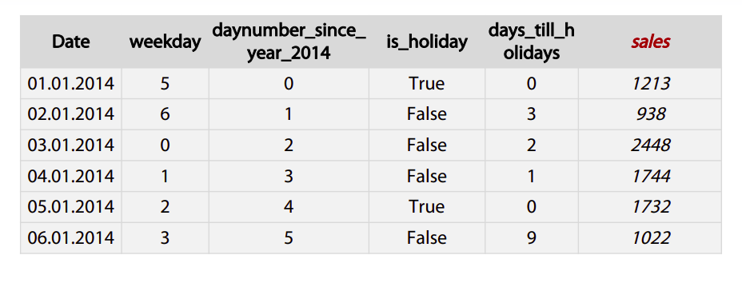

Date is obviously a **date**, and **sales** are the target of this task.

While other columns are generated features. `weekday` feature indicates which day in the week is this, `day_number_since_year_2014` indicates how many days have passed since January 1st, 2014. `is_holiday` is a binary feature indicating whether this day is a holiday and `days_ till_ holidays` indicate how many days are left before the closest holiday. Sometimes we have several datetime columns in our data. The most for data here is to **subtract one feature from another**.

```py
import datetime

date = ['01.01.2014', '02.01.2014', '03.01.2014', '04.01.2014', '05.01.2014', '06.01.2014']
sales = [1213, 938, 2448, 1744, 1732, 1022]

df = pd.DataFrame({'date': date, 'sales': sales})
df.head()
"""
         date  sales
0  01.01.2014   1213
1  01.02.2014    938
2  01.03.2014   2448
3  01.04.2014   1744
4  01.05.2014   1732
"""

# convert str to datetime
df['date'] = pd.to_datetime(df['date'])

# create new column dayname
df['dayname'] = df.date.apply(lambda x : x.day_name())
df.head()
"""
        date  sales    dayname
0 2014-01-01   1213  Wednesday
1 2014-01-02    938   Thursday
2 2014-01-03   2448     Friday
3 2014-01-04   1744   Saturday
4 2014-01-05   1732     Sunday
"""
# is_holiday
df['is_holiday'] = df.date.apply(lambda x: "Yes" if x.isoweekday() == 5 else "No")

# day number since year 2021
df['daynumber_since_year_2021'] = df.date.dt.dayofyear - df.date.dt.dayofyear[0]
df.head()

# final output
"""
        date  sales    dayname is_holiday  daynumber_since_year_2021
0 2014-01-01   1213  Wednesday         No                          0
1 2014-01-02    938   Thursday         No                          1
2 2014-01-03   2448     Friday        Yes                          2
3 2014-01-04   1744   Saturday         No                          3
4 2014-01-05   1732     Sunday         No                          4
"""
```

**Feature Generation for Coordinates**:

- Generally, you can **calculate distances to important points on the map**.

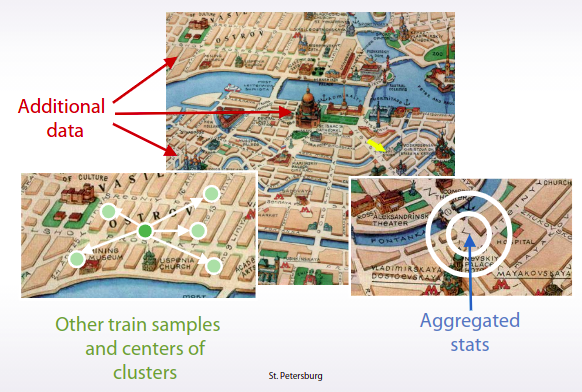

- Keep this wonderful map. If you have additional data with infrastructural buildings, you can add as a **feature distance** to the nearest shop to the second by distance hospital, to the best school in the neighborhood and so on.
- If you do not have such data, you can extract interesting points on the map from your trained test data. For example, you can do a new map to **squares**, with a **grid**, and within each square, find the most **expensive** flat, and for every other object in this square, add the distance to that flat. Or you can organize your data points into **clusters**, and then use centers of clusters as such important points.
- Or again, another way. You can find some special areas, like the area with very old buildings and add distance to this one.
- Another major approach to use coordinates is to calculate **aggregated statistics for objects surrounding area**. This can include number of lets around this particular point, which can then be interpreted as areas or polarity.
- Or we can add mean realty price, which will indicate how expensive area around selected point is.

Both **distances** and **aggregate statistics** are often useful in tasks with coordinates.

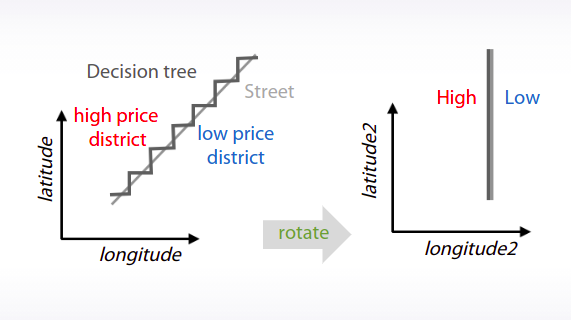

- One more trick you need to know about coordinates, that if you train decision trees from them, you can add **slightly rotated coordinates** is new features. And this will help a model make more precise selections on the map.
  It can be hard to know what exact rotation we should make, so we may want to add all rotations to 45 or 22.5 degrees.
- Let's look at the next example of a relative price prediction.
  Here the street is dividing an area in two parts. `The high priced district above the street, and the low priced district below it`. If the street is **slightly rotated, trees will try to make a lot of space here**. But if we will add new coordinates in which these two districts can be divided by a single split, this will hugely facilitate the rebuilding process.

**Summary**

- Datetime
  - **Periodicity**
  - Time since row-independent/dependent event
  - **Difference** between dates
- Coordinates
  - Interesting places from train/test data or additional data
  - **Centers of clusters**.
  - **Aggregated statistics**

#### Missing Values

Often we have to deal with missing values in our data. They could look like not **numbers**, **empty strings**, or **outliers** like minus `999`.

**Hidden NaN**

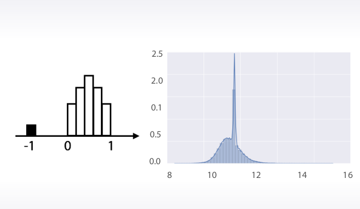

For example, how can we found out that `-1` can be the missing value? We could draw a **histogram** and see this variable has **uniform distribution** between `0 and 1`. And that it has small peak of `-1` values. So if there are no not numbers there, we can assume that they were replaced by -1.

**Fillna Approaches**

Great, let's talk about missing value **importation**. The most often examples are:

1. Replacing not a number with some value outside **fixed value range**.
   > First method is useful in a way that it gives **tree** **possibility** to take missing value into **separate category**. The **downside** of this is that **performance** of **linear networks can suffer**.
2. Replacing not a number with **mean** or **median**.
   > Second method usually **beneficial** for simple **linear models** and **neural networks**. But again for **trees** it can be **harder** to select object which had missing values in the first place.

**isnull features**:

```py
import pandas as pd
import numpy as np

features = np.array([0.1, 0.9,5, np.NaN, -3,np.NaN])
df = pd.DataFrame({'features': features})
df.head()

df['isnull'] = df.isnull()
df.head()
"""
   features  isnull
0       0.1   False
1       0.9   False
2       5.0   False
3       NaN    True
4      -3.0   False
"""
```

> New feature **isnull** indicating which **rows** have **missing** values for this feature. This can solve problems with **trees** and **neural networks** while computing **mean** or **median**. But the **downside** of this is that we will **double number of columns** in the data set.

3. Trying to **reconstruct** value somehow.

... is to reconstruct each value if possible. One example of such possibility is having missing values in **time series**. For example, we could have everyday temperature for a month but several values in the middle of months are missing.

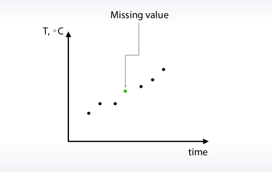

Well of course, **we can approximate them using nearby observations**. But obviously, this kind of opportunity is rarely the case. In most typical scenario rows of our `data set are independent`. And we usually will not find any proper logic to reconstruct them.

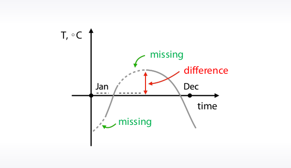

... near the missing values this difference usually will be **abnormally** huge. And this can be **misleading** our model. But hey, we already know that we can approximate missing values sometimes here by interpolation the error by points, great. But unfortunately, we usually don't have enough time to be so careful here. And more importantly, these problems can occur in cases when we can't come up with such specific solution.

#### Quiz - Feature preprocessing and generation with respect to models

1. What type does a feature with values: [‘low’, ‘middle’, ‘high’] most likely have?

**Answer**: Ordinal(Ordered Categorical)

2. Suppose you have a dataset X, and a version of X where each feature has been standard scaled. For which model types training or testing quality can be much different depending on the choice of the dataset?

**Answer**: Linear Models, KNN, Neural Networks

3. Suppose we want to fit a GBDT model to a data with a categorical feature. We need to somehow encode the feature. Which of the following statements are true?

**Answer**: Depending on the dataset either of label encoder or one-hot encoder could be better

4. What can be useful to do about missing values?

**Answer**:
a) Impute with a feature mean
b) Replace them with a constant (-1/-999/etc.)
c) Reconstruct them (for example train a model to predict the missing values)

**Additional Material and Links**

- Feature preprocessing
  - [Preprocessing in Sklearn](https://scikit-learn.org/stable/modules/preprocessing.html)
  - [Andrew NG about gradient descent and feature scaling](https://www.coursera.org/learn/machine-learning)
  - [Feature Scaling and the effect of standardization for machine learning algorithms](https://sebastianraschka.com/Articles/2014_about_feature_scaling.html)
- Feature generation
  - [Discover Feature Engineering, How to Engineer Features and How to Get Good at It](https://machinelearningmastery.com/discover-feature-engineering-how-to-engineer-features-and-how-to-get-good-at-it/)
  - [Discussion of feature engineering on Quora](https://www.quora.com/What-are-some-best-practices-in-Feature-Engineering)

#### Bag of Words

Hi. Often in competition, we have data like **text** and **images**. If you have only them, we can apply approach specific for this type of data. For example, we can use `search engines` in order to find similar text. That was the case in the Allen AI Challenge for example. For images, on the other hand, we can use **CNN**, like in the Data Science Bowl, and a whole bunch of other competitions. **But if we have text or images as additional data, we usually must grasp different features**, which can be edited as complementary to our main data frame of samples and features. Very simple example of such case we can see in the **Titanic** dataset we have called **name**, `which is more or less like text`, and to use it, we first need to **derive the useful features from it**. Another most surest example,

> we can predict whether a **pair of online advertisements** are **duplicates**, like **slightly different copies** of each other, and we could have images from these advertisements as complimentary data, like the Avito Duplicates Ads Detection competition. Or you may be given the task of classifying documents, like in the Tradeshift Text Classification Challenge.

> **Ensembles (Important)**

**Feature Extraction from Text**

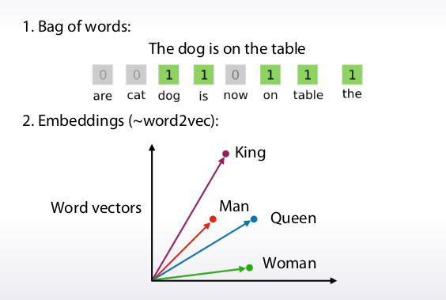

**Bag of Words**:

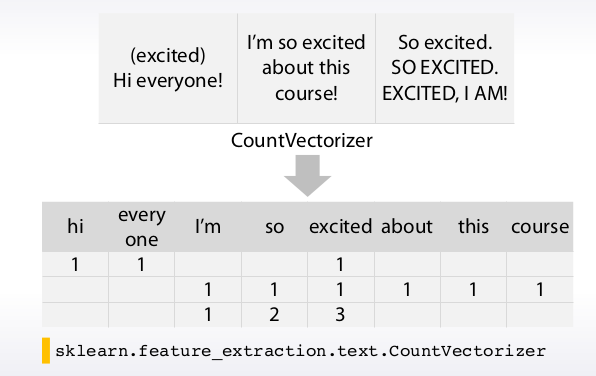

```py
from sklearn.feature_extraction.text import CountVectorizer

text = ['(excited) Hi everyone', "I'm so excited about this course!", "So excited, SO EXCITED, EXCITED, I AM!"]

vectorizer = CountVectorizer()
X = vectorizer.fit_transform(text)
print(vectorizer.get_feature_names())
print(X.toarray())
"""
['about', 'am', 'course', 'everyone', 'excited', 'hi', 'so', 'this']
[[0 0 0 1 1 1 0 0]
 [1 0 1 0 1 0 1 1]
 [0 1 0 0 3 0 2 0]]
"""
```


Here we create new column for each unique word from the data, then we simply count number of **occurences** for each word, and place this value in the appropriate **column**. After applying the separation to each row, we will have usual dataframe of samples and features.

**Scaling BOW**:

We also can **post process calculated metrics** using some pre-defined methods. To make out why we need post-processing let's remember that some models like **kNN**, like **linear regression**, and **neural networks**, **depend on scaling of features**. So the main goal of post-processing here is to make samples more comparable on one side, and on the other, boost more important features while decreasing the scale of useless ones.

**Normalize sum of values in a row or Term Frequency**:

```py
X = X.toarray()
tf = 1 / X.sum(axis=1) # axis=1 is for row
X = X * tf.reshape(-1, 1)
bow = pd.DataFrame(data=X, columns=vectorizer.get_feature_names())
bow.head()
```

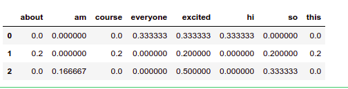

> **Note**: ndarray. **sum(axis=0)** to calculate the sum of each **column** in numpy. ndarray . Setting **axis to 1** would calculate the sum of each **row**.

**Inverse Document Frequency(IDF)**

A good idea is to normalize each feature by the inverse fraction of documents, which contain the exact word corresponding to this feature.

We can further improve this idea by taking a logarithm of these numberization coefficients. As a result, this will decrease the significance of widespread words in the dataset and do require feature scaling. This is the purpose of inverse document frequency transformation.

```py
from sklearn.feature_extraction.text import CountVectorizer

text = ['(excited) Hi everyone', "I'm so excited about this course!", "So excited, SO EXCITED, EXCITED, I AM!"]

vectorizer = CountVectorizer()
X = vectorizer.fit_transform(text)
X = X.toarray()
idf = np.log(X.shape[0] / (X > 0).sum(axis=0)) # column wise
X = X * idf

bow = pd.DataFrame(data=X, columns=vectorizer.get_feature_names())
bow.head()
```

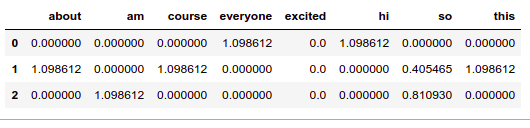

**sklearn.feature_extraction.text.TfidfVectorizer**:

```py
from sklearn.feature_extraction.text import TfidfVectorizer
v = TfidfVectorizer()
m = v.fit_transform(text)
print(m.toarray())
"""
array([[0.        , 0.        , 0.        , 0.65249088, 0.38537163,
        0.65249088, 0.        , 0.        ],
       [0.50461134, 0.        , 0.50461134, 0.        , 0.29803159,
        0.        , 0.38376993, 0.50461134],
       [0.        , 0.39365673, 0.        , 0.        , 0.69750001,
        0.        , 0.59877217, 0.        ]])
"""
```

**N-grams**

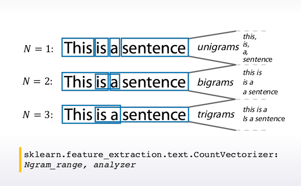

> If you have 28 unique symbols, the number of all possible combinations is equal to 28 \* 28.

```py
"""
ngram_range: tuple (min_n, max_n), default=(1, 1)
The lower and upper boundary of the range of n-values for
different word n-grams or char n-grams to be extracted.
All values of n such such that min_n <= n <= max_n will be used.
For example an ngram_range of (1, 1) means only
unigrams, (1, 2) means unigrams and bigrams,
and (2, 2) means only bigrams. Only applies if analyzer is not callable.

analyzer: {‘word’, ‘char’, ‘char_wb’} or callable, default=’word’

"""
from sklearn.feature_extraction.text import CountVectorizer

t = [(1,1), (2,2), (3,3)]

for a in t:
    vectorizer = CountVectorizer(ngram_range=a, analyzer='word')
    print(vectorizer)
    vectorizer.fit(text)
    print(vectorizer.get_feature_names(),end='\n\n')

"""
CountVectorizer()
['about', 'am', 'course', 'everyone', 'excited', 'hi', 'so', 'this']

CountVectorizer(ngram_range=(2, 2))
['about this', 'excited about', 'excited am', 'excited excited', 'excited hi',
'excited so', 'hi everyone', 'so excited', 'this course']

CountVectorizer(ngram_range=(3, 3))
['about this course', 'excited about this', 'excited excited am',
'excited hi everyone', 'excited so excited', 'so excited about',
'so excited excited', 'so excited so']
"""
```

**Text Preprocessing**:

- Lowercase
- Lemmatization
- Stemming
- Stopwords

**Lowercase**:

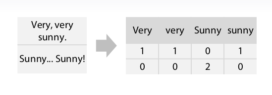

Let's consider simple example which shows utility of lowercase. What if we applied bag of words to the sentence very, very sunny? We will get three columns for each word. So because Very, with capital letter, is not the same string as very without it, we will get multiple columns for the same word, and again, Sunny with capital letter doesn't match sunny without it. So, first preprocessing what we want to do is to apply lowercase to our text. Fortunately, configurizer from sklearn does this by default.

