# Intro to Descriptive Statistics

Mathematics for Understanding Data. Statistics is an important field of math that is used to analyze, interpret, and predict outcomes from data. Descriptive statistics will teach you the basic concepts used to describe data. This is a great beginner course for those interested in Data Science, Economics, Psychology, Machine Learning, Sports analytics and just about any other field.

## Table of Contents

- [Intro to Descriptive Statistics](#intro-to-descriptive-statistics)
  - [Table of Contents](#table-of-contents)
    - [Visualizing Data](#visualizing-data)
      - [Frequency](#frequency)
      - [Relative Frequency](#relative-frequency)
      - [Range of Proportions](#range-of-proportions)
      - [Convert to Percentage](#convert-to-percentage)
      - [Range of Percentage](#range-of-percentage)
      - [Continents](#continents)
      - [Number of Rows](#number-of-rows)
      - [Bin Size](#bin-size)
      - [Visualize (Histogram)](#visualize-histogram)
      - [Histogram and Bar Plot](#histogram-and-bar-plot)
      - [Difference Between Graphs](#difference-between-graphs)
      - [Interpret Histogram](#interpret-histogram)
      - [Skewed Distribution](#skewed-distribution)

### Visualizing Data

#### Frequency

In statistics the frequency (or absolute frequency) of an event ***n<sub>i</sub>*** is the number ***n<sub>i</sub>*** of times the observation occurred/recorded in an experiment or study. These frequencies are often graphically represented in `histograms`.

**Types**:

The `cumulative frequency` is the total of the absolute frequencies of all events at or below a certain point in an ordered list of events.

The `relative frequency` (or `empirical probability`) of an event is the absolute frequency normalized by the total number of events:


The values of ***f<sub>i</sub>*** for all events ***i*** can be plotted to produce a frequency distribution.

In the case when ***n<sub>i</sub> = 0*** for certain ***i***, pseudocounts can be added.

```py
from collections import Counter

fruits = "apple banana apple strawberry banana lemon"
fruits = fruits.split()

fruits_count = Counter(fruits) # take list and return frequency dictionary
for key, values in fruits_count.items():
    print(key, values)
```

> If data is organized it is easier to find useful information. (freq table)

#### Relative Frequency

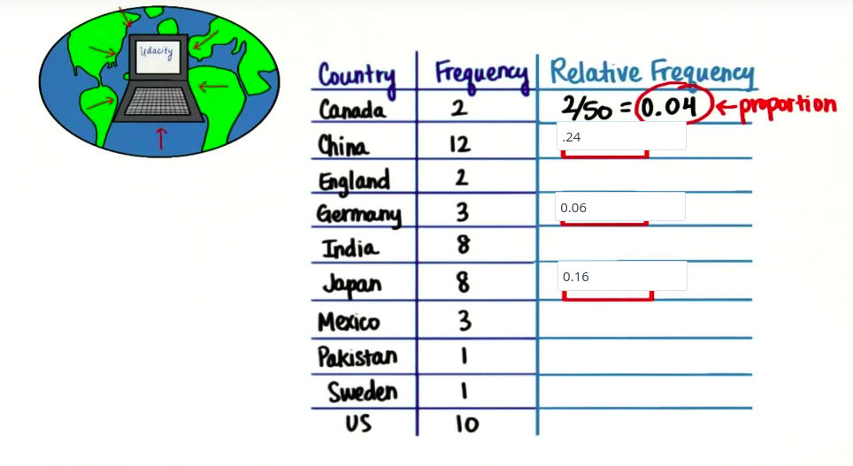

#### Range of Proportions

All proportions are greater than `0` and less than `1`, or may be equal to either of these values.

`sum(all_proportions) = 1`

#### Convert to Percentage

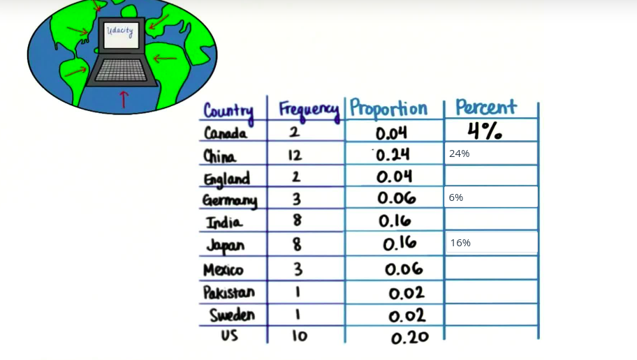

#### Range of Percentage

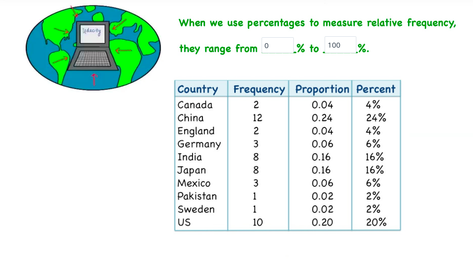

#### Continents

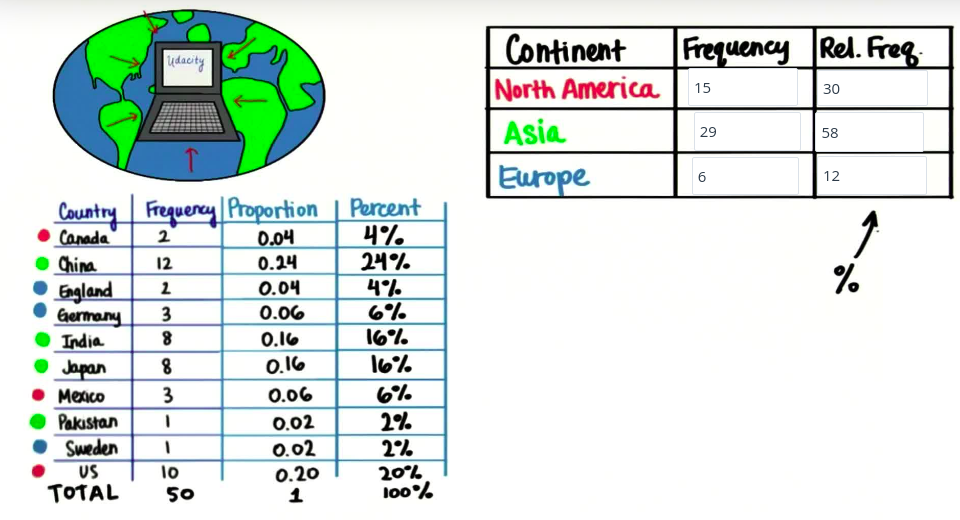

#### Number of Rows

`bins`, `buckets`, `interval`

| Age   | Frequency |
| :---- | :-------- |
| 0-19  | 19        |
| 20-39 | 21        |

Here `0-19` is known as `bins` or `interval` and `bin size` is `20`.

#### Bin Size

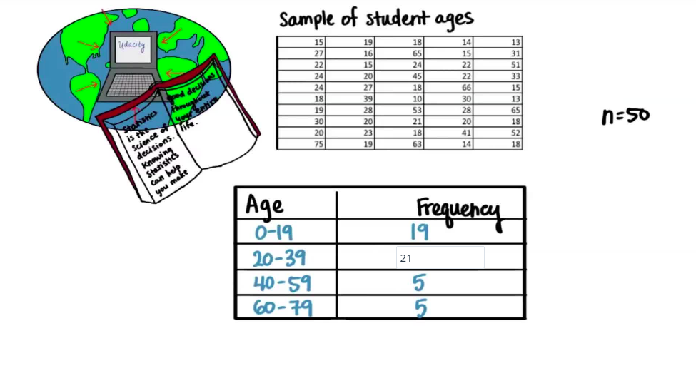

#### Visualize (Histogram)

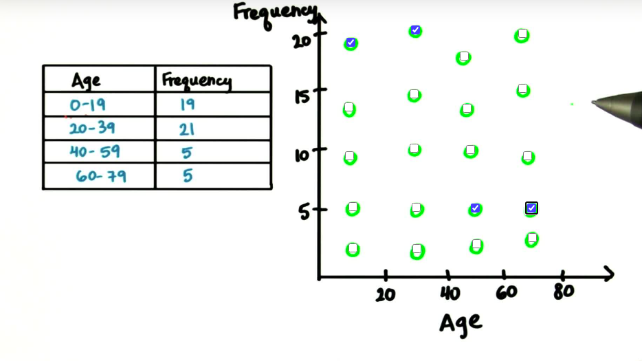

[Shodor: Interactive Graph Creator](http://www.shodor.org/interactivate/activities/Histogram/)

**Udacity Student Ages Data**:

| A   | B   | C   | D   | E   |
| --- | --- | --- | --- | --- |
| 15  | 19  | 18  | 14  | 13  |
| 27  | 16  | 65  | 15  | 31  |
| 22  | 15  | 24  | 22  | 51  |
| 24  | 20  | 45  | 22  | 33  |
| 24  | 27  | 18  | 66  | 15  |
| 18  | 39  | 10  | 30  | 13  |
| 19  | 28  | 53  | 28  | 65  |
| 30  | 20  | 21  | 20  | 18  |
| 20  | 23  | 18  | 41  | 52  |
| 75  | 19  | 63  | 14  | 18  |

#### Histogram and Bar Plot

**Histogram**:

```py
import pandas as pd

ages_df = pd.read_csv('datasets/udacity-student-ages-data.csv')

# use matplotlib
import matplotlib.pyplot as plt
import numpy as np

plt.hist(x=ages_df.age, bins=20, density=True, rwidth=.90)
plt.xlabel('Value')
plt.ylabel('Frequency')
plt.title('Udacity Student Age Histogram')

# using pandas
ages_df.age.hist(rwidth=.9, bins=20) # basic graph on pandas package
```

**Bar Plot**:

```py
continent = ['Europe', 'North America', 'Asia']
student = [6, 15, 29]

con_stu = pd.DataFrame({'continent':continent, 'student':student}, index=continent)
con_stu.plot.bar(rot=0)
```

**Graph** for the above code...

|        Histogram        | Bar plot |
| :---------------------: | :------: |
| 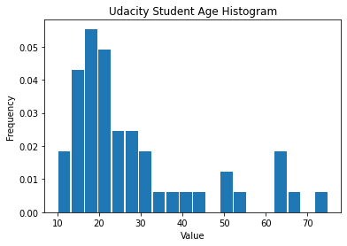 | 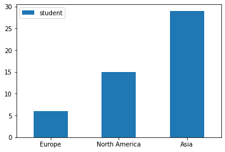

#### Difference Between Graphs

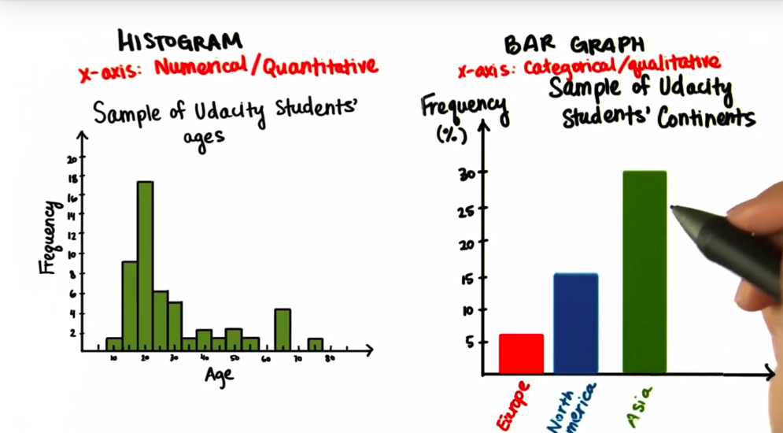

#### Interpret Histogram

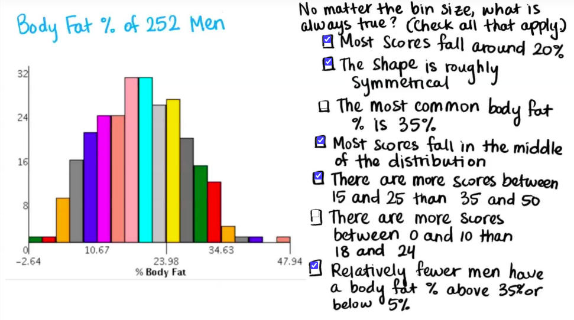

#### Skewed Distribution

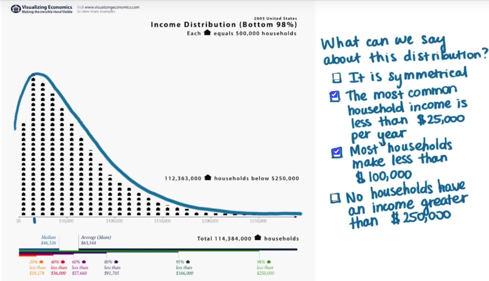
