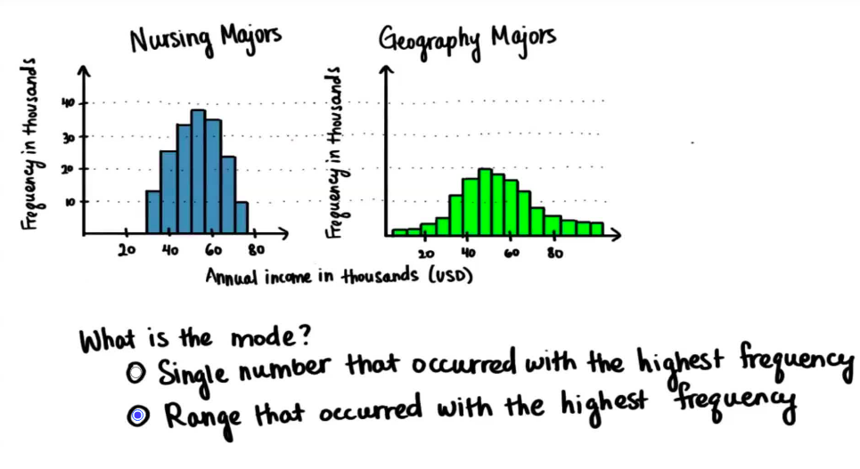
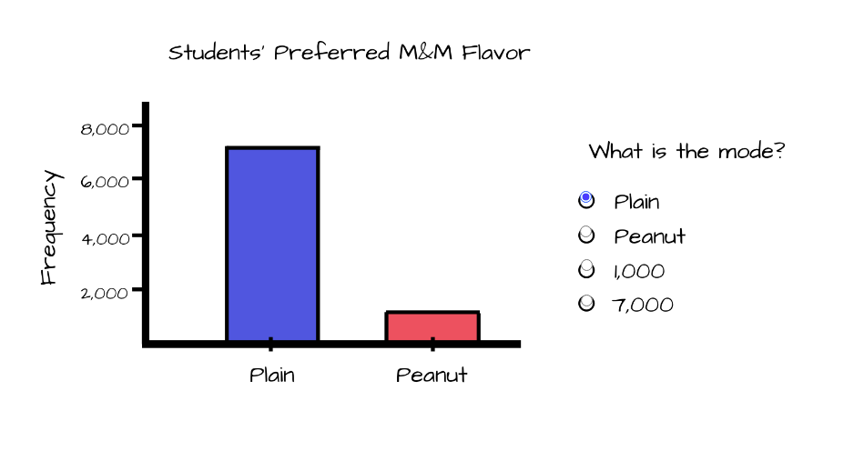
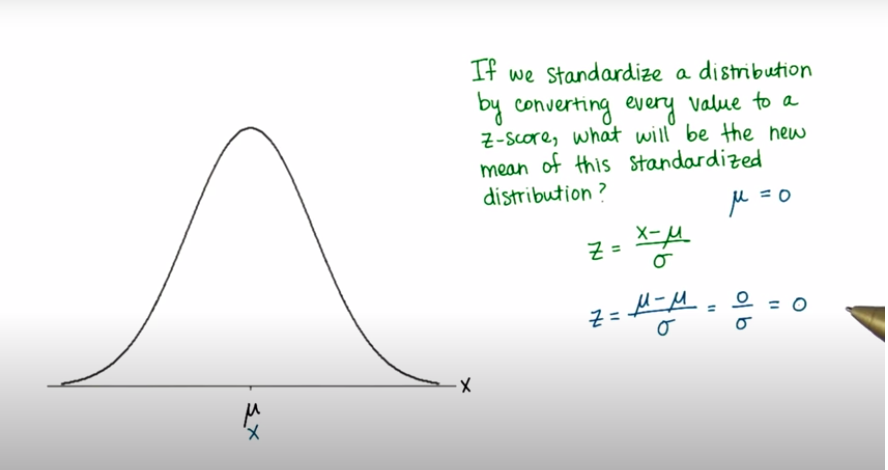
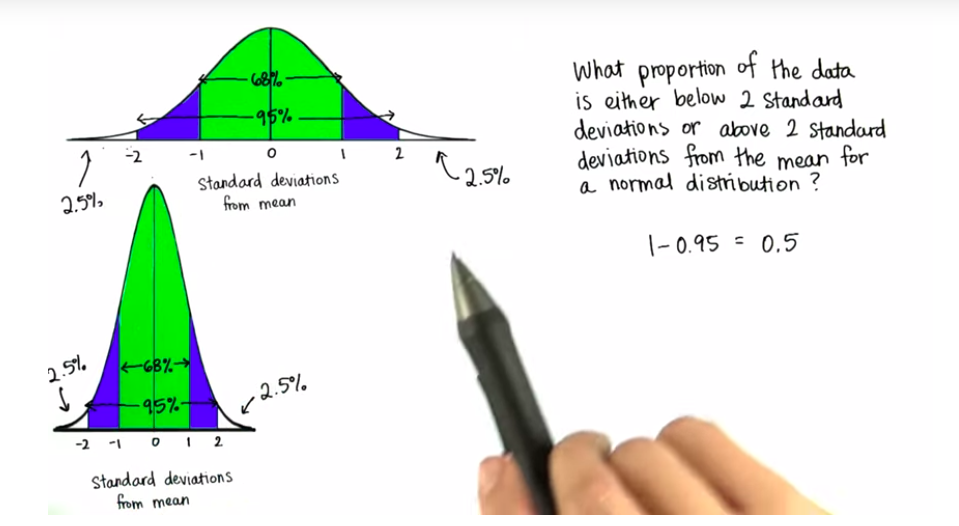
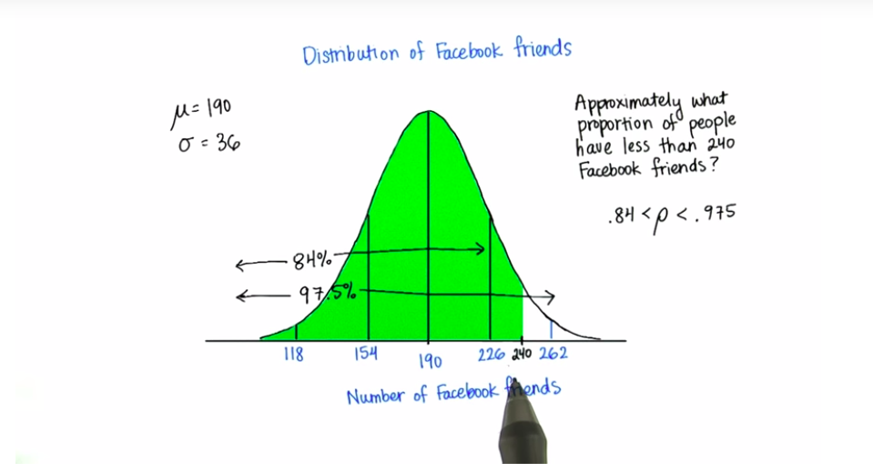

# Intro to Descriptive Statistics

Mathematics for Understanding Data. Statistics is an important field of math that is used to analyze, interpret, and predict outcomes from data. Descriptive statistics will teach you the basic concepts used to describe data. This is a great beginner course for those interested in Data Science, Economics, Psychology, Machine Learning, Sports analytics and just about any other field.

## Table of Contents

- [Intro to Descriptive Statistics](#intro-to-descriptive-statistics)
  - [Table of Contents](#table-of-contents)
    - [Visualizing Data](#visualizing-data)
      - [Frequency](#frequency)
      - [Relative Frequency](#relative-frequency)
      - [Range of Proportions](#range-of-proportions)
      - [Convert to Percentage](#convert-to-percentage)
      - [Range of Percentage](#range-of-percentage)
      - [Continents](#continents)
      - [Number of Rows](#number-of-rows)
      - [Bin Size](#bin-size)
      - [Visualize (Histogram)](#visualize-histogram)
      - [Histogram and Bar Plot](#histogram-and-bar-plot)
      - [Difference Between Graphs](#difference-between-graphs)
      - [Interpret Histogram](#interpret-histogram)
      - [Skewed Distribution](#skewed-distribution)
    - [Problem Set - 1: (Visualize Data)](#problem-set---1-visualize-data)
      - [Blood Types](#blood-types)
      - [Bin/Interval Size](#bininterval-size)
      - [22. Commute an Hour](#22-commute-an-hour)
    - [Central Tendency](#central-tendency)
      - [Which number to choose](#which-number-to-choose)
      - [`Mode` of Distribution](#mode-of-distribution)
      - [Uniform Distribution](#uniform-distribution)
      - [More than one modes](#more-than-one-modes)
      - [Mode on Categorical Data](#mode-on-categorical-data)
      - [More on Mode](#more-on-mode)
      - [Mode in Python](#mode-in-python)
      - [Find the `Mean`](#find-the-mean)
      - [Mean in Python](#mean-in-python)
      - [Properties of Mean](#properties-of-mean)
      - [Mean with Outlier](#mean-with-outlier)
      - [Requirement and find the Median](#requirement-and-find-the-median)
      - [Median with Outlier](#median-with-outlier)
      - [Formula for Location for Median](#formula-for-location-for-median)
      - [Measures of Center](#measures-of-center)
    - [Variability](#variability)
      - [Social Networker's Salaries](#social-networkers-salaries)
      - [What is the difference](#what-is-the-difference)
      - [Quantify Spread](#quantify-spread)
      - [Mark Z Outlier](#mark-z-outlier)
      - [Quartile](#quartile)
      - [Inter-quartile Range(IQR)](#inter-quartile-rangeiqr)
      - [Outlier and Define Outlier](#outlier-and-define-outlier)
      - [Box-plot](#box-plot)
      - [`Mean` with `IQR`](#mean-with-iqr)
      - [Problem with IQR](#problem-with-iqr)
      - [Measure Variability](#measure-variability)
      - [Deviation](#deviation)
      - [Be Happy and Get Rid of Negatives](#be-happy-and-get-rid-of-negatives)
      - [Average Absolute Deviation and Formula of Absolute Deviation](#average-absolute-deviation-and-formula-of-absolute-deviation)
      - [SS ( Sum of Squared)](#ss--sum-of-squared)
      - [Average Squared Deviation or `Variance`](#average-squared-deviation-or-variance)
      - [Average Squared Deviation in Words](#average-squared-deviation-in-words)
      - [One Dimension or SD](#one-dimension-or-sd)
      - [Calculate SD(Standard Deviation)](#calculate-sdstandard-deviation)
      - [SD Social Networkers](#sd-social-networkers)
      - [Point of SD](#point-of-sd)
      - [Bessel's Corrections](#bessels-corrections)
    - [Standardizing](#standardizing)
      - [Absolute or Relative](#absolute-or-relative)
      - [Relative Frequency Histogram](#relative-frequency-histogram)
      - [Continuous Distribution](#continuous-distribution)
      - [Theoretical Distribution](#theoretical-distribution)
      - [Unpopular](#unpopular)
      - [Formula for number of `SD's`](#formula-for-number-of-sds)
      - [Z-score](#z-score)
      - [Mean of Standardized Distribution](#mean-of-standardized-distribution)
      - [SD of Standardized Distribution](#sd-of-standardized-distribution)
      - [Popular Chris](#popular-chris)
      - [Convert to Z-score and  Popularity Score](#convert-to-z-score-and--popularity-score)
    - [Normal Distribution](#normal-distribution)
      - [Intro to PDF](#intro-to-pdf)
      - [Probability](#probability)
      - [Get to know the PDF](#get-to-know-the-pdf)
      - [SD below or Above the Mean](#sd-below-or-above-the-mean)
      - [Proportions of Facebook's Friends](#proportions-of-facebooks-friends)
      - [Using the Z-Table](#using-the-z-table)
      - [Karma  Points](#karma--points)
      - [Area In between 10 and 16](#area-in-between-10-and-16)
      - [Top 5%](#top-5)

### Visualizing Data

#### Frequency

In statistics the frequency (or absolute frequency) of an event ***n`<sub>`i</sub>*** is the number ***n`<sub>`i</sub>*** of times the observation occurred/recorded in an experiment or study. These frequencies are often graphically represented in `histograms`.

**Types**:

The `cumulative frequency` is the total of the absolute frequencies of all events at or below a certain point in an ordered list of events.

The `relative frequency` (or `empirical probability`) of an event is the absolute frequency normalized by the total number of events:


The values of ***f`<sub>`i</sub>*** for all events ***i*** can be plotted to produce a frequency distribution.

In the case when ***n`<sub>`i</sub> = 0*** for certain ***i***, pseudocounts can be added.

```py
from collections import Counter

fruits = "apple banana apple strawberry banana lemon"
fruits = fruits.split()

fruits_count = Counter(fruits) # take list and return frequency dictionary
for key, values in fruits_count.items():
    print(key, values)
```

> If data is organized it is easier to find useful information. (freq table)

#### Relative Frequency


#### Range of Proportions

All proportions are greater than `0` and less than `1`, or may be equal to either of these values.

`sum(all_proportions) = 1`

#### Convert to Percentage


#### Range of Percentage


#### Continents


#### Number of Rows

`bins`, `buckets`, `interval`

| Age   | Frequency |
| :---- | :-------- |
| 0-19  | 19        |
| 20-39 | 21        |

Here `0-19` is known as `bins` or `interval` and `bin size` is `20`.

#### Bin Size


#### Visualize (Histogram)


[Shodor: Interactive Graph Creator](http://www.shodor.org/interactivate/activities/Histogram/)

**Udacity Student Ages Data**:

| A   | B   | C   | D   | E   |
| --- | --- | --- | --- | --- |
| 15  | 19  | 18  | 14  | 13  |
| 27  | 16  | 65  | 15  | 31  |
| 22  | 15  | 24  | 22  | 51  |
| 24  | 20  | 45  | 22  | 33  |
| 24  | 27  | 18  | 66  | 15  |
| 18  | 39  | 10  | 30  | 13  |
| 19  | 28  | 53  | 28  | 65  |
| 30  | 20  | 21  | 20  | 18  |
| 20  | 23  | 18  | 41  | 52  |
| 75  | 19  | 63  | 14  | 18  |

#### Histogram and Bar Plot

**Histogram**:

```py
import pandas as pd

ages_df = pd.read_csv('datasets/udacity-student-ages-data.csv')

# use matplotlib
import matplotlib.pyplot as plt
import numpy as np

plt.hist(x=ages_df.age, bins=20, density=True, rwidth=.90)
plt.xlabel('Value')
plt.ylabel('Frequency')
plt.title('Udacity Student Age Histogram')

# using pandas
ages_df.age.hist(rwidth=.9, bins=20) # basic graph on pandas package
```

**Bar Plot**:

```py
continent = ['Europe', 'North America', 'Asia']
student = [6, 15, 29]

con_stu = pd.DataFrame({'continent':continent, 'student':student}, index=continent)
con_stu.plot.bar(rot=0)
```

**Graph** for the above code...

|        Histogram         |        Bar plot        |
| :----------------------: | :--------------------: |
|  |  |

#### Difference Between Graphs


#### Interpret Histogram


#### Skewed Distribution


### Problem Set - 1: (Visualize Data)

#### Blood Types

How to calculate,

```py
from collections import Counter
# O map-to 1
# A map-to 2
# B map-to 3
# C map-to 4

a = [1, 1, 2, 1, 1, 2, 2, 3, 2, 1, 1, 1, 1, 4, 1, 2, 1,
     2, 1, 2, 3, 2, 1, 2, 3, 4, 1, 2, 1, 3, 2, 2, 1, 2, 1]

for item, freq in Counter(a).items():
    print(freq, round(freq / len(a), 3), round(freq / len(a) * 100, 3))
```

The `Σ` symbol means the total sum. It is the Greek letter capital `sigma`. `f` stands for frequency (count), `p` stands for proportion.


**Decision**:

- Most **rare** blood type is **AB**.
- Most **common** blood type is **O**.
- Proportion of type `A` is `.37`.

#### Bin/Interval Size

`105 - 15 = 90`. This is `10` bins of size `9` between `15 and 105`.

#### 22. Commute an Hour


### Central Tendency


#### Which number to choose


- **Mode**: The mode is the value that `appears most often in a set of data values`. ... If `X` is a discrete `random` variable, the mode is the value x (i.e, X = x) at which the `probability mass function` takes its `maximum` value. In other words, it is the value that is most `likely to be sampled`.

#### `Mode` of Distribution

Mode: Highest frequency's bean.



> Note: Uniform distribution has no mode.

#### Uniform Distribution

Picture of uniform distribution..


#### More than one modes

Many distribution has more than one mode. Example image of bi-modal distribution...


#### Mode on Categorical Data



> Note: Remember, the mode occurs on the X-axis, so you are looking for whatever value has the highest frequency.

#### More on Mode


#### Mode in Python

```python
import statistics

# using statistics module
statistics.mode([1,2,3,4,5,1,2,3,1]) # 1
statistics.multimode([[1,2,3,4,5,1,2,3,1,2,3]]) # [1,2,3]

# using user defined function
def find_mode(sample):
    val_counts_map = {}

    # count the frequency
    for samp in sample:
        if samp in val_counts_map.keys():
            val_counts_map[samp] += 1
        else:
            val_counts_map[samp] = 1


    # find the max freq key
    max_freq = max(val_counts_map.values())

    # multimode
    result = list()
    for key, values in val_counts_map.items():
        if max_freq == values:
            result.append(key)

    return result

find_mode([1,2,1,1,3,4,5,2,1,2,2,4,4]) # [1,2]
```

#### Find the `Mean`


#### Mean in Python

```python
import statistics

values = [1,2,3,4,5,6,7,8,9,10]

# using statistics module
print(statistics.mean(values)) # 5.5

# using user defined function
def find_mean(sample):
  return sum(sample) / len(sample)

print(find_mean(sample)) # 5.5
```

**Helpful Symbols**:


#### Properties of Mean

[](https://www.youtube.com/watch?v=AqlvTMZg6HY)

#### Mean with Outlier


#### Requirement and find the Median


#### Median with Outlier


#### Formula for Location for Median

[](https://www.youtube.com/watch?v=lNYLU1b4qoM)

#### Measures of Center

[](https://www.youtube.com/watch?v=CBaw2pGOO3A)

**Code for Median**:

```py
# using statistics module
statistics.median([1,2,3,4,3,2,2,4,2])

# user defined function
sample = [1,2,3,4,5,6,1,4,2]

def find_median(sample):
    # first ordering the sample using sort function
    sample.sort()

    if len(sample) % 2 == 0:
        return (sample[len(sample) // 2] + sample[len(sample) // 2 + 1]) / 2
    else:
        return sample[len(sample) // 2]

find_median(sample)
```

### Variability

#### Social Networker's Salaries

Symmetrical Distribution, that's why **mean**, **mode**, **median** are same.


#### What is the difference

- More less spread distribution is more consistent.
- We actually don't know that people who has highest salary has social account or not?


#### Quantify Spread

- **Range**: is the difference between the maximum value and the minimum value observed.

```py
def calculate_range(sample):
    return max(sample) - min(sample)

# generate random sample
import random

sample = [random.randint(50,120) * 965 for _ in range(10)]

calculate_range(sample)
```


**Does `range` change?**:

- If we add data between previous range then range is not change. But if we add data more than the previous maximum
or minimum then range is change.


#### Mark Z Outlier


#### Quartile

**What is the Q1(25%)**:


**Q3 - Q1**:


#### Inter-quartile Range(IQR)


#### Outlier and Define Outlier

```text
Outlier < Q1 - 1.5(IQR)
        > Q2 + 1.5(IQR)
```

```py
def outlier(sample):
    # calculate inter-quartile
    q3, q1 = np.percentile(data, [75, 25])
    iqr = q3 - q1

    outliers = ((q1 - 1.5 * iqr), (q3 + 1.5 * iqr))
    return outliers

data = np.array([38946, 43420, 49191, 50430, 50557, 52580, 53595, 54135, 60181, 10000000])
print(outlier(data)) # (42751.875, 60748.875)
```


**Answer**: is last 3 points >=60,748

#### Box-plot


> "min" and "max" in this context mean the smallest and largest values from the sample that are not outliers.

**Match Boxplot**:


- `C` : With Z. Because with Z. has an outlier.
- `A` : Less Spread.
- `B` : More Spread.

#### `Mean` with `IQR`


- The `median` is always between `Q1` and `Q3`, but remember that the `mean` is `sensitive` to `outliers`.

#### Problem with IQR

- The problem with `IQR` is it is same in different sample of data. Like Symmetrical, Bi-modal and Uniform.

#### Measure Variability


#### Deviation


#### Be Happy and Get Rid of Negatives


#### Average Absolute Deviation and Formula of Absolute Deviation


#### SS ( Sum of Squared)


#### Average Squared Deviation or `Variance`

```py
sample_data = [33219, 36254, 38801,46335,46840,47546,55130,56863,78070,88830]

def variance(sample_data):
    # calculate mean
    mean = sum(sample_data) / len(sample_data)
    # total data point
    total_element = len(sample_data)

    sum_squared_deviation = 0
    for data in sample_data:
        sum_squared_deviation += (data - mean) ** 2

    # avg_squared dev
    return sum_squared_deviation / total_element

variance(sample_data)
```


#### Average Squared Deviation in Words


#### One Dimension or SD


#### Calculate SD(Standard Deviation)

**Standard Deviation**: SD is the most common way to calculate `spread`.

```text
  SD, σ(sigma) = √variance
```


#### SD Social Networkers

```py
sample_data = [38946, 43420, 49191, 50430, 50557, 52580, 53595, 54135, 60181, 62076]

def std(sample_data):
    mean = sum(sample_data) / len(sample_data)
    total = 0
    for data in sample_data:
        total += (data - mean) ** 2
    return math.sqrt(total / len(sample_data))

std(sample_data)
```

[](https://www.youtube.com/watch?v=cy8BwWl36Q4)

#### Point of SD

[](https://www.youtube.com/watch?v=d-_ZKyocTDw)


#### Bessel's Corrections

> If you need to calculate approximate SD from sample for population use `n-1` else `n`


### Standardizing

#### Absolute or Relative


#### Relative Frequency Histogram


#### Continuous Distribution


#### Theoretical Distribution


#### Unpopular

| Katie                    | Andy                     |
| ------------------------ | ------------------------ |
|  |  |

**Now who is more unpopular?**:

[](https://www.youtube.com/watch?v=W5qXCZ-nrHM)

#### Formula for number of `SD's`

```py
# suppose we are already know the mean(average) and SD

mean_value = 190
sd = 36
point = 88

number_of_sd = (mean_value - point) / sd
print(number_of_sd)
```


#### Z-score

```py
z = (point - mean_value) / sd
print(z)
```


#### Mean of Standardized Distribution



#### SD of Standardized Distribution


#### Popular Chris


#### Convert to Z-score and  Popularity Score


### Normal Distribution

#### Intro to PDF

`PDF`: Probability Density Function.


#### Probability


**Note**: `Absolute frequency`, `Relative frequency` and `Cumulative frequency`.


#### Get to know the PDF


**Probability Greater**:


> This probability is in fact much, much lower than 0.01 - about one in 3.5 million!

**Probability Less**:


#### SD below or Above the Mean



#### Proportions of Facebook's Friends


**Between 118 and 226**:


**Below the 240**:

```text
> 13.5 * 14 / 36 # Hence 36 -> 13.5%, So, 14 -> 13.5 * 14 / 36
> 5.25
> 84 + 5.25
89.25 # Approximate probability
```



#### Using the Z-Table


#### Karma  Points

**Integer SD**:


**Less than 5**:


**More than 20**:


#### Area In between 10 and 16


#### Top 5%


