# Intro to Inferential Statistics

## Table of Contents

- [Intro to Inferential Statistics](#intro-to-inferential-statistics)
  - [Table of Contents](#table-of-contents)
    - [Estimation](#estimation)
      - [Sampling Distribution Summary](#sampling-distribution-summary)
      - [Mean of Treated Population](#mean-of-treated-population)
      - [Population Mean Vs Sample Mean](#population-mean-vs-sample-mean)
      - [Percent of Sample Mean](#percent-of-sample-mean)
      - [Approximate Margin of Error](#approximate-margin-of-error)
      - [Interval Estimate for Population Mean](#interval-estimate-for-population-mean)
      - [Confidence Interval Bounds](#confidence-interval-bounds)
      - [Exact Z Score](#exact-z-score)
      - [95% of CI with Exact Z-Score](#95-of-ci-with-exact-z-score)
      - [Generalize Point Estimate](#generalize-point-estimate)
      - [Generalize CI](#generalize-ci)
      - [CI Range for Larger Sample Size](#ci-range-for-larger-sample-size)
      - [CI when n = 250](#ci-when-n--250)
      - [Z for 98% CI](#z-for-98-ci)
      - [Find 98% CI](#find-98-ci)
      - [Critical values of Z](#critical-values-of-z)
      - [Engagement Ratio](#engagement-ratio)
      - [Point Estimate Engagement Ratio](#point-estimate-engagement-ratio)
      - [Standard Error](#standard-error)
      - [Generalize CI # 2](#generalize-ci--2)
      - [Margin of Error](#margin-of-error)
      - [Sampling Distribution](#sampling-distribution)
      - [Z-Score for sample Mean](#z-score-for-sample-mean)
      - [What is the mean of above z-score](#what-is-the-mean-of-above-z-score)
    - [Hypothesis Testing](#hypothesis-testing)
      - [Alpha Levels](#alpha-levels)
      - [Z-Critical Values](#z-critical-values)
      - [Significance](#significance)
      - [Z-Score](#z-score)
      - [Two-Tailed Test](#two-tailed-test)
      - [Two-Tailed Test for 1%](#two-tailed-test-for-1)
      - [Two-Tailed Test for 0.1%](#two-tailed-test-for-01)

### Estimation

#### Sampling Distribution Summary


#### Mean of Treated Population

**Point Estimation**: In statistics, point estimation involves the use of sample data to calculate a single value (known as a point estimate since it identifies a point in some parameter space) which is to serve as a "best guess" or "best estimate" of an unknown population parameter (for example, the population mean).


#### Population Mean Vs Sample Mean


#### Percent of Sample Mean

Why this result: we know sample sd = sigma / sqrt_root(n).

So we can say about 95% are laying out in 2*sigma / sqrt_root(n).


#### Approximate Margin of Error

```py
margin_of_error = 2 * sigma / sqrt(n)
margin_of_error
```


#### Interval Estimate for Population Mean

```text
40 + 2*sigma / sqrt_root(n) > 40 > 40 - 2*sigma / sqrt_root(n)
```


#### Confidence Interval Bounds

**Python3 Code**:

```py
def confidence_interval_bounds(mean, se, samples=None):
    """
      Approximately 95% samples are fall in this interval.
      se: standard error!
    """
    left = mean - (2 * se)
    right  = mean + (2 * se)

    return (left, right)

confidence_interval_bounds(40, 2.71)
# (34.58, 45.42)
```


#### Exact Z Score

```py
import scipy.stats as st

# exact z score
def exact_z_score(left, right):
    left = st.norm.ppf(left)
    right = st.norm.ppf(right)

    return (left, right)

left, right = exact_z_score(.025, .975)
print(left, right)
# -1.9599639845400545 1.959963984540054
```


**Note**: This works only for sampling distribution.

#### 95% of CI with Exact Z-Score

```text
CI = (mean - Z*sigma/sqrt(n), mean + Z*sigma/sqrt(n))
```

```py
# retrieve exact z-score
left, right = exact_z_score(0.025, 0.975)

# Here we put '+' because left is already negative.
print(40 + (left * sd), 40 + (right * sd))
# 34.68603814271902 45.31396185728097
```


#### Generalize Point Estimate


#### Generalize CI


#### CI Range for Larger Sample Size


#### CI when n = 250

```text
CI = (mean - Z*sigma/sqrt(n), mean + Z*sigma/sqrt(n))
```

```py
_sd = 1.01

# Here we put '+' because left is already negative.
print(40 + (left * _sd), 40 + (right * _sd))
# 38.020436375614544 41.979563624385456
```


**Note**: Bigger sample size smaller CI(Confidence Interval) and more accurate `estimation`.

#### Z for 98% CI

```py
left, right = exact_z_score(.01, .99)
print(left, right)
# -2.3263478740408408 2.3263478740408408
```


#### Find 98% CI

```py
print(40 + (left * _sd), 40 + (right * _sd))
# 37.65038864721875 42.34961135278125
```


#### Critical values of Z


#### Engagement Ratio

```py
import pandas as pd

# read data from 'code-colab/datasets/...'
df = pd.read_csv('datasets/Engagement Ratio.csv')
df.head()

print(df.Ratio.mean(), df.Ratio.std())
# (0.07726584465256987, 0.10721572539079689)
```


#### Point Estimate Engagement Ratio

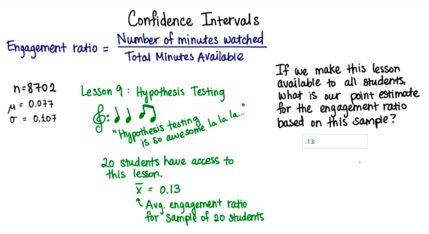

#### Standard Error

```text
sigma : population standard deviation

SE = sigma / sqrt(sample_size)
```

**Python3 Code**:

```py
from math import sqrt

sigma = .107
n = 20

SE = sigma / sqrt(n)
print(SE)
```

#### Generalize CI # 2

```py
import scipy.stats as st

# exact z score
def exact_z_score(left, right):
    left = st.norm.ppf(left)
    right = st.norm.ppf(right)

    return (left, right)


# calculate general 95% confidence interval
def gen_ci(mean, sigma, sample_size,percent=[.025, .975]):
    left, right = exact_z_score(percent[0], percent[1])

    return (mean + (left * (sigma / sqrt(sample_size))), mean + (right * (sigma / sqrt(sample_size))))

ci = gen_ci(.013, .107, 20)
print(ci)
# (-0.033893955920847124, 0.05989395592084711)
```

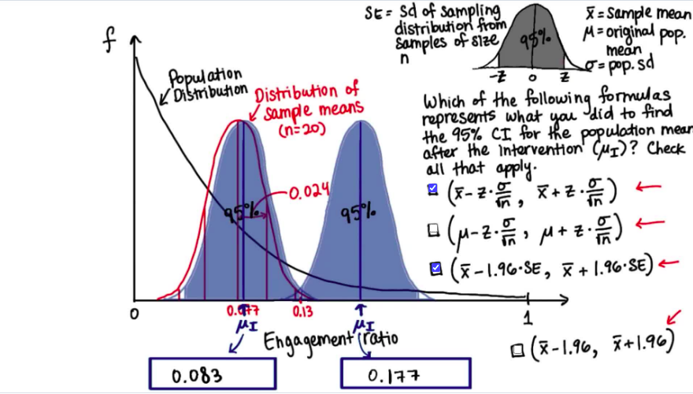

#### Margin of Error

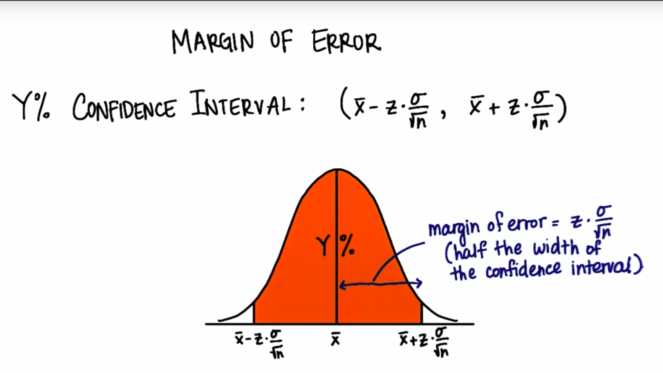

> **Note**: The margin of error is half the width of the confidence interval.

#### Sampling Distribution

```text
sampling mean = population mean
sampling SE = population SD / sqrt(sample size)
```

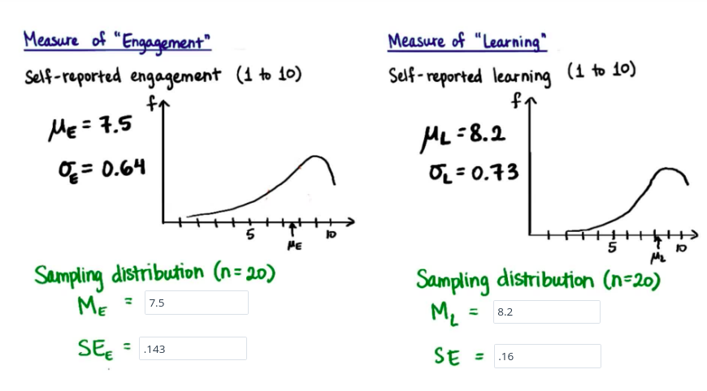

#### Z-Score for sample Mean

```py
# z = sample_mean - population_mean / sd
zE = (8.94 - 7.5) / (.64/sqrt(20))
print(zE)
# 10.06

zL = (8.35 - 8.2) / (.73/sqrt(20))
print(zl)
# .92
```

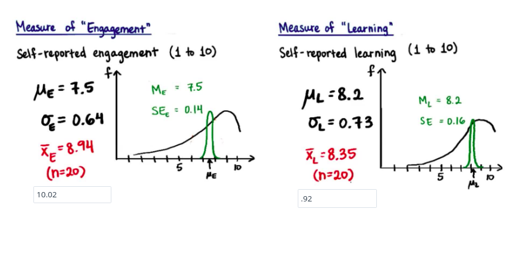

#### What is the mean of above z-score

> **WARNING!! IT'S AN VIDEO LECTURE**

[](https://www.youtube.com/watch?v=Hqk1_dUlmo4)

### Hypothesis Testing

#### Alpha Levels

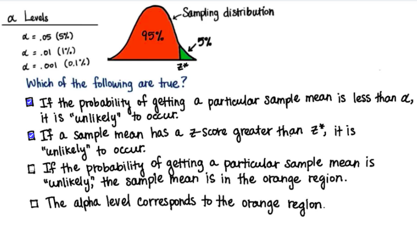

#### Z-Critical Values

```py
import scipy.stats as st

def critical_z(point):
    return st.norm.ppf(point)

# critical value for 95% or last 5%
print(critical_z(1 -.05))
# 1.6448536269514722

# critical value for 99% or last 1%
print(critical_z(1 - .01))
# 2.3263478740408408

# critical value for % or last .01%
print(critical_z(1 -.001))
# 3.090232306167813
```

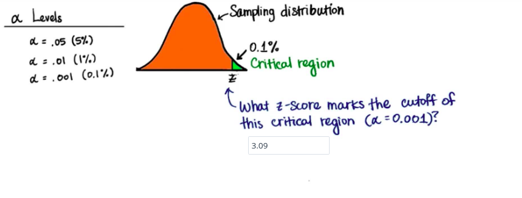

#### Significance

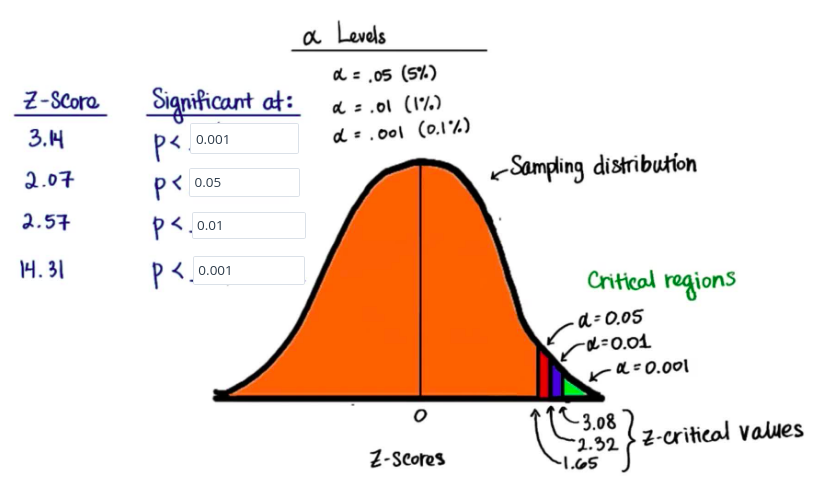

#### Z-Score

```py
from math import sqrt

mu = 7.5 # population mean
sigma = .64 # SD
x_var = 7.13 # sample mean
sample_size = 20

def z_score(x_var, mu, sigma, sample_size):
    return (x_var - mu) / (sigma /sqrt(sample_size))

print(z_score(x_var, mu, sigma, sample_size))
# -2.58...
```

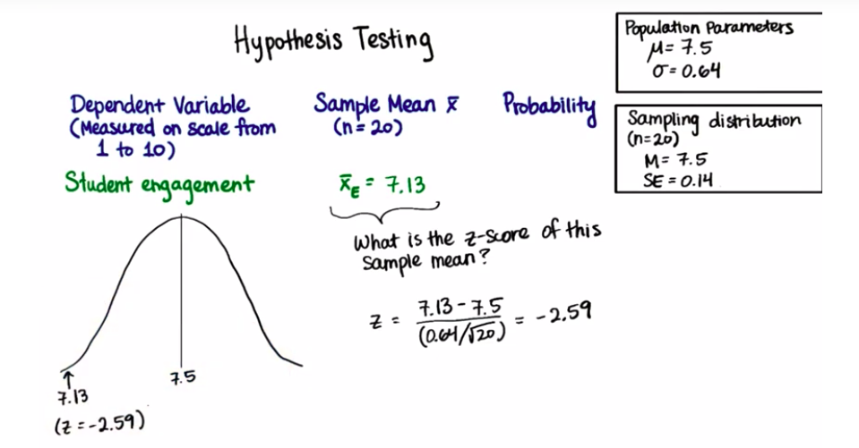

#### Two-Tailed Test

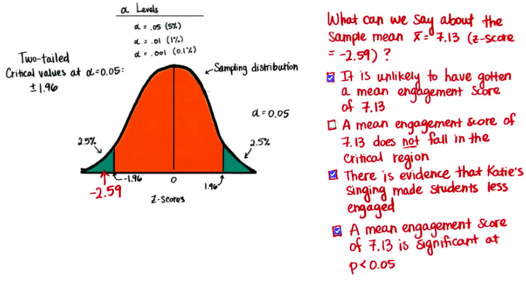

#### Two-Tailed Test for 1%

```py
left = critical_z((1 - .99) / 2)
right = left * -1
print(left, right)
# (-2.5758293035489004, 2.5758293035489004)
```

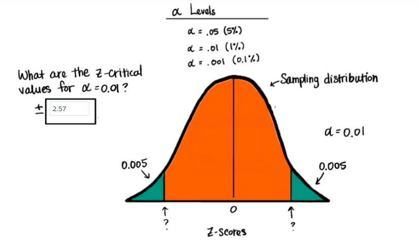

#### Two-Tailed Test for 0.1%

```py
left = critical_z((1 - .999) / 2)
right = left * -1
print(left, right)
# (-3.2905267314918945, 3.2905267314918945)
```
