# Intro to Inferential Statistics

## Table of Contents

- [Intro to Inferential Statistics](#intro-to-inferential-statistics)
  - [Table of Contents](#table-of-contents)
    - [Estimation](#estimation)
      - [Sampling Distribution Summary](#sampling-distribution-summary)
      - [Mean of Treated Population](#mean-of-treated-population)
      - [Population Mean Vs Sample Mean](#population-mean-vs-sample-mean)
      - [Percent of Sample Mean](#percent-of-sample-mean)
      - [Approximate Margin of Error](#approximate-margin-of-error)
      - [Interval Estimate for Population Mean](#interval-estimate-for-population-mean)
      - [Confidence Interval Bounds](#confidence-interval-bounds)
      - [Exact Z Score](#exact-z-score)
      - [95% of CI with Exact Z-Score](#95-of-ci-with-exact-z-score)
      - [Generalize Point Estimate](#generalize-point-estimate)

### Estimation

#### Sampling Distribution Summary


#### Mean of Treated Population

**Point Estimation**: In statistics, point estimation involves the use of sample data to calculate a single value (known as a point estimate since it identifies a point in some parameter space) which is to serve as a "best guess" or "best estimate" of an unknown population parameter (for example, the population mean).

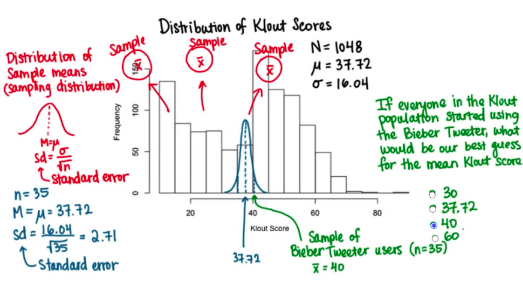

#### Population Mean Vs Sample Mean

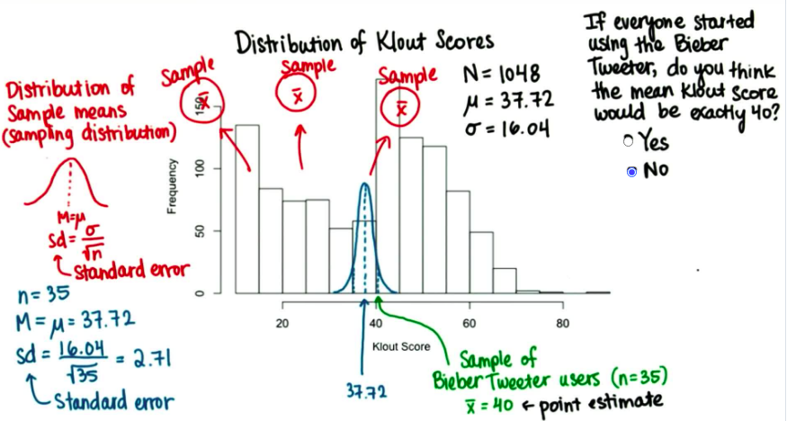

#### Percent of Sample Mean

Why this result: we know sample sd = sigma / sqrt_root(n).

So we can say about 95% are laying out in 2*sigma / sqrt_root(n).

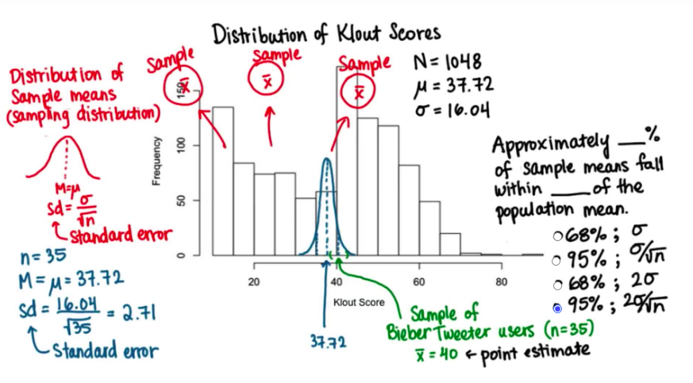

#### Approximate Margin of Error

```py
margin_of_error = 2 * sigma / sqrt(n)
margin_of_error
```

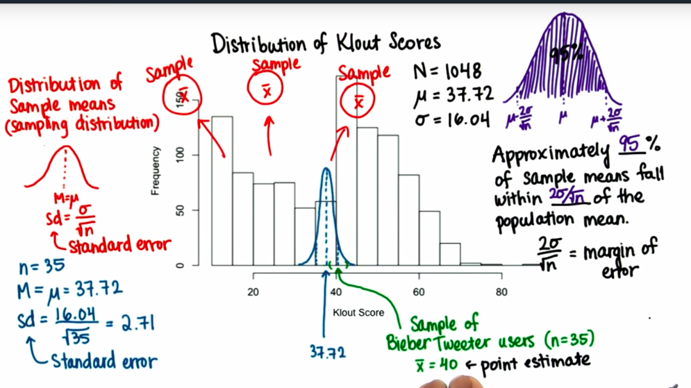

#### Interval Estimate for Population Mean

```text
40 + 2*sigma / sqrt_root(n) > 40 > 40 - 2*sigma / sqrt_root(n)
```

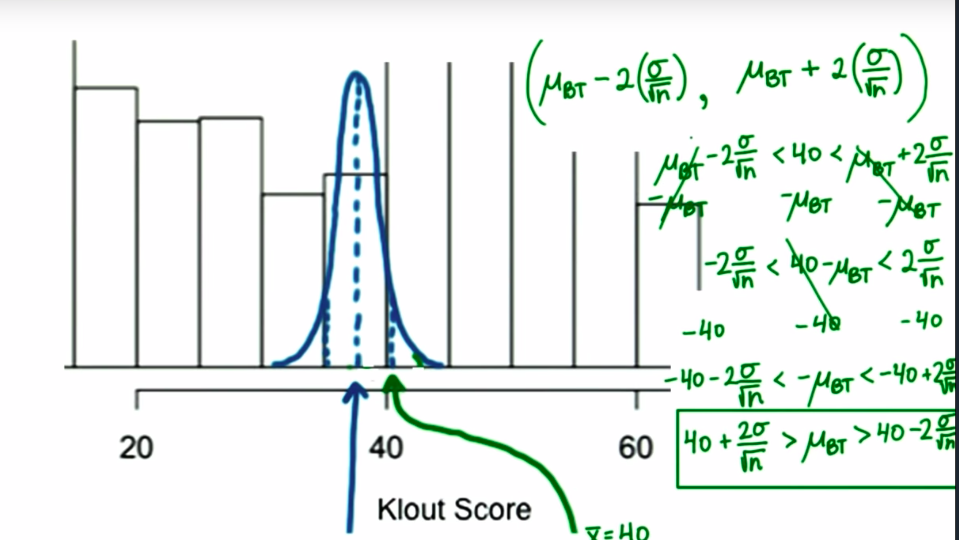

#### Confidence Interval Bounds

**Python3 Code**:

```py
def confidence_interval_bounds(mean, se, samples=None):
    """
      Approximately 95% samples are fall in this interval.
      se: standard error!
    """
    left = mean - (2 * se)
    right  = mean + (2 * se)

    return (left, right)

confidence_interval_bounds(40, 2.71)
# (34.58, 45.42)
```

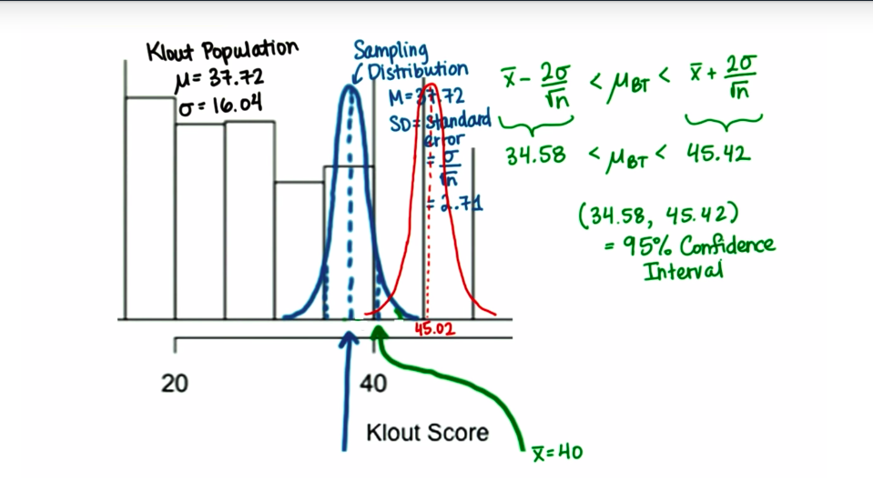

#### Exact Z Score

```py
import scipy.stats as st

# exact z score
def exact_z_score(left, right):
    left = st.norm.ppf(left)
    right = st.norm.ppf(right)

    return (left, right)

left, right = exact_z_score(.025, .975)
print(left, right)
# -1.9599639845400545 1.959963984540054
```

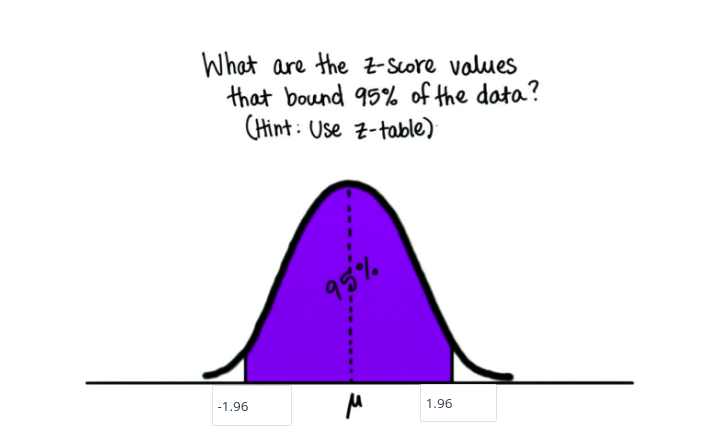

**Note**: This works only for sampling distribution.

#### 95% of CI with Exact Z-Score

```text
CI = (mean - Z*sigma/sqrt(n), mean + Z*sigma/sqrt(n))
```

```py
# retrieve exact z-score
left, right = exact_z_score(0.025, 0.975)

# Here we put '+' because left is already negative.
print(40 + (left * sd), 40 + (right * sd))
# 34.68603814271902 45.31396185728097
```

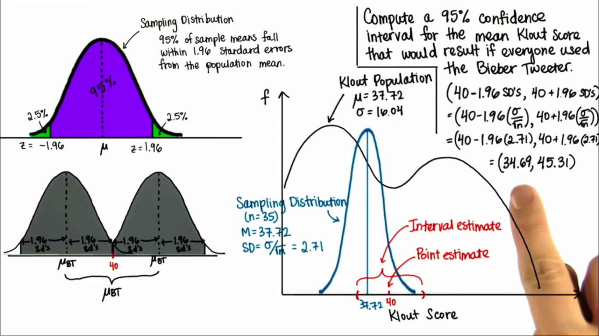

#### Generalize Point Estimate

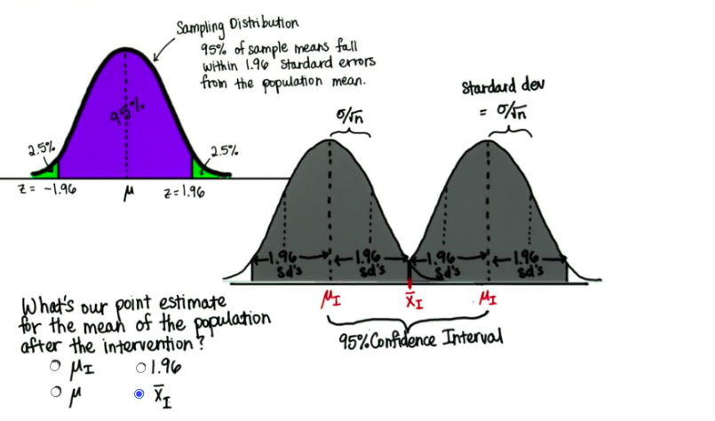

#### Generalize CI

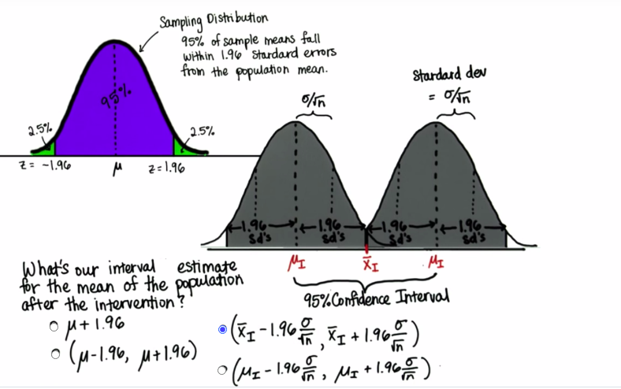

#### CI Range for Larger Sample Size

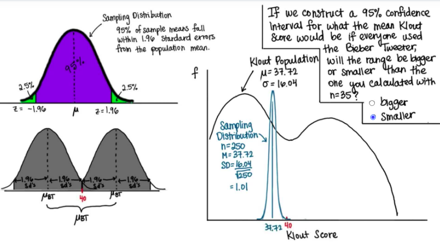

#### CI when n = 250

```text
CI = (mean - Z*sigma/sqrt(n), mean + Z*sigma/sqrt(n))
```

```py
_sd = 1.01

# Here we put '+' because left is already negative.
print(40 + (left * _sd), 40 + (right * _sd))
# 38.020436375614544 41.979563624385456
```

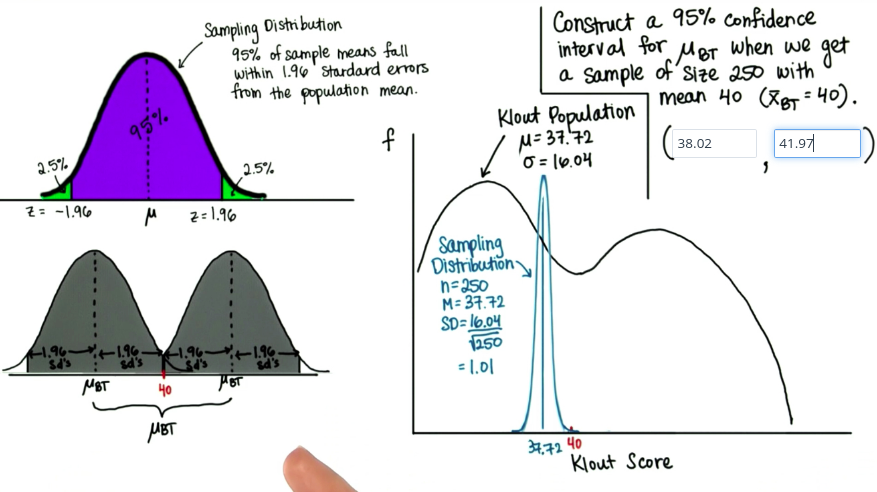

**Note**: Bigger sample size smaller CI(Confidence Interval) and more accurate `estimation`.

#### Z for 98% CI

```py
left, right = exact_z_score(.01, .99)
print(left, right)
# -2.3263478740408408 2.3263478740408408
```

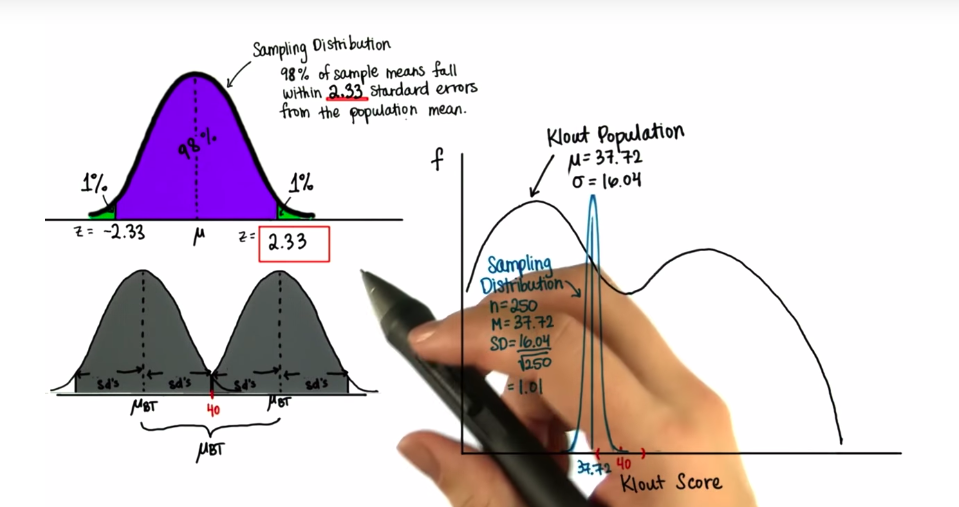

#### Find 98% CI

```py
print(40 + (left * _sd), 40 + (right * _sd))
# 37.65038864721875 42.34961135278125
```

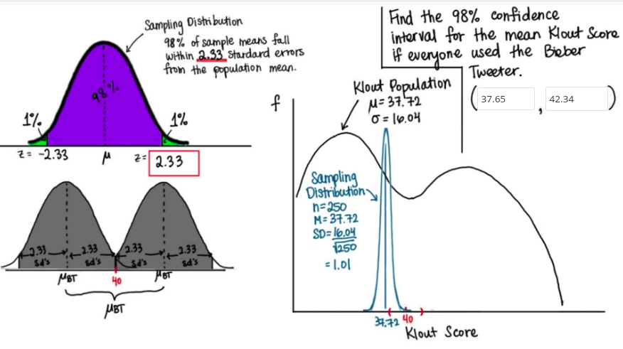

#### Critical values of Z

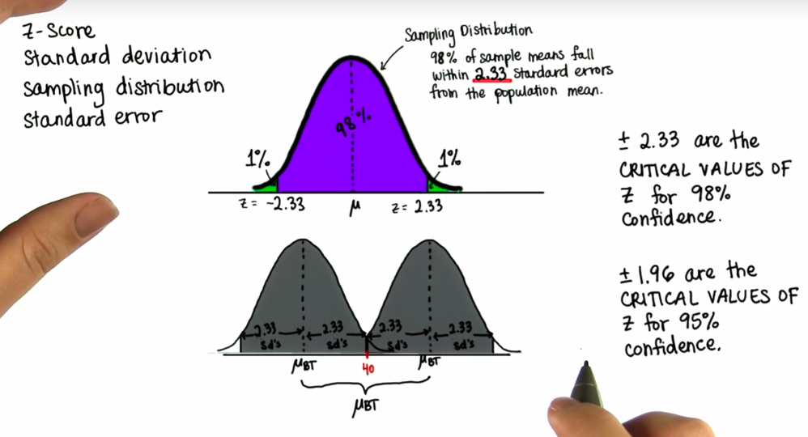

#### Engagement Ratio

```py
import pandas as pd

# read data from 'code-colab/datasets/...'
df = pd.read_csv('datasets/Engagement Ratio.csv')
df.head()

print(df.Ratio.mean(), df.Ratio.std())
# (0.07726584465256987, 0.10721572539079689)
```

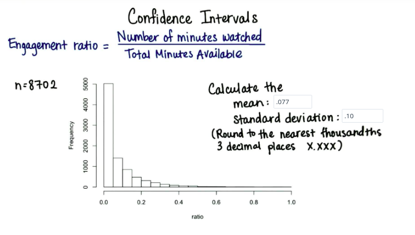
