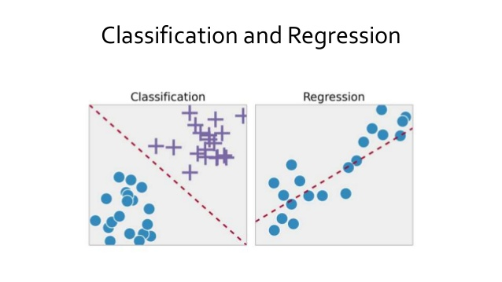
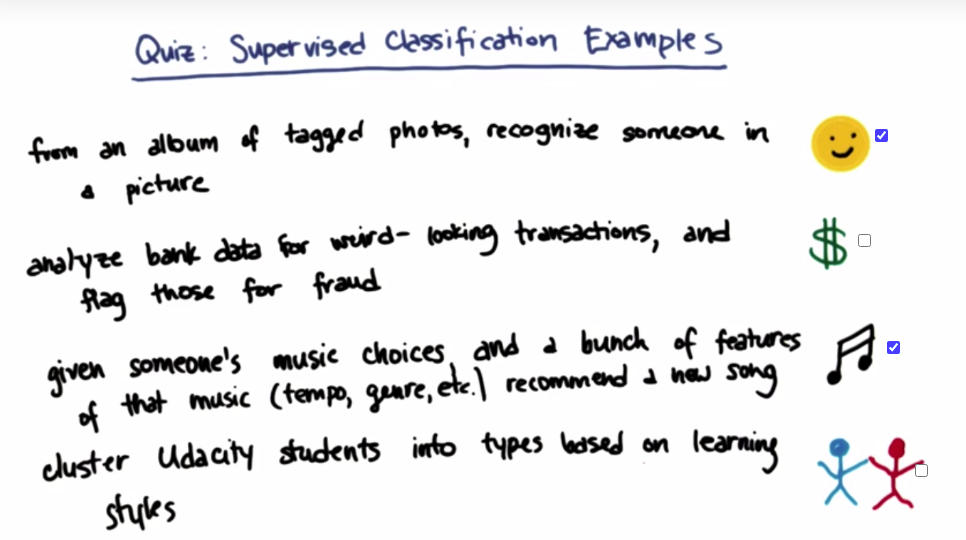
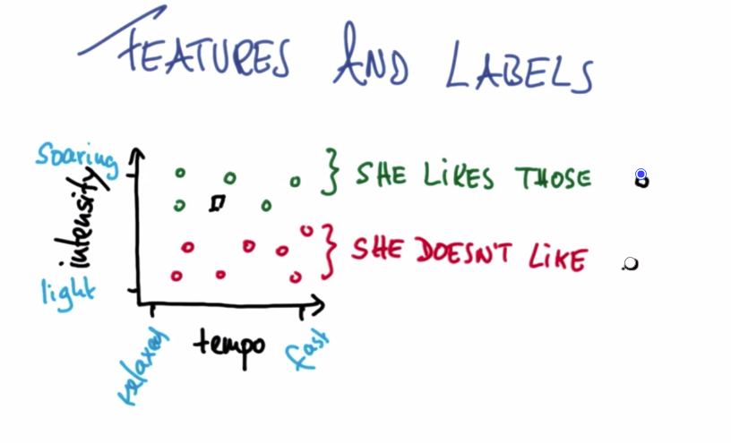
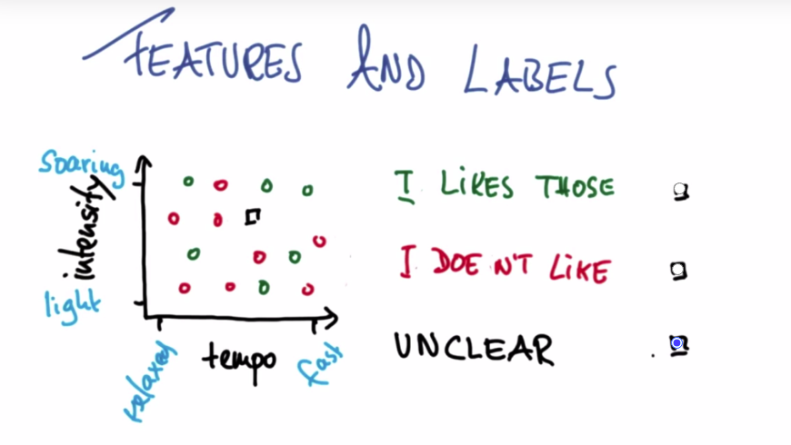

# Intro to Machine Learning

Machine Learning is all about learning from examples.

**Prerequisites**:

1. [Intro to Descriptive Statistics](https://www.udacity.com/course/intro-to-descriptive-statistics--ud827)
2. [Intro to Inferential Statistics](https://www.udacity.com/course/intro-to-inferential-statistics--ud201)

## Table of Contents

- [Intro to Machine Learning](#intro-to-machine-learning)
  - [Table of Contents](#table-of-contents)
    - [Naive Bayes](#naive-bayes)
      - [ML in the Google Self Driving Car](#ml-in-the-google-self-driving-car)
      - [Acerous Vs. Non-Acerous](#acerous-vs-non-acerous)
      - [Supervised Classification Example](#supervised-classification-example)
      - [Features and Labels Musical Example](#features-and-labels-musical-example)
      - [Features Visualization Quiz](#features-visualization-quiz)
      - [Classification By Eye](#classification-by-eye)

### Naive Bayes

#### ML in the Google Self Driving Car

`Self Driving Car` is one of the Biggest `Supervised Classification` Problem.

**Supervised Learning**: Supervised learning is the machine learning task of learning a function that maps an input to an output based on example input-output pairs. It infers a function from labeled training data consisting of a set of training examples.

**Supervised Classification**: Supervised classification is based on the idea that a user can select sample pixels in an image that are representative of specific classes and then direct the image processing software to use these training sites as references for the classification of all other pixels in the image.

#### Acerous Vs. Non-Acerous

**Question**: An horse is acerous or non-acerous?

When you looking at the new example, you have to figure out what parts of it to be paying `attention to`. We call these `features`.

**Feature**: `Colors`, `How many legs has?`, `whether it has horns or antlers?`

Acerous has `horns` or `antlers`. So **Horse** is Acerous.

> What `ML` is going to be doing: is we give you bunch of examples and each one has a number of `features`, a number of `attributes` that you can use to describe it. And if you can pick out the `right feature` and it's giving you the right information then you can classify new `examples`.

#### Supervised Classification Example

#### Features and Labels Musical Example

Music - Features:

- Intensity
- Tempo(Time)
- Genre
- Gender

Now `Katie`(Instructor name) brain,

- [ ] Is like music?
- [ ] Is don't like music?

#### Features Visualization Quiz

> The new test point seems to fall in the green "Like" category.

#### Classification By Eye

> We agree the test point does not fall into a clear category.
