# Introduction to Tensorflow for Deep Learning

## Table of Contents

- [Introduction to Tensorflow for Deep Learning](#introduction-to-tensorflow-for-deep-learning)
  - [Table of Contents](#table-of-contents)
    - [Welcome to the Course](#welcome-to-the-course)
      - [Introduction](#introduction)
      - [Applications of Machine Learning](#applications-of-machine-learning)
      - [Colab: Python and Colab Primer](#colab-python-and-colab-primer)
    - [Introduction to Machine Learning](#introduction-to-machine-learning)
      - [Recap](#recap)
      - [Dense Layers](#dense-layers)
    - [Your First Model - Fashion MNIST](#your-first-model---fashion-mnist)
      - [Interview with Sebastian](#interview-with-sebastian)
      - [Fashion MNIST Dataset](#fashion-mnist-dataset)
      - [Training and Testing](#training-and-testing)

### Welcome to the Course

#### Introduction

When studying Machine Learning you will come across many different terms such as artificial intelligence, machine learning, neural network, and deep learning. But what do these terms actually mean and how do they relate to each other?

Below we give a brief description of these terms:

**Artificial Intelligence**: A field of computer science that aims to make computers achieve human-style intelligence. There are many approaches to reaching this goal, including machine learning and deep learning.

- **Machine Learning**: A set of related techniques in which computers are trained to perform a particular task rather than by explicitly programming them.

- **Neural Network**: A construct in Machine Learning inspired by the network of neurons (nerve cells) in the biological brain. Neural networks are a fundamental part of deep learning, and will be covered in this course.

- **Deep Learning**: A subfield of machine learning that uses multi-layered neural networks. Often, “machine learning” and “deep learning” are used interchangeably.


Machine learning and deep learning also have many subfields, branches, and special techniques. A notable example of this diversity is the separation of **Supervised Learning** and **Unsupervised Learning**.

To over simplify — in supervised learning you know what you want to teach the computer, while unsupervised learning is about letting the computer figure out what can be learned. Supervised learning is the most common type of machine learning, and will be the focus of this course.

#### Applications of Machine Learning

- Skin Cancer
- Self Driving Car
- Games - `Alpha Go`

#### Colab: Python and Colab Primer

[Python and Colab Primer](https://colab.research.google.com/github/tensorflow/examples/blob/master/courses/udacity_intro_to_tensorflow_for_deep_learning/l01c01_introduction_to_colab_and_python.ipynb#scrollTo=7b5jv0ouFREV)

### Introduction to Machine Learning

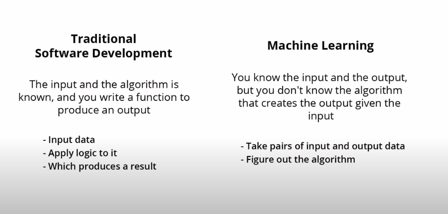

- Traditional Programming Approach:

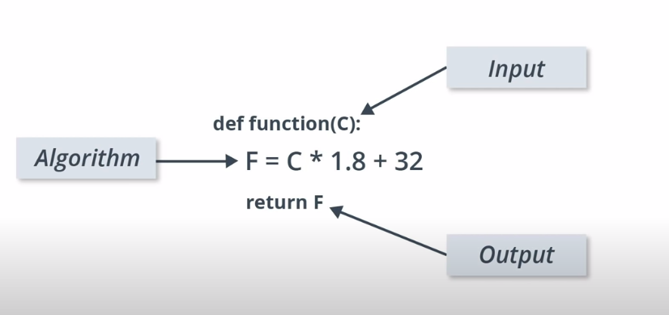

- Machine Learning Approach:

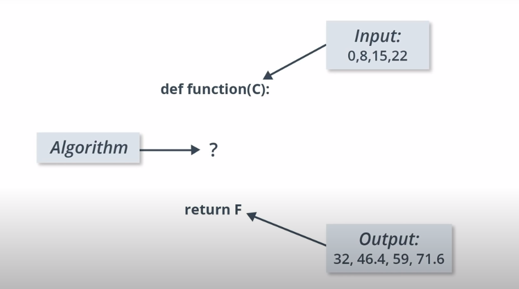

- Neural Network

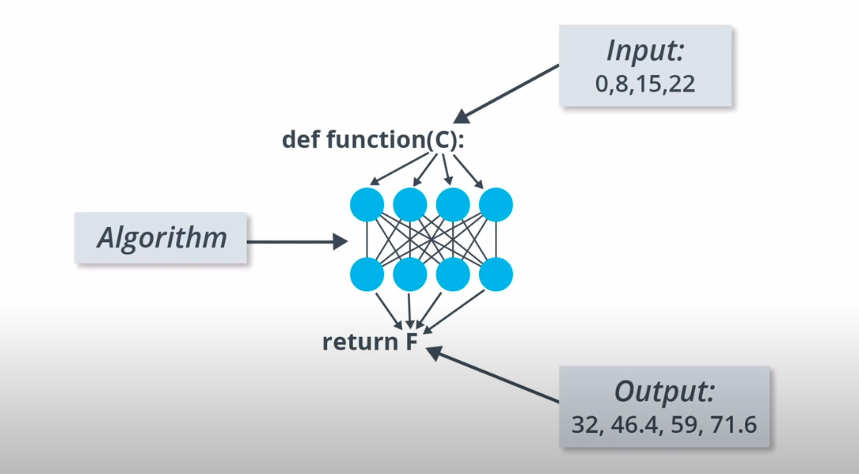

- Train 100's or 1000's or millions of time:

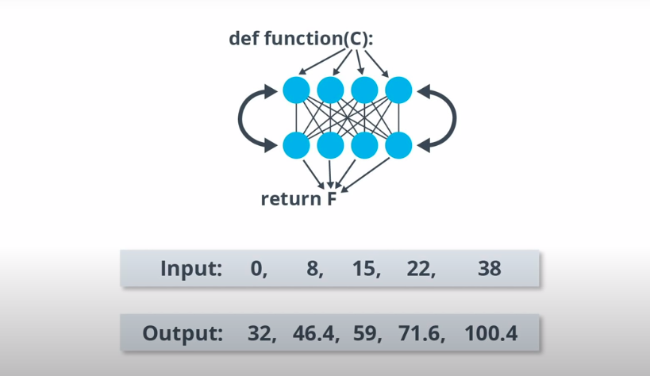

There are many types of `neural network architectures`. However, no matter what architecture you choose, the math it contains (what calculations are being performed, and in what order) is `not modified` during `training`. Instead, it is the `internal` variables (“`weights`” and “`biases`”) which are `updated` during `training`.

For example, in the Celsius to Fahrenheit conversion problem, the model starts by multiplying the input by some number (the weight) and adding another number (the bias). Training the model involves finding the right values for these variables, `not changing` from `multiplication` and `addition` to some other operation.

One cool thing to think about. If you solved the Celsius to Fahrenheit conversion problem you saw in the video, you probably did so because you had some prior knowledge of how to convert between Celsius and Fahrenheit.

```py
def cel_to_far(c):
    return (c * 1.8) + 32

cel_to_far(0) # 32
```

For example, you may have known that 0 degrees Celsius corresponds to 32 degrees Fahrenheit. On the other hand, machine learning systems never have any previous knowledge to help them solve problems. They learn to solve these types of problems without any prior knowledge.

```py
# import dependencies
import tensorflow as tf
import numpy as np
import matplotlib.pyplot as plt
import logging

# set logger
# get logger from tensorflow
logger = tf.get_logger()
logger.setLevel(logging.ERROR)

# Setup training data
# feature
celsius = np.array([-40, -10,  0,  8, 15, 22,  38],  dtype=float)
# label
fahrenheit = np.array([-40,  14, 32, 46, 59, 72, 100],  dtype=float)

# both celsius and fahrenheit makes an example. [0, 32] is an example

# create model
# build layer

# units = 1 means 1 neuron
# input_shape=[1] means This specifies that the input to this layer is a single value. That is, the shape is a one-dimensional array with one member. Since this is the first (and only) layer, that input shape is the input shape of the entire model. The single value is a floating point number, representing degrees Celsius.
l0 = tf.keras.layers.Dense(units=1, input_shape=[1])

# assemble layers into model
model = tf.keras.Sequential([l0])

# display model summary
print(model.summary())

# compile the model with loss and optimizer function
model.compile(loss='mean_squared_error', optimizer=tf.keras.optimizers.Adam(0.1))

# fit or train the model

history = model.fit(celsius, fahrenheit, epochs=500, verbose=False)

# make prediction
print(model.predict([100])) # actual result is 100 * 1.8 + 32 = 212

# print weights
print(l0.get_weights())

# display loss graph
plt.xlabel('Loss')
plt.ylabel('Epochs')
plt.plot(history.history['loss'])
plt.show()
```

#### Recap

Congratulations! You just trained your first machine learning model. We saw that by training the model with input data and the corresponding output, the model learned to multiply the input by 1.8 and then add 32 to get the correct result.


This was really impressive considering that we only needed a few lines code:

```py
l0 = tf.keras.layers.Dense(units=1, input_shape=[1])
model = tf.keras.Sequential([l0])
model.compile(loss='mean_squared_error', optimizer=tf.keras.optimizers.Adam(0.1))
history = model.fit(celsius_q, fahrenheit_a, epochs=500, verbose=False)
model.predict([100.0])
```

```text
Step - 1: Import dependencies # import tensorflow as tf
Step - 2: Prepare dataset     # a = np.array([10,20,30], dtype=float)
Step - 3: Create model        # model = tf.keras.Sequential(tf.keras.layers.Dense(units=1, input_shape=[1]))
Step - 4: Compile model       # model.compile(loss='..', optimizer='...')
Step - 5: Train or fit model  # model.fit(input, output, epochs='..', batch='..', validation='..')
Step - 6: Predict Result      # model.predict(input)
Step - 7: Deploy              # Deploy model in cloud.
```

This example is the general plan for of any machine learning program. You will use the same structure to create and train your neural network, and use it to make predictions.


Once a value is predicted, the difference between that predicted value and the correct value is calculated. This difference is called the loss, and it's a measure of how well the model performed the mapping task. The value of the loss is calculated using a loss function, which we specified with the loss parameter when calling model.compile().

After the loss is calculated, the internal variables (weights and biases) of all the layers of the neural network are adjusted, so as to minimize this loss — that is, to make the output value closer to the correct value (see Fig. 2).


This optimization process is called Gradient Descent. The specific algorithm used to calculate the new value of each internal variable is specified by the optimizer parameter when calling model.compile(...). In this example we used the Adam optimizer.

It is not required for this course, but if you're interested in learning more details about how the training process works, you can look at the lesson on reducing loss in Google’s machine learning crash course.

By now you should know what the following terms are:

- **Feature**: The input(s) to our model
- **Examples**: An input/output pair used for training
- **Labels**: The output of the model
- **Layer**: A collection of nodes connected together within a neural network.
- **Model**: The representation of your neural network
- **Dense** and Fully Connected (FC): Each node in one layer is connected to each node in the previous layer.
- **Weights** and biases: The internal variables of model
- **Loss**: The discrepancy between the desired output and the actual output
- **MSE**: Mean squared error, a type of loss function that counts a small number of large discrepancies as worse than a large number of small ones.
- **Gradient Descent** : An algorithm that changes the internal variables a bit at a time to gradually reduce the loss function.
- **Optimizer**: A specific implementation of the gradient descent algorithm. (There are many algorithms for this. In this course we will only use the “Adam” Optimizer, which stands for ADAptive with Momentum. It is considered the best-practice optimizer.)
- **Learning rate**: The “step size” for loss improvement during gradient descent.
- **Batch**: The set of examples used during training of the neural network
- **Epoch**: A full pass over the entire training dataset
- **Forward pass**: The computation of output values from input
- **Backward pass (backpropagation)**: The calculation of internal variable adjustments according to the optimizer algorithm, starting from the output layer and working back through each layer to the input.

> **Important keywords**: `Gradient Descent`, `Backpropagation`, `Loss`, `MSE`, `Optimizer`.

#### Dense Layers

- Coding visualization:

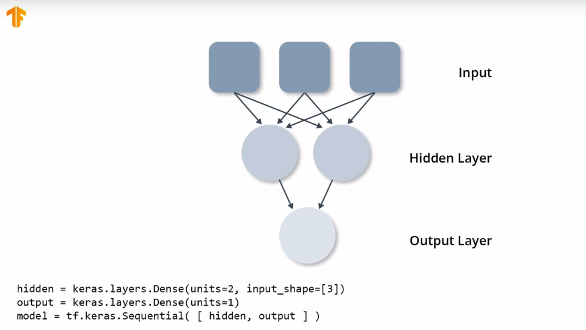

- With internal variable and math:

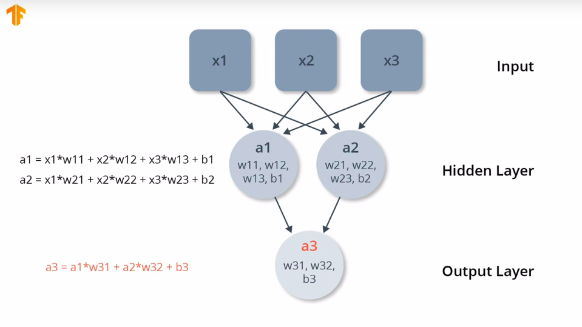

- In celsius to fahrenheit:

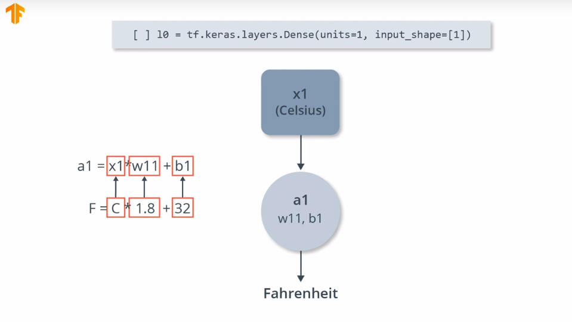

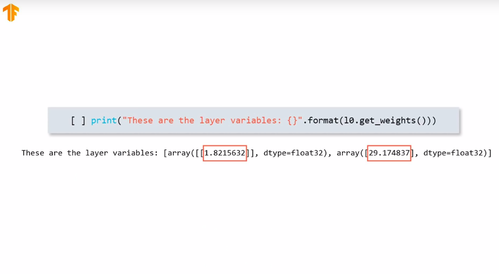

```py
l0 = tf.keras.layers.Dense(units=4, input_shape=[1])
l1 = tf.keras.layers.Dense(units=4)
l2 = tf.keras.layers.Dense(units=1)
model = tf.keras.Sequential([l0, l1, l2])
model.compile(loss='mean_squared_error', optimizer=tf.keras.optimizers.Adam(0.1))
model.fit(celsius_q, fahrenheit_a, epochs=500, verbose=False)
print("Finished training the model")
print(model.predict([100.0]))
print("Model predicts that 100 degrees Celsius is: {} degrees Fahrenheit".format(model.predict([100.0])))
print("These are the l0 variables: {}".format(l0.get_weights()))
print("These are the l1 variables: {}".format(l1.get_weights()))
print("These are the l2 variables: {}".format(l2.get_weights()))
```

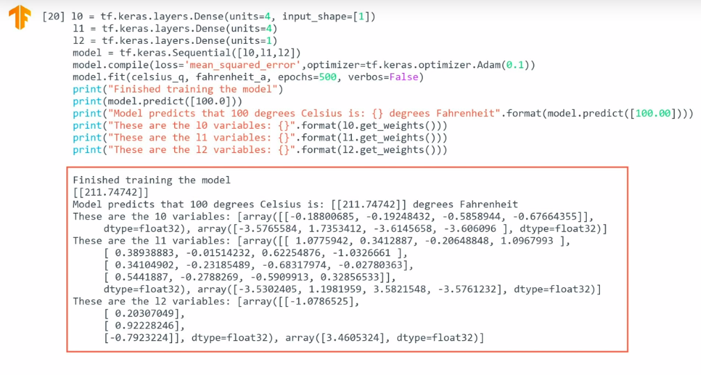

### Your First Model - Fashion MNIST

#### Interview with Sebastian

Next big thing in deep learning:

- 1st is More general intelligence(Training in network to do more than one task).
- 2nd is bring it to market. (Cost lots of money but it makes world more better place).

> Deep learning is a tool that can help you accomplish a task.

**Important keywords**: `Deep learning in Medicine, Health`

#### Fashion MNIST Dataset

```text
An example = (feature, label) pair.
features => input data.
label => output data.
```

- `Regression` predicts a numeric value.
- Dense layer is the most important layer in neural networks.

In here we create a neural network that can **recognize** items of clothing and images.

**Introduce about Fashion MNIST Dataset**:

Full list of 10 different item in Fashion MNIST dataset contains.

| Label | Class       |
| :---: | ----------- |
|   0   | T-shirt/top |
|   1   | Trouser     |
|   2   | Pullover    |
|   3   | Dress       |
|   4   | Coat        |
|   5   | Sandal      |
|   6   | Shirt       |
|   7   | Sneaker     |
|   8   | Bag         |
|   9   | Ankle Boot  |

In total `70,000` images which is plenty for us to get started with.

**Train Test Split**:

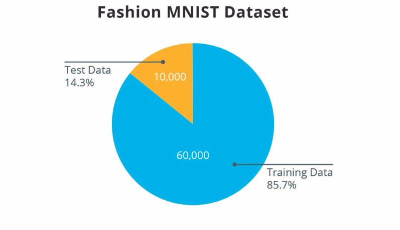

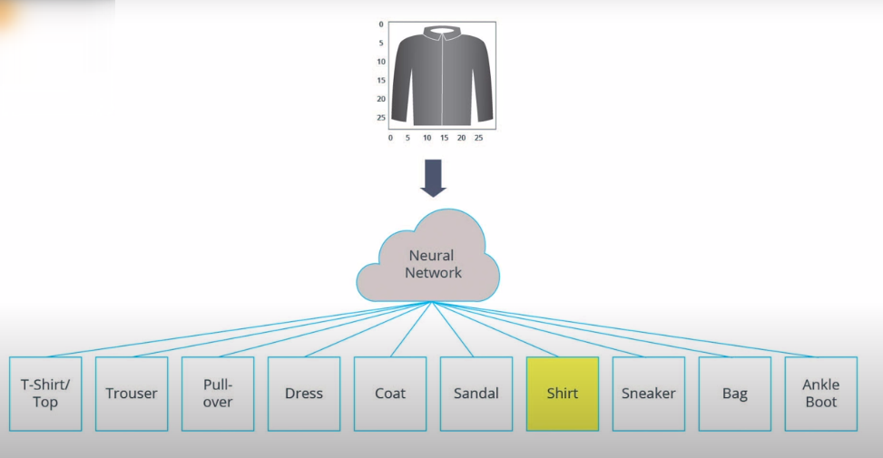

Each image is `28*28` gray-scale image that total is `784` bytes. So each image is `784` bytes.
So our job is create a neural network that take the `784` bytes as `input`, and then identifies
which of the `10` different items of clothing the image represents.

- **Model Overview**:

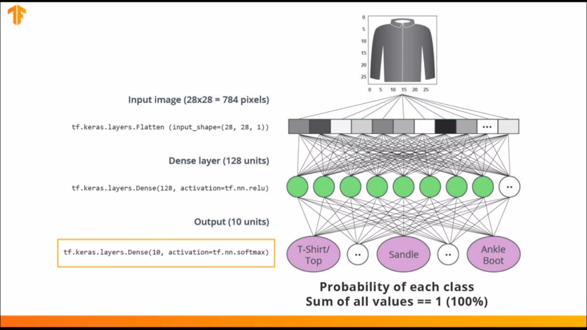

- **Predicted Output Overview**:

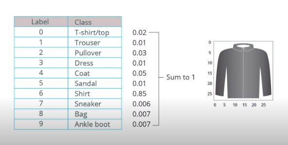

**The Rectified Linear Unit (ReLU)**:

In this lesson we talked about ReLU and how it gives our Dense layer more power. ReLU stands for `Rectified Linear Unit` and it is a mathematical function that looks like this:

```py
# using condition
def relu(x):
    if x <=0:
        return 0
    else:
        return x

# another process
def relu2(x):
    return max(x, 0)

# relu
relu(-10) # 0
relu(10) # 10

# relu2
relu2(-10) # 0
relu2(3) # 3
```


As we can see, the ReLU function gives an output of `0` if the input is `negative or zero`, and if input is `positive`, then the output will be equal to the `input`.

ReLU gives the network the ability to solve **nonlinear** problems.

Converting Celsius to Fahrenheit is a linear problem because `f = 1.8*c + 32` is the same form as the equation for a line, `y = m*x + b`. But most problems we want to solve are nonlinear. In these cases, adding ReLU to our Dense layers can help solve the problem.

ReLU is a type of **activation** function. There several of these functions (**ReLU**, **Sigmoid**, **tanh**, **ELU**), but ReLU is used most commonly and serves as a good default. To build and use models that include ReLU, you don’t have to understand its internals. But, if you want to know more, see this article on ReLU in Deep Learning.

Let’s review some of the new terms that were introduced in this lesson:

- **Flattening**: The process of converting a 2d image into 1d vector
- **ReLU**: An activation function that allows a model to solve nonlinear problems
- **Softmax**: A function that provides probabilities for each possible output class
- **Classification**: A machine learning model used for distinguishing among two or more output categories

**Important keywords**: `Flattening`, `Relu`, `Softmax`, `Classification`.

#### Training and Testing

TensorFlow Datasets provides a collection of datasets ready to use with TensorFlow.

Datasets are typically split into different subsets to be used at various stages of training and evaluation of the neural network. In this section we talked about:

- **Training Set**: The data used for training the neural network.
- **Test set**: The data used for testing the final performance of our neural network.
The test dataset was used to try the network on data it has never seen before. This enables us to see how the model generalizes beyond what it has seen during training, and that it has not simply memorized the training examples.

In the same way, it is common to use what is called a Validation dataset. This dataset is not used for training. Instead, it it used to test the model during training. This is done after some set number of training steps, and gives us an indication of how the training is progressing. For example, if the loss is being reduced during training, but accuracy deteriorates on the validation set, that is an indication that the model is memorizing the test set.

The validation set is used again when training is complete to measure the final accuracy of the model.

You can read more about all this in the [Training and Test Sets lesson of Google’s Machine Learning Crash Course](https://developers.google.com/machine-learning/crash-course/training-and-test-sets/video-lecture).
