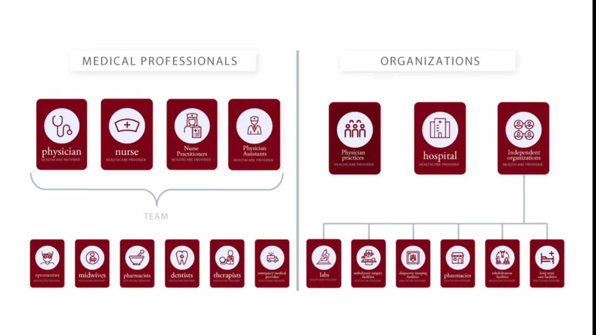

# Introduction to Healthcare

## Table of Contents

- [Introduction to Healthcare](#introduction-to-healthcare)
  - [Table of Contents](#table-of-contents)
    - [Overview of Healthcare Systems and Key Challenges They Face](#overview-of-healthcare-systems-and-key-challenges-they-face)
      - [Introduction HC](#introduction-hc)
      - [A Simple Interaction Between Providers and Patients](#a-simple-interaction-between-providers-and-patients)
      - [The Problem of Risk](#the-problem-of-risk)
      - [Solving the Problem of Risk: Risk Pooling](#solving-the-problem-of-risk-risk-pooling)
      - [Insurance and Intermediaries for Risk Pooling](#insurance-and-intermediaries-for-risk-pooling)
      - [Beyond Patients, Providers, and Intermediaries: Other Players in the Health Care System](#beyond-patients-providers-and-intermediaries-other-players-in-the-health-care-system)
      - [Overview of the Types and Roles of Intermediaries](#overview-of-the-types-and-roles-of-intermediaries)
      - [Overview of the Types and Roles of Providers](#overview-of-the-types-and-roles-of-providers)
      - [Providers and Levels of Care](#providers-and-levels-of-care)
      - [The Challenge of Rising Health Care Costs](#the-challenge-of-rising-health-care-costs)
      - [The Challenges of Quality and Access](#the-challenges-of-quality-and-access)
      - [The Challenges of Quality and Access](#the-challenges-of-quality-and-access-1)

### Overview of Healthcare Systems and Key Challenges They Face

#### Introduction HC

#### A Simple Interaction Between Providers and Patients

**Small Image**: 

**Little Big Picture**:

#### The Problem of Risk

**We need to made our more sophisticated**:

**Sophisticated HC Effect**

**Unplanned Issues**

**Risk between Patient and Service Provider**

#### Solving the Problem of Risk: Risk Pooling

**Poll the Risk**:

**Assumption**:

**Risk Polling Share in the Groups**:

**Calculation**:

#### Insurance and Intermediaries for Risk Pooling

**Ultimate Healthcare Risk System for Payment**:

**Quiz#1**:

**Question**: What are the two general kinds of intermediaries that do risk-pooling in the US healthcare system? Describe at least one important difference between them.

**Answer**: Insurance companies and government/government programs. Insurance companies sell insurance policies to their enrollees, who pay the insurance company a premium to be covered under that policy. Governments collect funds, either through the tax system or via a premium system, and use those funds to cover the health costs for a group of people.

#### Beyond Patients, Providers, and Intermediaries: Other Players in the Health Care System

**Government Rules** First, the role of governments. We've already noted that governments can be involved in setting up and operating intermediaries, but governments can play other roles as well. In some countries, governments are directly involved in providing care. They may directly hire physicians, or they may set up and operate hospitals, for example. Even when governments are not directly involved in the operation of intermediaries, or in the provision of care, they are very often part of the story, in that they regulate aspects of the healthcare system.

**Company Rules**: There are lots of other companies operating in and around the healthcare system also providing services to healthcare providers, sometimes services to patients, for example, creating data systems and computer systems that can manage patient health records. Sometimes we call these electronic health records or electronic medical records. As another example, there may be companies looking to create applications for patients that they can use to manage their health. Now beyond these two groups, there can also be others depending on the system. There are professional societies and related organizations that work with providers, like medical associations that work with physicians. There are groups and professionals working on public health that can be philanthropies that provide or finance care for people that might face challenges getting care, the list could go on. Overall, it's important to remember that healthcare systems have a variety of components. We'll try to draw out the most important ones. 

#### Overview of the Types and Roles of Intermediaries

Intermediaries these days are not only pulling risk. Pulling risk, is of course a core activity of intermediaries, risk is kind of why we have them. But once the intermediaries are holding the risk though, they get additional incentives and additional interests. Now they've got a more or less fixed pool of money they've collected from premiums and they're on the hook if their members get a lot of care. So they get an interest in influencing the care that their members get. If they can manage the cost of care in a responsible way, so they don't drive away their customers, they'll do better in business. Now they can do that in a bunch of different ways, which will lead to differences from one intermediary to the next. Some intermediaries might decide to spend a lot of energy trying to manage the care that their members get. Have you heard the term managed care? One place it comes from, other intermediaries less so. Variations and approaches to this can be interesting and lead to lots of terms that we'll encounter. 

#### Overview of the Types and Roles of Providers

Let's take a look at the group of providers and take note of the different kinds of providers we'll find in there. We can organize this into two groups. First, the people, the medical professionals who provide care. And second, the organizations that are involved in providing care. We'll find many different kinds of medical professionals in the healthcare system. We'll start with physicians, who are people who generally have a medical degree and play a central role in providing health care. We often refer to physicians as doctors as well, pretty much synonyms. There are many different types of physicians, varying along multiple dimensions. Most physicians have focused training in a particular area of medicine and what we often call their specialty. In fact, physicians are often referred to by their specialty, we may refer to internist, for example, or pediatricians or cardiologists, or thoracic surgeons. Physicians work in a variety of settings. Many physicians work in what we call outpatient settings. And by outpatient, we generally mean outside of a hospital. For example, in a physician office or a clinic, what might be referred to as a physician surgery in some places. In outpatient care, patients come in, see a provider, get any consultation or treatment that they need. And then they go back home, generally all in the same day. Some physicians also even only work in inpatient settings. By inpatient, we usually mean care provided to patients in hospitals. Patients needing inpatient care would be admitted to the hospital, stay there for a period of time and receive care, and then go home when they're done. Physicians often work with other medical professionals, so our second group of people to take note of are those who commonly work with physicians to provide care. Nurses play an essential role in providing care. Nurse practitioners and physician assistants can play roles as well, there are often technologists and people with skills and training to carry out particular medical procedures, drawing blood or operating imaging equipment for example. We often think of people in this group as working as part of a team with physicians to deliver medical care. Physicians may play a leadership role in planning and delivering care. But the professionals on the team all play important roles, essential roles often in carrying it out. The third group of people would be other professionals of which there are many. Optometrists, midwives, pharmacists, dentists, therapists, emergency medical providers, and many others. Providers in this group also work with patients delivering care and their areas of expertise. While we won't focus as much on this group, many of the lessons we'll draw can apply to them as well. And depending on the particular issues you're interested in, these providers can be very important and worth looking into. Beyond medical professionals there are organizations that we need to look at We'll distinguish three types. First, physician practices, we'll say physician practices are the organizations within which physicians work, providing the administrative and the physical infrastructure they need to do their work. We mainly think of practices as providing infrastructure for outpatient care, the rooms and equipment that physicians might need to see and treat patients coming in to see them. We might call this their office, some places we call this their surgery, practices can provide other infrastructure as well. Practices often hire personnel like nurses or others like scheduling and billing personnel to work with physicians in the practice. Second, we'll note hospitals. Hospitals are organizations that house facilities for providing generally more complex care for inpatients. Hospitals have beds where patients can stay and often house more complex equipment, facilities for surgeries, advanced testing and imaging and related things. Some hospitals also house facilities that can be used for outpatient care like clinics or emergency departments. Hospitals also generally hire a range of medical professionals like nurses to provide care. The third group is a set of independent organizations by which we mean ones that provide facilities in which some types of medical care can be provided, but are not part of a physician practice or a hospital. There are a wide variety of these, laboratories for example, perform diagnostic testing, some labs are part of a hospital. Sometimes you'll even find a lab as part of a physician practice. But others operate independently in the community. They may receive referrals from a physician when a patient needs a test. The patient can go there, get the test, and the lab will report the results back to the doctor. In a similar way, there can be ambulatory surgery facilities, diagnostic imaging facilities, pharmacies, rehabilitation facilities, long term care facilities and many others. Some of these can sometimes be found associated with hospitals or physician practices, but they can also operate as independent facilities providing their services. It's useful to note that these organizations can be owned and operated under different arrangements. In some systems, the organizations, physician practices, hospitals, independent organizations are set up and run by governments or government organizations that may for example, own and operate them. In other systems, Including commonly in the US, these organizations would be privately owned, operating separately from a government, though they may be regulated by the government. In this case, it can sometimes be useful to think of them as operating essentially like businesses providing a product in return for compensation. And trying to be economically successful. Some of these organizations are explicitly for profit with a goal of earning profits for their owners. Others may be nonprofit set up as businesses, but with a stated mission that's broader than just earning profits. Even nonprofits we might know though, do have to be sufficiently economically successful to stay in operation. So while there can be differences, there are also often similarities between for profit and not for profit organizations. And finally, a note on the relationship between physicians and other organizations and facilities like hospitals. One thing to be aware of is that in some systems like in the US, physicians or physician practices and Facilities are often organized separately, though they work closely together. For example, for inpatient care, commonly a physician will provide medical care and the hospital will provide the facilities. And while they work together, they're considered technically separate entities by the healthcare system, they're paid and organized separately. In other systems though, you might find them more closely integrated. For example, with the hospital employing physicians, and thus providing both the facilities and the physician services in what is considered the same organization.

#### Providers and Levels of Care

#### The Challenge of Rising Health Care Costs

#### The Challenges of Quality and Access

#### The Challenges of Quality and Access

**Quiz#2**:

Correct answers to this question could describe challenges in different ways.  One useful framework is the overuse, underuse, and misuse framework.  Any of these three could be areas of challenge, and there are examples in each area.

- **Underuse**: People don’t use enough of a beneficial service (e.g. vaccines).
- **Overuse**: Services that only have value for some patients are used by others as well (e.g. MRI scans are given to every person who comes to the emergency department for back pain).
- **Misuse**: Giving a patient a service when it is not indicated (e.g. giving blood thinners to patient in whom they are contraindicated).