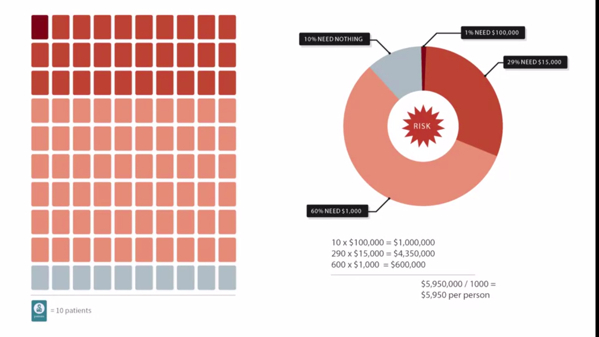

# Introduction to Healthcare

## Table of Contents

- [Introduction to Healthcare](#introduction-to-healthcare)
  - [Table of Contents](#table-of-contents)
    - [Overview of Healthcare Systems and Key Challenges They Face](#overview-of-healthcare-systems-and-key-challenges-they-face)
      - [Introduction HC](#introduction-hc)
      - [A Simple Interaction Between Providers and Patients](#a-simple-interaction-between-providers-and-patients)
      - [The Problem of Risk](#the-problem-of-risk)
      - [Solving the Problem of Risk: Risk Pooling](#solving-the-problem-of-risk-risk-pooling)
      - [Insurance and Intermediaries for Risk Pooling](#insurance-and-intermediaries-for-risk-pooling)
      - [Beyond Patients, Providers, and Intermediaries: Other Players in the Health Care System](#beyond-patients-providers-and-intermediaries-other-players-in-the-health-care-system)
      - [Overview of the Types and Roles of Intermediaries](#overview-of-the-types-and-roles-of-intermediaries)
      - [Overview of the Types and Roles of Providers](#overview-of-the-types-and-roles-of-providers)

### Overview of Healthcare Systems and Key Challenges They Face

#### Introduction HC

#### A Simple Interaction Between Providers and Patients

**Small Image**: 

**Little Big Picture**:

#### The Problem of Risk

**We need to made our more sophisticated**:

**Sophisticated HC Effect**

**Unplanned Issues**

**Risk between Patient and Service Provider**

#### Solving the Problem of Risk: Risk Pooling

**Poll the Risk**:

**Assumption**:

**Risk Polling Share in the Groups**:

**Calculation**:

#### Insurance and Intermediaries for Risk Pooling

**Ultimate Healthcare Risk System for Payment**:

**Quiz#1**:

**Question**: What are the two general kinds of intermediaries that do risk-pooling in the US healthcare system? Describe at least one important difference between them.

**Answer**: Insurance companies and government/government programs. Insurance companies sell insurance policies to their enrollees, who pay the insurance company a premium to be covered under that policy. Governments collect funds, either through the tax system or via a premium system, and use those funds to cover the health costs for a group of people.

#### Beyond Patients, Providers, and Intermediaries: Other Players in the Health Care System

**Government Rules** First, the role of governments. We've already noted that governments can be involved in setting up and operating intermediaries, but governments can play other roles as well. In some countries, governments are directly involved in providing care. They may directly hire physicians, or they may set up and operate hospitals, for example. Even when governments are not directly involved in the operation of intermediaries, or in the provision of care, they are very often part of the story, in that they regulate aspects of the healthcare system.

**Company Rules**: There are lots of other companies operating in and around the healthcare system also providing services to healthcare providers, sometimes services to patients, for example, creating data systems and computer systems that can manage patient health records. Sometimes we call these electronic health records or electronic medical records. As another example, there may be companies looking to create applications for patients that they can use to manage their health. Now beyond these two groups, there can also be others depending on the system. There are professional societies and related organizations that work with providers, like medical associations that work with physicians. There are groups and professionals working on public health that can be philanthropies that provide or finance care for people that might face challenges getting care, the list could go on. Overall, it's important to remember that healthcare systems have a variety of components. We'll try to draw out the most important ones. 

#### Overview of the Types and Roles of Intermediaries

Intermediaries these days are not only pulling risk. Pulling risk, is of course a core activity of intermediaries, risk is kind of why we have them. But once the intermediaries are holding the risk though, they get additional incentives and additional interests. Now they've got a more or less fixed pool of money they've collected from premiums and they're on the hook if their members get a lot of care. So they get an interest in influencing the care that their members get. If they can manage the cost of care in a responsible way, so they don't drive away their customers, they'll do better in business. Now they can do that in a bunch of different ways, which will lead to differences from one intermediary to the next. Some intermediaries might decide to spend a lot of energy trying to manage the care that their members get. Have you heard the term managed care? One place it comes from, other intermediaries less so. Variations and approaches to this can be interesting and lead to lots of terms that we'll encounter. 

#### Overview of the Types and Roles of Providers