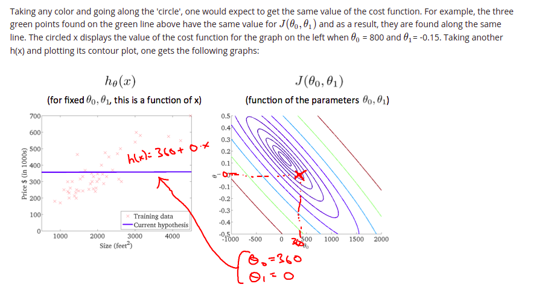

# Machine Learning

What is machine learning? You probably use it dozens of times a day without even knowing it. Each time you do a web search on Google or Bing, that works so well because their machine learning software has figured out how to **rank** what pages. When Facebook or Apple's photo application **recognizes** your friends in your pictures, that's also machine learning. Each time you read your email and a **spam** filter saves you from having to wade through tons of spam, again, that's because your computer has learned to distinguish spam from non-spam email. So, that's machine learning. There's a science of getting computers to learn without being explicitly programmed. One of the research projects that I'm working on is getting robots to tidy up the house. How do you go about doing that? Well what you can do is have the robot watch you demonstrate the task and learn from that. The robot can then watch what objects you pick up and where to put them and try to do the same thing even when you aren't there. For me, one of the reasons I'm excited about this is the AI, or artificial intelligence problem. Building truly **intelligent** machines, we can do just about anything that you or I can do. Many scientists think the best way to make progress on this is through learning algorithms called neural networks, which mimic how the human brain works, and I'll teach you about that, too. `In this class, you learn about machine learning and get to implement them yourself`.

## Table of Contents

- [Machine Learning](#machine-learning)
  - [Table of Contents](#table-of-contents)
    - [Introduction](#introduction)
      - [Welcome](#welcome)
      - [What is Machine Learning?](#what-is-machine-learning)
      - [Supervised Learning](#supervised-learning)
      - [Unsupervised Learning](#unsupervised-learning)
      - [Model Representation](#model-representation)
      - [Cost Function](#cost-function)
      - [Cost Function - Intuition I](#cost-function---intuition-i)
      - [Cost Function - Intuition II](#cost-function---intuition-ii)
  
### Introduction

#### Welcome

- Ranking Pages (Google)
- Photo Recognition
- Spam or Not Spam

**Machine learning is so exciting that** - 

- Grew out of work in AI
- New capability of Computers

**Examples**:

- **Database mining**
  - Web click data, medical records, biology, engineering.
- **Applications programmed not by hand**
  - Autonomous Helicopter, Handwriting Recognition, NLP, Computer Vision.
- **Self Customizing programs**
  - Amazon, Netflix recommendations.
- **Understanding Human learning**
  - Brain, Real AI 

#### What is Machine Learning?

Two definitions of Machine Learning are offered. Arthur Samuel described it as: `"the field of study that gives computers the ability to learn without being explicitly programmed."` This is an older, informal definition.

Tom Mitchell provides a more modern definition: "A computer program is said to learn from **experience** `E` with respect to some class of **tasks** `T` and **performance** measure `P`, if its performance at tasks in `T`, as measured by `P`, improves with experience `E`."

Example: playing checkers.

E = the experience of playing many games of checkers

T = the task of playing checkers.

P = the probability that the program will win the next game.

In general, any machine learning problem can be assigned to one of **two broad classifications**:

**Supervised learning** and **Unsupervised learning**.

#### Supervised Learning

> In supervised learning **right answer** is given.

**Regression Problem**:


**Classification Problem**


**Supervised Learning**:

In supervised learning, we are given a data set and already know what our `correct output` should look like, having the idea that there is a `relationship between the input and the output`.

Supervised learning problems are categorized into "**regression**" and "**classification**" problems. In a regression problem, we are trying to predict results within a **continuous** output, meaning that we are trying to map input variables to some continuous function. In a classification problem, we are instead trying to predict results in a **discrete** output. In other words, we are trying to map input variables into discrete categories. 

**Example 1**:

Given data about the size of houses on the real estate market, try to predict their price. Price as a function of size is a continuous output, so this is a regression problem.

We could turn this example into a classification problem by instead making our output about whether the house "sells for more or less than the asking price." Here we are classifying the houses based on price into two discrete categories.

**Example 2**:

(a) Regression - Given a picture of a person, we have to predict their age on the basis of the given picture

(b) Classification - Given a patient with a tumor, we have to predict whether the tumor is malignant or benign. 

#### Unsupervised Learning

Unsupervised learning allows us to approach problems with little or no idea what our results should look like. We can derive structure from data where we don't necessarily know the effect of the variables.

We can derive this structure by **clustering** the data based on relationships among the variables in the data.

With unsupervised learning there is no feedback based on the prediction results.

**Example**:

**Clustering**: Take a collection of 1,000,000 different genes, and find a way to automatically group these genes into groups that are somehow similar or related by different variables, such as lifespan, location, roles, and so on.


**Non-clustering**: The `"Cocktail Party Algorithm"`, allows you to find structure in a chaotic environment. (i.e. identifying individual voices and music from a mesh of sounds at a cocktail party).

> Cocktail Party Algorithm

#### Model Representation

- `m`: number of training examples
- `x`: input variable / **features** 
- `y`: output variable

Single training example -> (x, y) 

```text
(x^i, y^i) -> i-th training example
```


**Note**: Hypothesis


#### Cost Function


#### Cost Function - Intuition I


#### Cost Function - Intuition II





