# Machine Learning with Python

## Table of Contents

- [Machine Learning with Python](#machine-learning-with-python)
  - [Table of Contents](#table-of-contents)
    - [What is Machine Learning](#what-is-machine-learning)
      - [Welcome](#welcome)
      - [Introduction to Machine Learning](#introduction-to-machine-learning)
      - [Python for Machine Learning](#python-for-machine-learning)
      - [Supervised vs Unsupervised](#supervised-vs-unsupervised)
    - [Regression](#regression)
      - [Simple Linear Regression](#simple-linear-regression)
      - [Model Evaluation in Regression Models](#model-evaluation-in-regression-models)
      - [Evaluation Metrics in Regression Models](#evaluation-metrics-in-regression-models)
      - [Simple Linear Regression Code](#simple-linear-regression-code)
      - [Multiple Linear Regression](#multiple-linear-regression)
      - [Code Multiple Linear Regression](#code-multiple-linear-regression)
      - [Non-Linear Regression](#non-linear-regression)
    - [Classification](#classification)
      - [What is Classification](#what-is-classification)
      - [K-Nearest Neighbours](#k-nearest-neighbours)
      - [Evaluation Metrics in Classification](#evaluation-metrics-in-classification)

### What is Machine Learning

#### Welcome

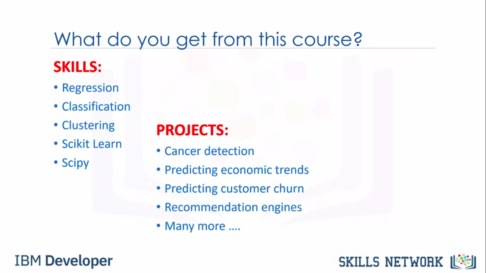

#### Introduction to Machine Learning

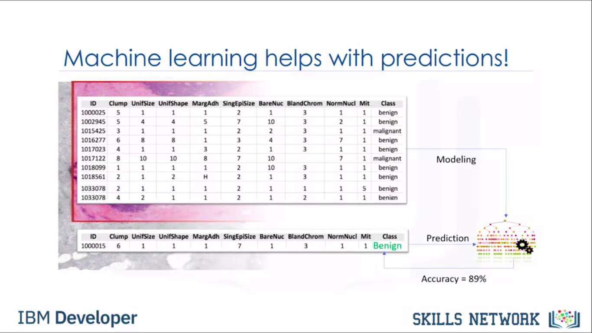

Hello, and welcome! In this video I will give you a high level introduction to Machine Learning. So let’s get started. This is a human cell sample extracted from a patient, and this cell has characteristics. For example, its clump thickness is 6, its uniformity of cell size is 1, its marginal adhesion is 1, and so on. One of the interesting questions we can ask, at this point is: Is this a benign or malignant cell? In contrast with a benign tumor, a malignant tumor is a tumor that may invade its surrounding tissue or spread around the body, and diagnosing it early might be the key to a patient’s survival. One could easily presume that only a doctor with years of experience could diagnose that tumor and say if the patient is developing cancer or not. Right? Well, imagine that you’ve obtained a dataset containing characteristics of thousands of human cell samples extracted from patients who were believed to be at risk of developing cancer. Analysis of the original data showed that many of the characteristics differed significantly between benign and malignant samples. You can use the values of these cell characteristics in samples from other patients to give an early indication of whether a new sample might be benign or malignant. You should clean your data, select a proper algorithm for building a prediction model, and train your model to understand patterns of benign or malignant cells within the data. Once the model has been trained by going through data iteratively, it can be used to predict your new or unknown cell with a rather high accuracy. This is machine learning! It is the way that a machine learning model can do a doctor’s task or at least help that doctor make the process faster.

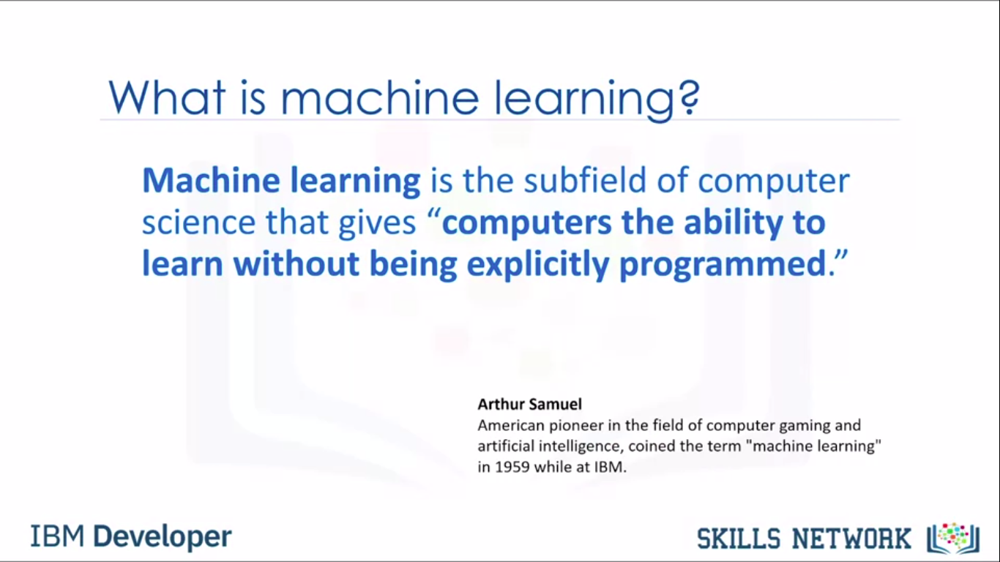

Now, let me give a formal definition of machine learning. Machine learning is the subfield of computer science that gives "computers the ability to learn without being explicitly programmed.” Let me explain what I mean when I say “without being explicitly programmed.”

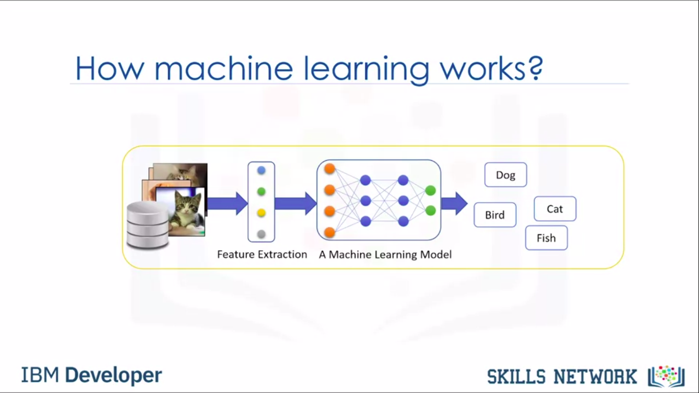

Assume that you have a dataset of images of animals such as cats and dogs, and you want to have software or an application that can recognize and differentiate them. The first thing that you have to do here is interpret the images as a set of feature sets. For example, does the image show the animal’s eyes? If so, what is their size? Does it have ears? What about a tail? How many legs? Does it have wings? Prior to machine learning, each image would be transformed to a vector of features. Then, traditionally, we had to write down some rules or methods in order to get computers to be intelligent and detect the animals. But, it was a failure. Why? Well, as you can guess, it needed a lot of rules, highly dependent on the current dataset, and not generalized enough to detect out-of-sample cases. This is when machine learning entered the scene. Using machine learning, allows us to build a model that looks at all the feature sets, and their corresponding type of animals, and it learns the pattern of each animal. It is a model built by machine learning algorithms. It detects without explicitly being programmed to do so. In essence, machine learning follows the same process that a 4-year-old child uses to learn, understand, and differentiate animals. So, machine learning algorithms, inspired by the human learning process, iteratively learn from data, and allow computers to find hidden insights. These models help us in a variety of tasks, such as object recognition, summarization, recommendation, and so on. Machine Learning impacts society in a very influential way.


Here are some real-life examples. First, how do you think Netflix and Amazon recommend videos, movies, and TV shows to its users? They use Machine Learning to produce suggestions that you might enjoy! This is similar to how your friends might recommend a television show to you, based on their knowledge of the types of shows you like to watch. How do you think banks make a decision when approving a loan application? They use machine learning to predict the probability of default for each applicant, and then approve or refuse the loan application based on that probability. Telecommunication companies use their customers’ demographic data to segment them, or predict if they will unsubscribe from their company the next month.

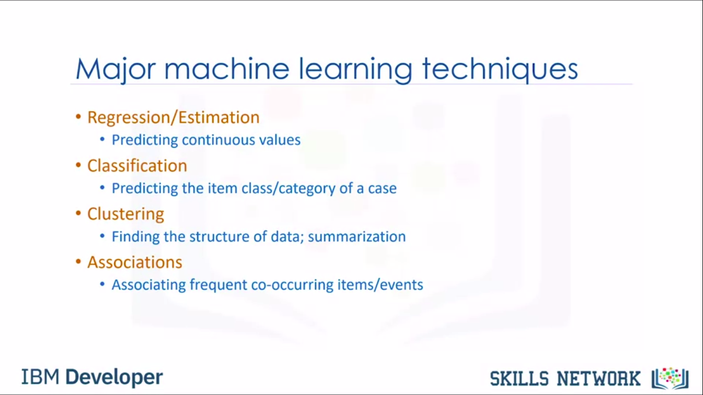

There are many other applications of machine learning that we see every day in our daily life, such as chatbot, logging into our phones or even computer games using face recognition. Each of these use different machine learning techniques and algorithms. So, let’s quickly examine a few of the more popular techniques. The Regression/Estimation technique is used for predicting a continuous value. For example, predicting things like the price of a house based on its characteristics, or to estimate the Co2 emission from a car’s engine. A Classification technique is used for Predicting the class or category of a case, for example, if a cell is benign or malignant, or whether or not a customer will churn. Clustering groups of similar cases, for example, can find similar patients, or can be used for customer segmentation in the banking field. Association technique is used for finding items or events that often co-occur, for example, grocery items that are usually bought together by a particular customer.

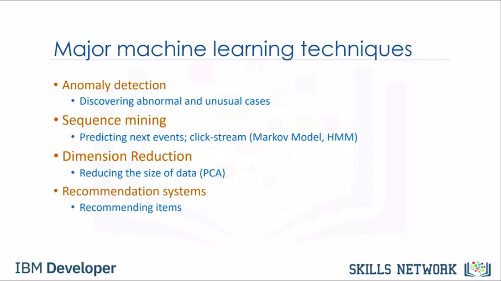

Anomaly detection is used to discover abnormal and unusual cases, for example, it is used for credit card fraud detection. Sequence mining is used for predicting the next event, for instance, the click-stream in websites. Dimension reduction is used to reduce the size of data. And finally, recommendation systems, this associates people's preferences with others who have similar tastes, and recommends new items to them, such as books or movies. We will cover some of these techniques in the next videos.


By this point, I’m quite sure this question has crossed your mind, “What is the difference between these buzzwords that we keep hearing these days, such as Artificial intelligence (or AI), Machine Learning and Deep Learning?” Well, let me explain what is different between them. In brief, AI tries to make computers intelligent in order to mimic the cognitive functions of humans. So, Artificial Intelligence is a general field with a broad scope including: Computer Vision, Language Processing, Creativity, and Summarization. Machine Learning is the branch of AI that covers the statistical part of artificial intelligence. It teaches the computer to solve problems by looking at hundreds or thousands of examples, learning from them, and then using that experience to solve the same problem in new situations. And Deep Learning is a very special field of Machine Learning where computers can actually learn and make intelligent decisions on their own. Deep learning involves a deeper level of automation in comparison with most machine learning algorithms. Now that we’ve completed the introduction to Machine Learning, subsequent videos will focus on reviewing two main components: First, you’ll be learning about the purpose of Machine Learning and where it can be applied in the real world; and Second, you’ll get a general overview of Machine Learning topics, such as supervised vs unsupervised learning, model evaluation and various Machine Learning algorithms. So now that you have a sense with what’s in store on this journey, let’s continue our exploration of Machine Learning!

#### Python for Machine Learning


Hello and welcome. In this video, we'll talk about how to use Python for machine learning. So let's get started. Python is a popular and powerful general purpose programming language that recently emerged as the preferred language among data scientists. You can write your machine-learning algorithms using Python, and it works very well. However, there are a lot of modules and libraries already implemented in Python, that can make your life much easier. We try to introduce the Python packages in this course and use it in the labs to give you better hands-on experience. The first package is NumPy which is a math library to work with N-dimensional arrays in Python. It enables you to do computation efficiently and effectively. It is better than regular Python because of its amazing capabilities. For example, for working with arrays, dictionaries, functions, datatypes and working with images you need to know NumPy. SciPy is a collection of numerical algorithms and domain specific toolboxes, including signal processing, optimization, statistics and much more. SciPy is a good library for scientific and high performance computation. Matplotlib is a very popular plotting package that provides 2D plotting, as well as 3D plotting. Basic knowledge about these three packages which are built on top of Python, is a good asset for data scientists who want to work with real-world problems. If you're not familiar with these packages, I recommend that you take the data analysis with Python course first. This course covers most of the useful topics in these packages. Pandas library is a very high-level Python library that provides high performance easy to use data structures. It has many functions for data importing, manipulation and analysis. In particular, it offers data structures and operations for manipulating numerical tables and timeseries. SciKit Learn is a collection of algorithms and tools for machine learning which is our focus here and which you'll learn to use within this course.

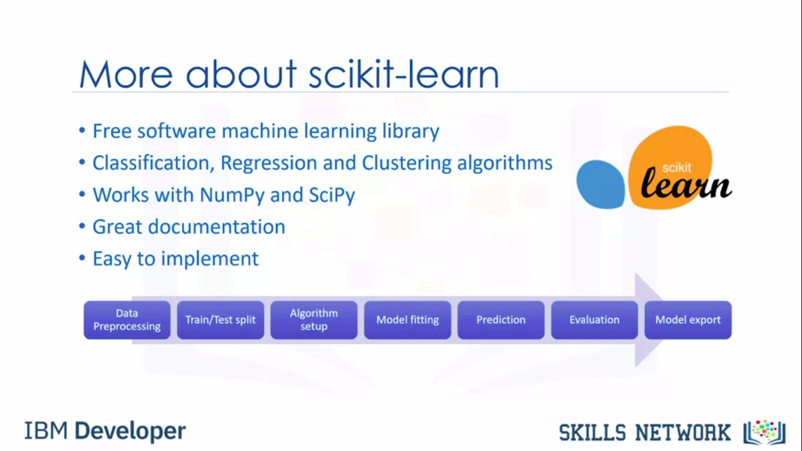

As we'll be using SciKit Learn quite a bit in the labs, let me explain more about it and show you why it is so popular among data scientists. SciKit Learn is a free Machine Learning Library for the Python programming language. It has most of the classification, regression and clustering algorithms, and it's designed to work with a Python numerical and scientific libraries: NumPy and SciPy. Also, it includes very good documentation. On top of that, implementing machine learning models with SciKit Learn is really easy with a few lines of Python code. Most of the tasks that need to be done in a machine learning pipeline are implemented already in Scikit Learn including pre-processing of data, feature selection, feature extraction, train test splitting, defining the algorithms, fitting models, tuning parameters, prediction, evaluation, and exporting the model.

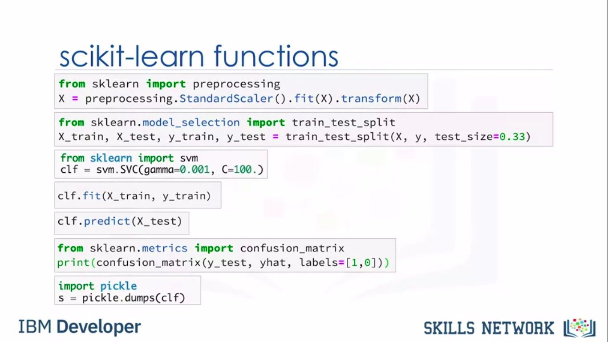

Let me show you an example of how SciKit Learn looks like when you use this library. You don't have to understand the code for now but just see how easily you can build a model with just a few lines of code. Basically, machine-learning algorithms benefit from standardization of the dataset. If there are some outliers or different scales fields in your dataset, you have to fix them. The pre-processing package of SciKit Learn provides several common utility functions and transformer classes to change raw feature vectors into a suitable form of vector for modeling. You have to split your dataset into train and test sets to train your model and then test the model's accuracy separately. SciKit Learn can split arrays or matrices into random train and test subsets for you in one line of code. Then you can set up your algorithm. For example, you can build a classifier using a support vector classification algorithm. We call our estimator instance CLF and initialize its parameters. Now you can train your model with the train set by passing our training set to the fit method, the CLF model learns to classify unknown cases. Then we can use our test set to run predictions, and the result tells us what the class of each unknown value is. Also, you can use the different metrics to evaluate your model accuracy. For example, using a confusion matrix to show the results. And finally, you save your model. You may find all or some of these machine-learning terms confusing but don't worry, we'll talk about all of these topics in the following videos. The most important point to remember is that the entire process of a machine learning task can be done simply in a few lines of code using SciKit Learn. Please notice that though it is possible, it would not be that easy if you want to do all of this using NumPy or SciPy packages. And of course, it needs much more coding if you use pure Python programming to implement all of these tasks.

#### Supervised vs Unsupervised

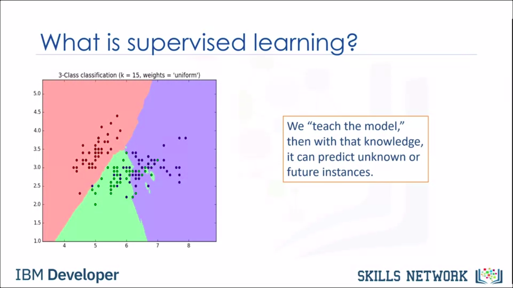

Hello, and welcome. In this video we'll introduce supervised algorithms versus unsupervised algorithms. So, let's get started. An easy way to begin grasping the concept of supervised learning is by looking directly at the words that make it up. Supervise, means to observe, and direct the execution of a task, project, or activity. Obviously we aren't going to be supervising a person, instead will be supervising a machine learning model that might be able to produce classification regions like we see here. So, how do we supervise a machine learning model? We do this by teaching the model, that is we load the model with knowledge so that we can have it predict future instances. But this leads to the next question which is, how exactly do we teach a model?

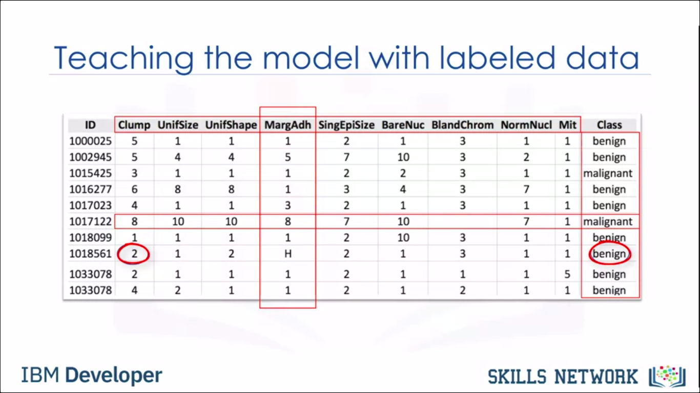

We teach the model by training it with some data from a labeled dataset. It's important to note that the data is labeled, and what does a labeled dataset look like? Well, it could look something like this. This example is taken from the cancer dataset. As you can see, we have some historical data for patients, and we already know the class of each row. Let's start by introducing some components of this table. The names up here which are called clump thickness, uniformity of cell size, uniformity of cell shape, marginal adhesion and so on are called attributes. The columns are called features which include the data. If you plot this data, and look at a single data point on a plot, it'll have all of these attributes that would make a row on this chart also referred to as an observation. Looking directly at the value of the data, you can have two kinds. The first is numerical. When dealing with machine learning, the most commonly used data is numeric. The second is categorical, that is its non-numeric because it contains characters rather than numbers. In this case, it's categorical because this dataset is made for classification.

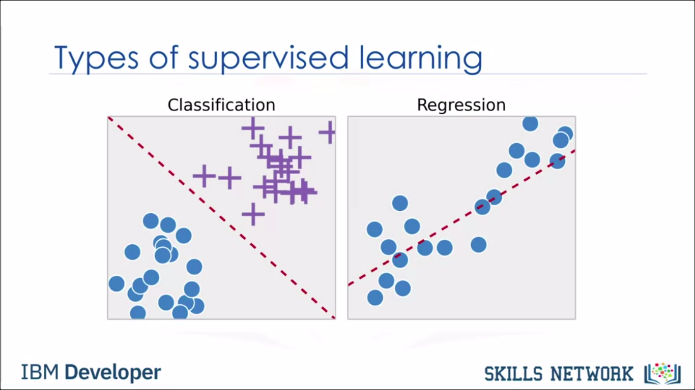

There are two types of supervised learning techniques. They are classification, and regression.

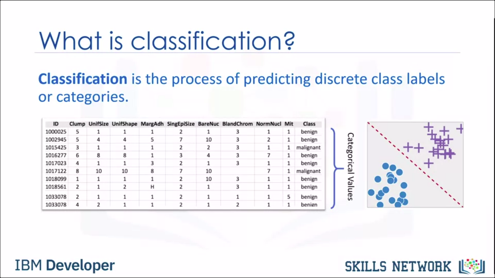

Classification is the process of predicting a discrete class label, or category.

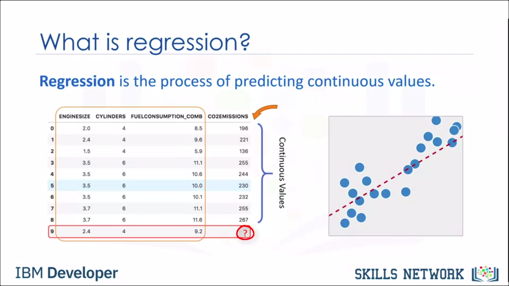

Regression is the process of predicting a continuous value as opposed to predicting a categorical value in classification. Look at this dataset. It is related to CO2 emissions of different cars. It includes; engine size, cylinders, fuel consumption, and CO2 emission of various models of automobiles. Given this dataset, you can use regression to predict the CO2 emission of a new car by using other fields such as engine size, or number of cylinders.
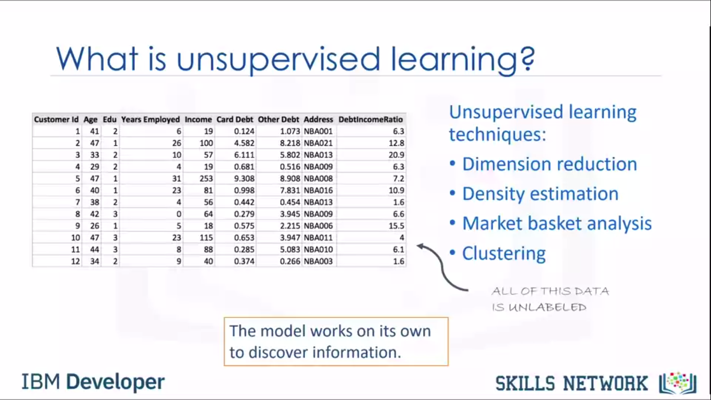

Since we know the meaning of supervised learning, what do you think unsupervised learning means? Yes, unsupervised learning is exactly as it sounds. We do not supervise the model, but we let the model work on its own to discover information that may not be visible to the human eye. It means, the unsupervised algorithm trains on the dataset, and draws conclusions on unlabeled data. Generally speaking, unsupervised learning has more difficult algorithms than supervised learning since we know little to no information about the data, or the outcomes that are to be expected. Dimension reduction, density estimation, market basket analysis, and clustering are the most widely used unsupervised machine learning techniques. Dimensionality reduction, and/or feature selection, play a large role in this by reducing redundant features to make the classification easier. Market basket analysis is a modeling technique based upon the theory that if you buy a certain group of items, you're more likely to buy another group of items. Density estimation is a very simple concept that is mostly used to explore the data to find some structure within it.

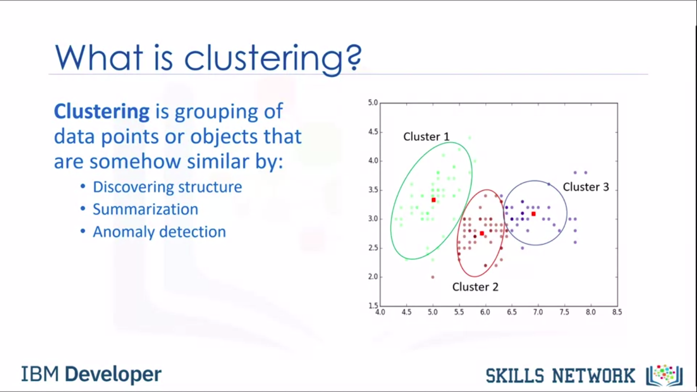

And finally, clustering: Clustering is considered to be one of the most popular unsupervised machine learning techniques used for grouping data points, or objects that are somehow similar. Cluster analysis has many applications in different domains, whether it be a bank's desire to segment his customers based on certain characteristics, or helping an individual to organize in-group his, or her favorite types of music. Generally speaking though, clustering is used mostly for discovering structure, summarization, and anomaly detection.

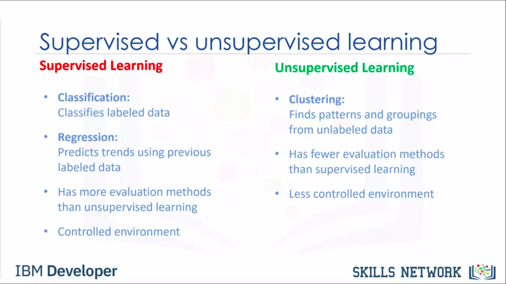

So, to recap, the biggest difference between supervised and unsupervised learning is that supervised learning deals with labeled data while unsupervised learning deals with unlabeled data. In supervised learning, we have machine learning algorithms for classification and regression. In unsupervised learning, we have methods such as clustering. In comparison to supervised learning, unsupervised learning has fewer models and fewer evaluation methods that can be used to ensure that the outcome of the model is accurate. As such, unsupervised learning creates a less controllable environment as the machine is creating outcomes for us.

### Regression

Hello and welcome! In this video we'll be giving a brief introduction to regression. So let's get started. Look at this data set.

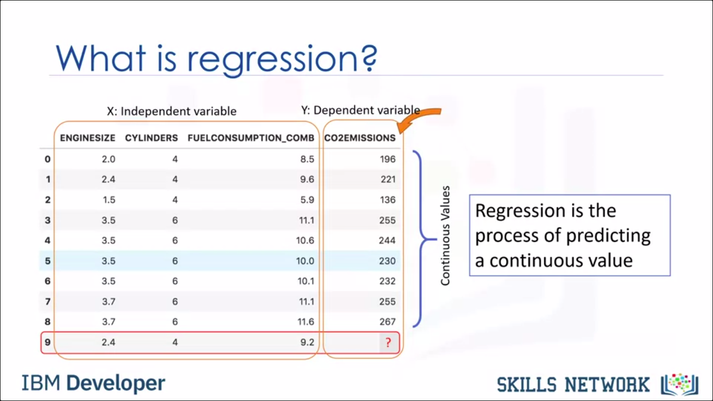

It's related to co2 emissions from different cars. It includes engine size, number of cylinders, fuel consumption, and co2 emission from various automobile models. The question is: given this data set can we predict the co2 emission of a car using other fields such as engine size or cylinders? Let's assume we have some historical data from different cars and assume that a car such as in row 9 has not been manufactured yet, but we're interested in estimating its approximate co2 emission after production. Is it possible? We can use regression methods to predict a continuous value such as co2 emission using some other variables. Indeed regression is the process of predicting a continuous value. In regression there are two types of variables: a dependent variable and one or more independent variables. The dependent variable can be seen as the state, target, or final goal we study and try to predict. And the independent variables, also known as explanatory variables, can be seen as the causes of those states. The independent variables are shown conventionally by X and the dependent variable is notated by Y. A regression model relates Y or the dependent variable to a function of X i.e. the independent variables. The key point in the regression is that our dependent value should be continuous and cannot be a discrete value. However, the independent variable, or variables, can be measured on either a categorical or continuous measurement scale.

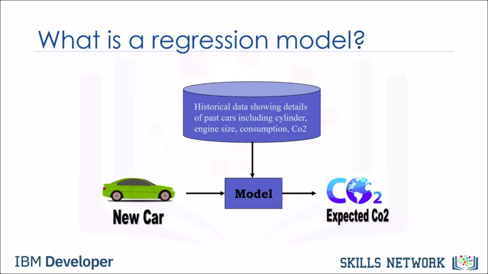

So, what we want to do here is to use the historical data of some cars using one or more of their features and from that data make a model. We use regression to build such a regression estimation model; then the model is used to predict the expected co2 emission for a new or unknown car.

Basically there are two types of regression models simple regression and multiple regression.

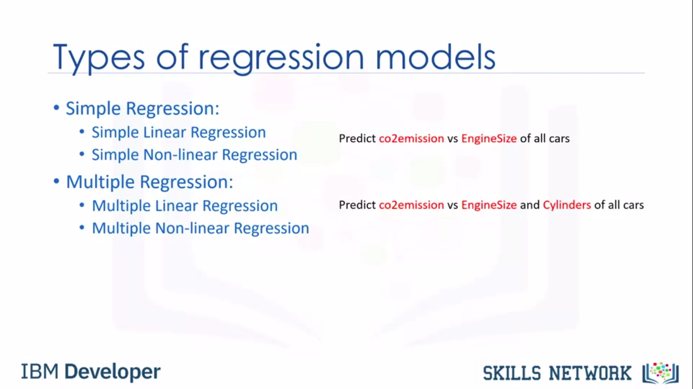

Simple regression is when one independent variable is used to estimate a dependent variable. It can be either linear or non-linear. For example, predicting co2 emission using the variable of engine size. Linearity of regression is based on the nature of relationship between independent and dependent variables. When more than one independent variable is present the process is called multiple linear regression. For example, predicting co2 emission using engine size and the number of cylinders in any given car. Again, depending on the relation between dependent and independent variables it can be either linear or non-linear regression.

Let's examine some sample applications of regression.

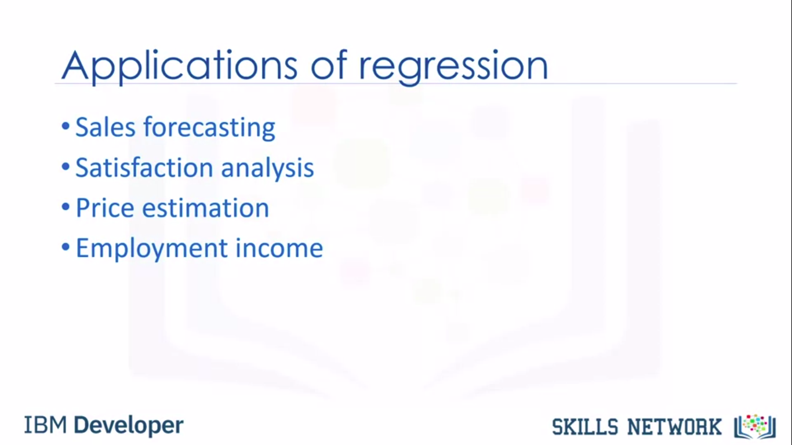

Essentially we use regression when we want to estimate a continuous value. For instance, one of the applications of regression analysis could be in the area of sales forecasting. You can try to predict a sales person's total yearly sales from independent variables such as age, education, and years of experience. It can also be used in the field of psychology, for example, to determine individual satisfaction, based on demographic and psychological factors. We can use regression analysis to predict the price of a house in an area, based on its size number of bedrooms, and so on. We can even use it to predict employment income for independent variables such as hours of work, education, occupation, sex, age, years of experience, and so on. Indeed, you can find many examples of the usefulness of regression analysis in these and many other fields or domains, such as finance, healthcare, retail, and more.

We have many regression algorithms, each of them has its own importance and a specific condition to which their application is best suited.

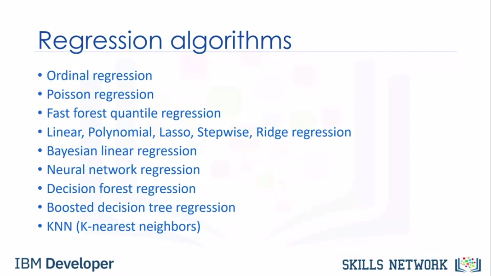

And while we've covered just a few of them in this course, it gives you enough base knowledge for you to explore different regression techniques. Thanks for watching.

#### Simple Linear Regression

Hello and welcome. In this video, we'll be covering 1linear regression1. You don't need to know any linear algebra to understand topics in linear regression. This high-level introduction will give you enough background information on linear regression to be able to use it effectively on your own problems. So let's get started.

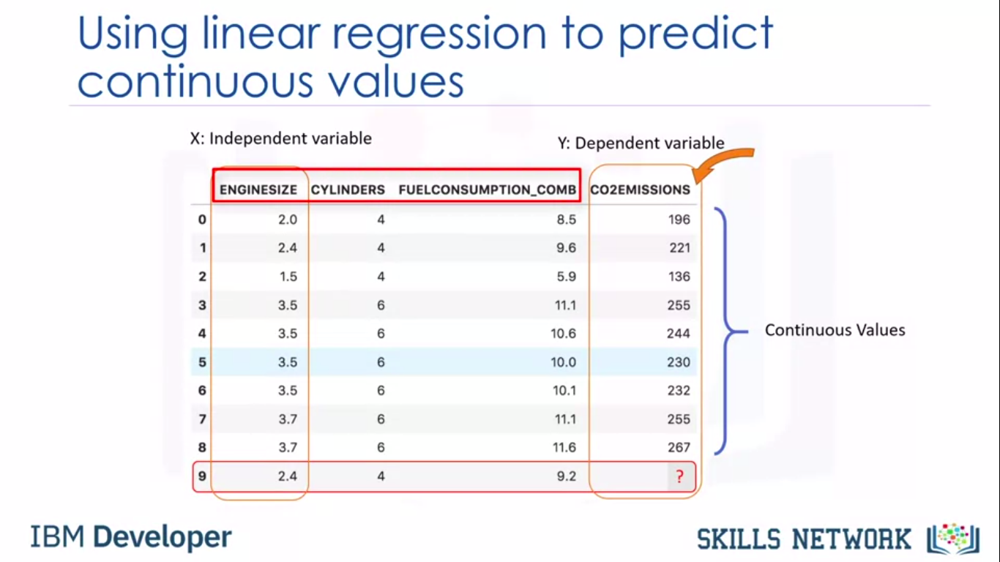

Let's take a look at this data set. It's related to the `Co2 emission` of different cars. It includes `engine size`, `cylinders`, `fuel consumption` and `Co2 emissions` for various car models. The question is, given this data set, can we predict the Co2 emission of a car using another field such as engine size? Quite simply, yes. We can use linear regression to predict a continuous value such as Co2 emission by using other variables. Linear regression is the approximation of a linear model used to describe the **relationship** between two or more variables. In simple linear regression, there are `two variables`, a **dependent** variable and an **independent** variable. The key point in the linear regression is that our dependent value should be **continuous** and cannot be a discrete value. However, the independent variables can be measured on either a categorical or continuous measurement scale.

There are two types of linear regression models.


They are simple regression and multiple regression. Simple linear regression is when one independent variable is used to estimate a dependent variable. For example, predicting Co2 emission using the engine size variable. When more than one independent variable is present the process is called multiple linear regression, for example, predicting Co2 emission using engine size and cylinders of cars. Our focus in this video is on simple linear regression.

Now let's see how linear regression works. Okay, so let's look at our data set again.

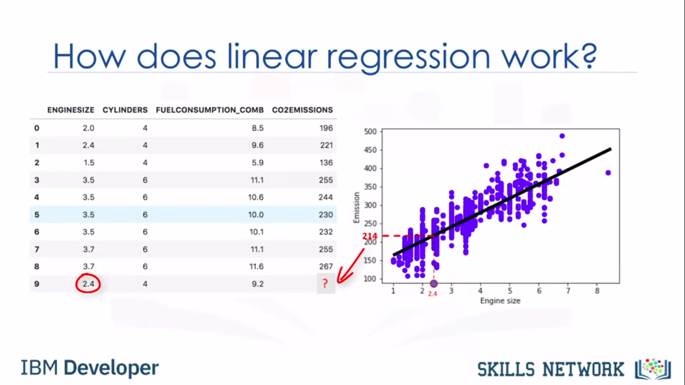

To understand linear regression, we can plot our variables here. We show engine size as an independent variable and emission as the target value that we would like to predict. A scatter plot clearly shows the relation between variables where changes in one variable explain or possibly cause changes in the other variable. Also, it indicates that these variables are linearly related. With linear regression you can fit a line through the data. For instance, as the engine size increases, so do the emissions. With linear regression you can model the relationship of these variables. A good model can be used to predict what the approximate emission of each car is. How do we use this line for prediction now?

Let us assume for a moment that the line is a good fit of the data. We can use it to predict the emission of an unknown
car.

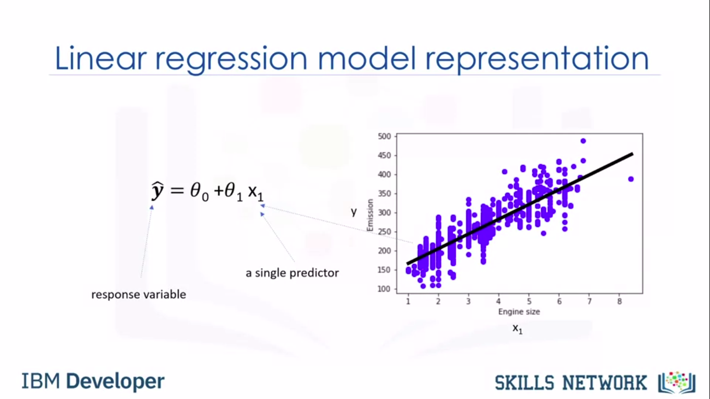

For example, for a sample car with engine size `2.4`, you can find the emission is `214`.
Now, let's talk about what the fitting line actually is.
We're going to predict the target value `y`. In our case using the independent variable engine size represented by `x1`. The fit line is shown traditionally as a **polynomial**. In a simple regression problem, a single `x`, the form of the model would be `theta` `0` plus `theta 1` `x1`. In this equation, `y` hat is the dependent variable of the predicted value. And `x1` is the independent variable.
Theta 0 and theta 1 are the parameters of the line that we must adjust. Theta 1 is known as the slope or gradient of the fitting line and theta 0 is known as the intercept.
Theta 0 and theta 1 are also called the coefficients of the linear equation.
You can interpret this equation as y hat being a function of x1, or y hat being dependent of x1. How would you draw a line through the points? And how do you determine which line fits best?
Linear regression estimates the coefficients of the line. This means we must calculate theta 0 and theta 1 to find the best line to fit the data. This line would best estimate the emission of the unknown data points. Let's see how we can find this line or, to be more precise, how we can adjust the parameters to make the line the best fit for the data.

For a moment, let's assume we've already found the best fit line for our data. Now, let's go through all the points and check how well they align with this line.

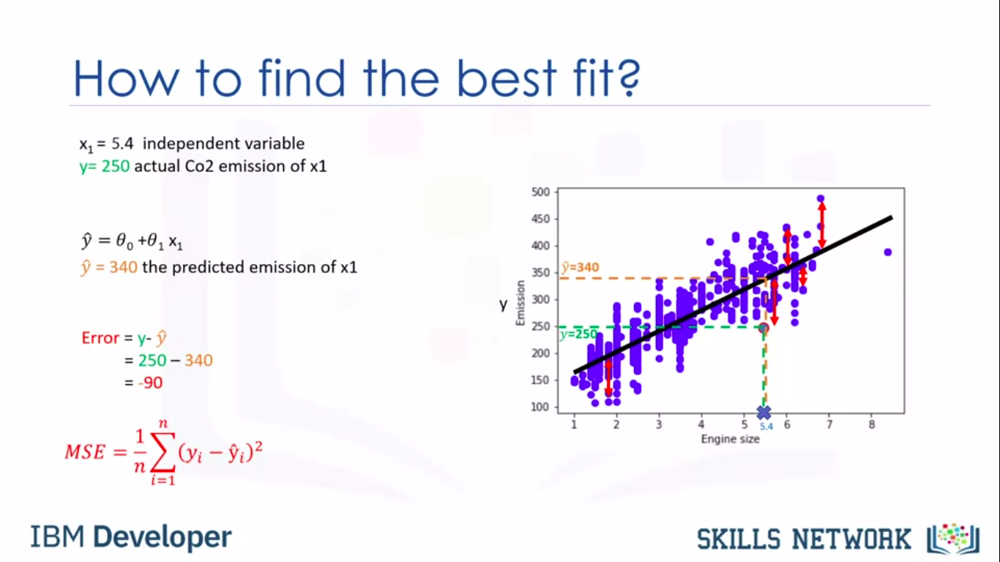

Best fit here means that if we have, for instance, a car with engine size `x1 = 5.4` and actual `Co2 = 250`, its Co2 should be predicted very close to the actual value, which is `y = 250` based on historical data. But if we use the fit line, or better to say using our polynomial with known parameters to predict the Co2 emission, it will return `y hat = 340`. Now if you compare the actual value of the emission of the car with what we've predicted using our model, you will find out that we have a `90 unit error`. This means our prediction line is not accurate. This error is also called the `residual error`. So we can say the error is the distance from the data point to the fitted regression line.
The mean of all residual errors shows how poorly the line fits with the whole data set. Mathematically it can be shown by the equation Mean Squared Error, shown as **MSE**. Our objective is to find a line where the mean of all these errors is minimized. In other words, the mean error of the prediction using the fit line should be minimized. Let's reword it more technically. The objective of linear regression, is to minimize this MSE equation and to minimize it, we should find the best parameters theta 0 and theta 1. Now the question is how to find theta 0 and theta 1 in such a way that it minimizes this error?
How can we find such a perfect line? Or said another way, how should we find the best parameters for our line? Should we move the line a lot randomly and calculate the MSE value every time and choose the minimum one?

Not really. Actually, we have two options here. Option one, we can use a mathematic approach, or option two, we can use an optimization approach. Let's see how we could easily use a mathematic formula to find the theta 0 and
As mentioned before, `theta 0 and theta 1` in the simple linear regression are the **coefficients** of the fit line.

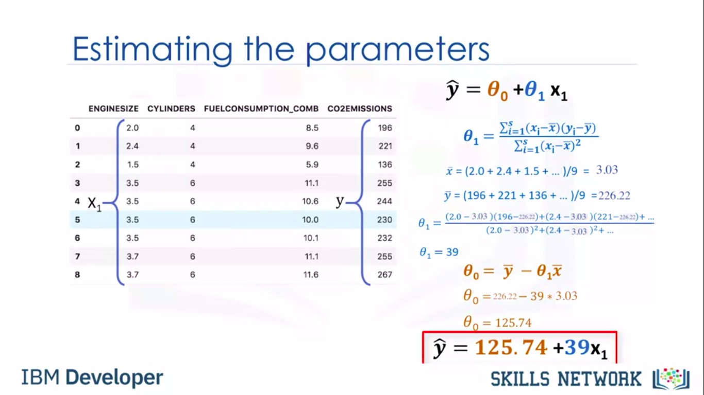

We can use a simple equation to estimate these coefficients. That is, given that it's a simple linear regression with only two parameters, and knowing that theta 0 and theta 1 are the **intercept** and **slope** of the line, we can estimate them directly from our data. It requires that we calculate the mean of the independent and dependent or target columns from the data set. Notice that all of the data must be available to traverse and calculate the parameters. It can be shown that the intercept and slope can be calculated using these equations.
We can start off by estimating the value for theta 1. This is how you can find the slope of a line based on the data. X bar is the average value for the engine size in our data set. Please consider that we have nine rows here, rows 0 to 8. First we calculate the average of x1 and of y, then we plug it into the slope equation to find theta 1.
The xi and yi in the equation refer to the fact that we need to repeat these calculations across all values in our data set. And i refers to the ith value of x or y. Applying all values, we find theta 1 equals 39. It is our second parameter. It is used to calculate the first parameter which is the intercept of the line.
Now we can plug theta 1 into the line equation to find theta 0. It is easily calculated hat theta 0 equals 125.74. So these are the two parameters for the line, where theta 0 is also called the bias coefficient, and theta 1 is the coefficient for the Co2 emission column.

As a side note, you really don't need to remember the formula for calculating these parameters, as most of the libraries used for machine learning in Python, R and Scala can easily find these parameters for you. But it's always good to understand how it works. Now, we can write down the polynomial of the line.

So we know how to find the best fit for our data and its equation. Now the question is how can we use it to predict the emission of a new car based on its engine size?

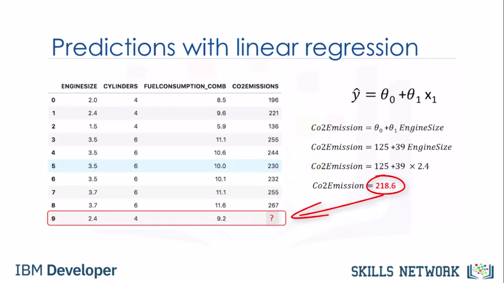

After we found the parameters of the linear equation, making predictions is as simple as solving the equation for a specific set of inputs.
Imagine we are predicting Co2 emission, or y, from engine size, or x for the automobile in record number 9. Our linear regression model representation for this problem would be y hat= theta 0 + theta 1 x1. Or if we map it to our data set, it would be Co2Emission =theta 0 + theta 1 EngineSize.
As we saw, we can find theta 0, theta 1 using the equations that we just talked about. Once found, we can plug in the equation of the linear model. For example, let's use theta 0 = 125 and theta 1 = 39. So we can rewrite the linear model as Co2Emission equals 125 plus 39 EngineSize. Now let's plug in the 9th row of our data set and calculate the Co2 emission for a car with an engine size of 2.4. So `Co2Emission = 125 + 39 x 2.4.` Therefore, we can predict that the Co2Emission for this specific car would be 218.6.

Let's talk a bit about why linear regression is so useful.

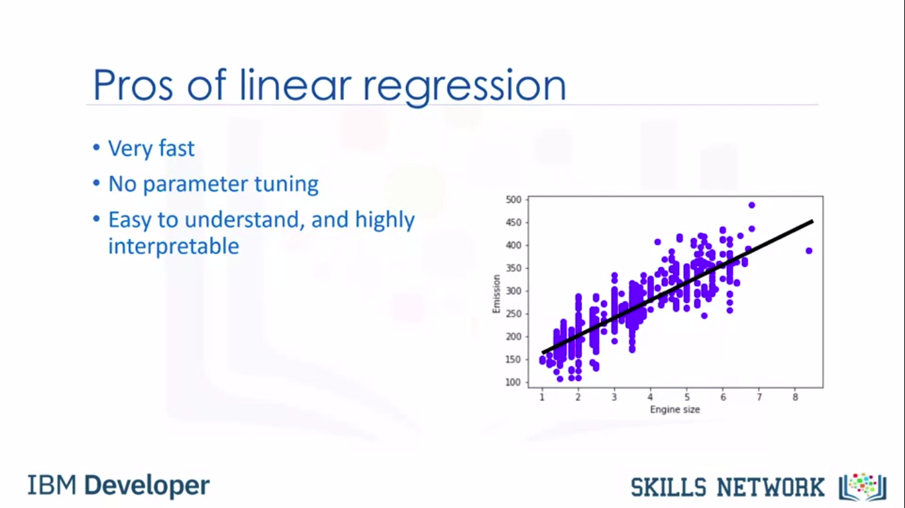

Quite simply, it is the most basic regression to use and understand. In fact, one reason why linear regression is so useful is that it's **fast**. It also doesn't require **tuning** of **parameters**. So something like tuning the K parameter and K nearest neighbors, or the learning rate in neural networks isn't something to worry about. Linear regression is also easy to understand, and highly **interpretable**.

#### Model Evaluation in Regression Models

Hello and welcome. In this video, we'll be covering model evaluation. So let's get started.
The goal of regression is to build a model to accurately predict an unknown case. To this end, we have to perform regression evaluation after building the model. In this video, we'll introduce and discuss two types of evaluation approaches that can be used to achieve this goal.

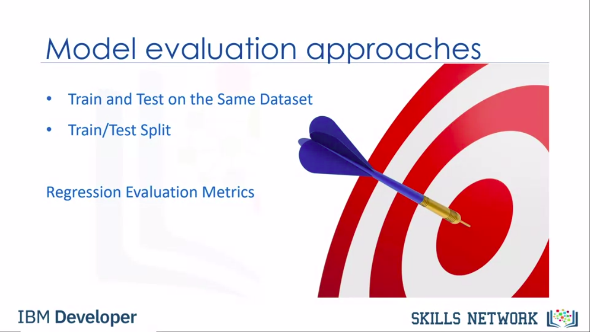

These approaches are train and test on the same dataset and train/test split. We'll talk about what each of these are, as well as the pros and cons of using each of these models. Also, we'll introduce some metrics for accuracy of regression models. Let's look at the first approach.

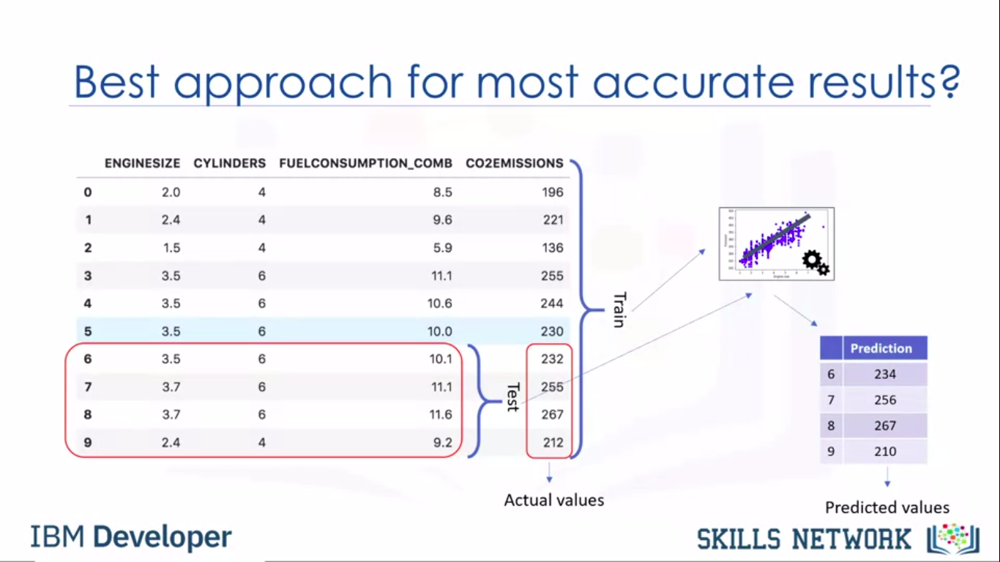

When considering evaluation models, we clearly want to choose the one that will give us the most accurate results. So, the question is, how can we calculate the accuracy of our model? In other words, how much can we trust this model for prediction of an unknown sample using a given dataset and having built a model such as linear regression? One of the solutions is to select a portion of our dataset for testing. For instance, assume that we have 10 records in our dataset. We use the entire dataset for training, and we build a model using this training set. Now, we select a small portion of the dataset, such as row number six to nine, but without the labels. This set is called a test set, which has the labels, but the labels are not used for prediction and is used only as ground truth. The labels are called actual values of the test set. Now we pass the feature set of the testing portion to our built model and predict the target values. Finally, we compare the predicted values by our model with the actual values in the test set. This indicates how accurate our model actually is. There are different metrics to report the accuracy of the model, but most of them work generally based on the similarity of the predicted and actual values.

Let's look at one of the simplest metrics to calculate the accuracy of our regression model.

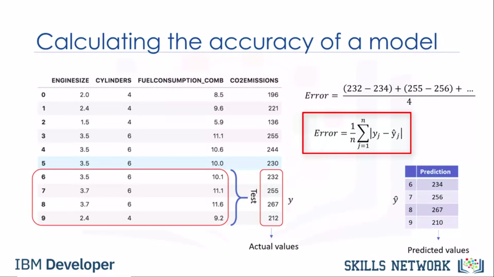

As mentioned, we just compare the actual values y with the predicted values, which is noted as y hat for the testing set. The error of the model is calculated as the average difference between the predicted and actual values for all the rows. We can write this error as an equation.

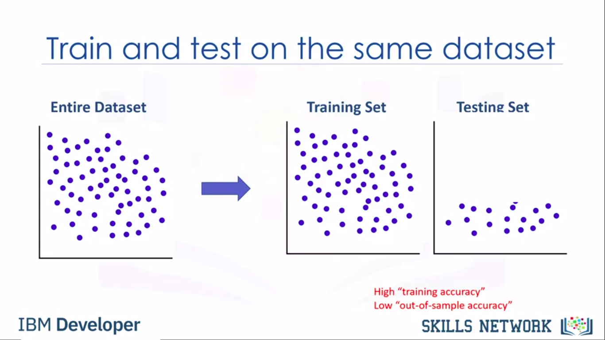

So, the first evaluation approach we just talked about is the simplest one, train and test on the same dataset. Essentially, the name of this approach says it all. You train the model on the entire dataset, then you test it using a portion of the same dataset. In a general sense, when you test with a dataset in which you know the target value for each data point, you're able to obtain a percentage of accurate predictions for the model. This evaluation approach would most likely have a high training accuracy and the low out-of-sample accuracy since the model knows all of the testing data points from the training.

What is training accuracy and out-of-sample accuracy?

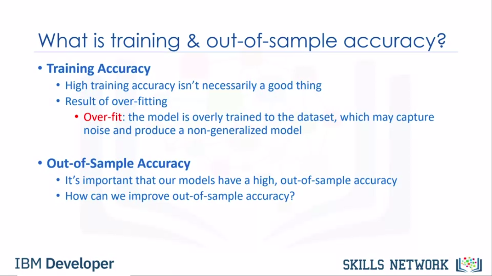

We said that training and testing on the same dataset produces a high training accuracy, but what exactly is training accuracy? Training accuracy is the percentage of correct predictions that the model makes when using the test dataset. However, a high training accuracy isn't necessarily a good thing. For instance, having a high training accuracy may result in an over-fit the data. This means that the model is overly trained to the dataset, which may capture noise and produce a non-generalized model. Out-of-sample accuracy is the percentage of correct predictions that the model makes on data that the model has not been trained on. Doing a train and test on the same dataset will most likely have low out-of-sample accuracy due to the likelihood of being over-fit. It's important that our models have high out-of-sample accuracy because the purpose of our model is, of course, to make correct predictions on unknown data. So, how can we improve out-of-sample accuracy?

One way is to use another evaluation approach called train/test split.

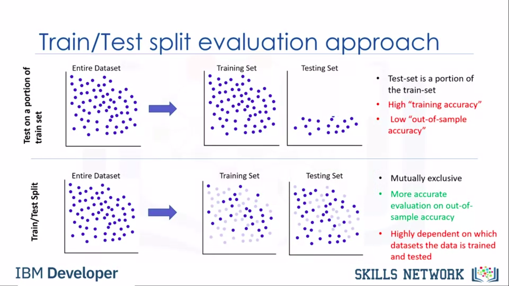
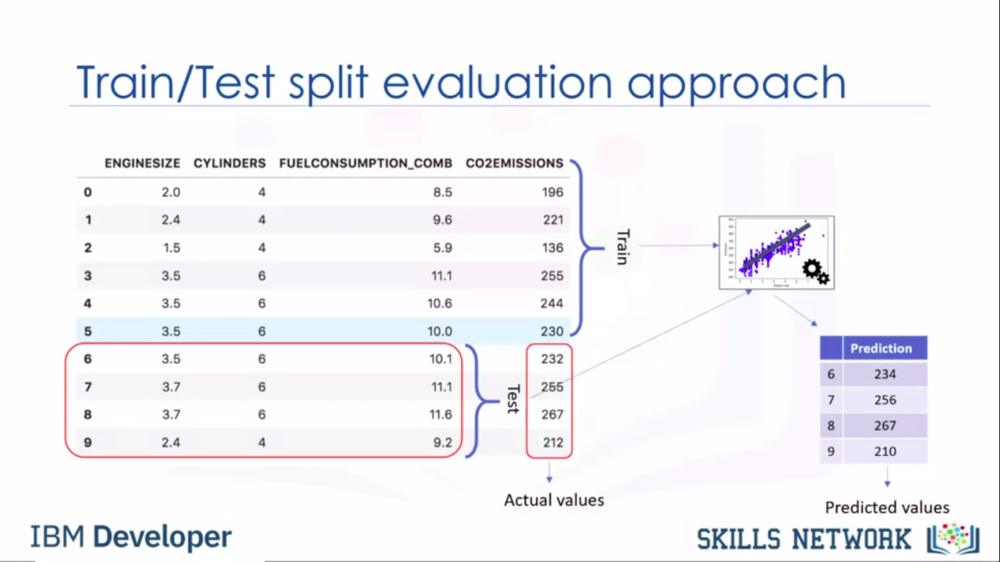

In this approach, we select a portion of our dataset for training, for example, row zero to five, and the rest is used for testing, for example, row six to nine. The model is built on the training set. Then, the test feature set is passed to the model for prediction. Finally, the predicted values for the test set are compared with the actual values of the testing set. The second evaluation approach is called train/test split. Train/test split involves splitting the dataset into training and testing sets respectively, which are mutually exclusive. After which, you train with the training set and test with the testing set. This will provide a more accurate evaluation on out-of-sample accuracy because the testing dataset is not part of the dataset that has been used to train the data. It is more realistic for real-world problems. This means that we know the outcome of each data point in the dataset, making it great to test with. Since this data has not been used to train the model, the model has no knowledge of the outcome of these data points. So, in essence, it's truly out-of-sample testing. However, please ensure that you train your model with the testing set afterwards, as you don't want to lose potentially valuable data. The issue with train/test split is that it's highly dependent on the datasets on which the data was trained and tested. The variation of this causes train/test split to have a better out-of-sample prediction than training and testing on the same dataset, but it still has some problems due to this dependency.

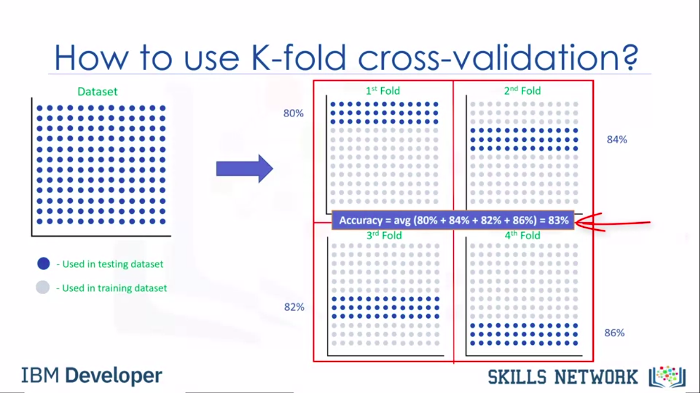

Another evaluation model, called K-fold cross-validation, resolves most of these issues. How do you fix a high variation that results from a dependency? Well, you average it. Let me explain the basic concept of K-fold cross-validation to see how we can solve this problem. The entire dataset is represented by the points in the image at the top left. If we have K equals four folds, then we split up this dataset as shown here. In the first fold for example, we use the first 25 percent of the dataset for testing and the rest for training. The model is built using the training set and is evaluated using the test set. Then, in the next round or in the second fold, the second 25 percent of the dataset is used for testing and the rest for training the model. Again, the accuracy of the model is calculated. We continue for all folds. Finally, the result of all four evaluations are averaged. That is, the accuracy of each fold is then averaged, keeping in mind that each fold is distinct, where no training data in one fold is used in another. K-fold cross-validation in its simplest form performs multiple train/test splits, using the same dataset where each split is different. Then, the result is average to produce a more consistent out-of-sample accuracy. We wanted to show you an evaluation model that addressed some of the issues we've described in the previous approaches. However, going in-depth with K-fold cross-validation model is out of the scope for this course.

#### Evaluation Metrics in Regression Models

Hello, and welcome! In this video, we’ll be covering evaluation metrics for classifiers. So let’s get started. Evaluation metrics explain the performance of a model. Let’s talk more about the model evaluation metrics that are used for classification.

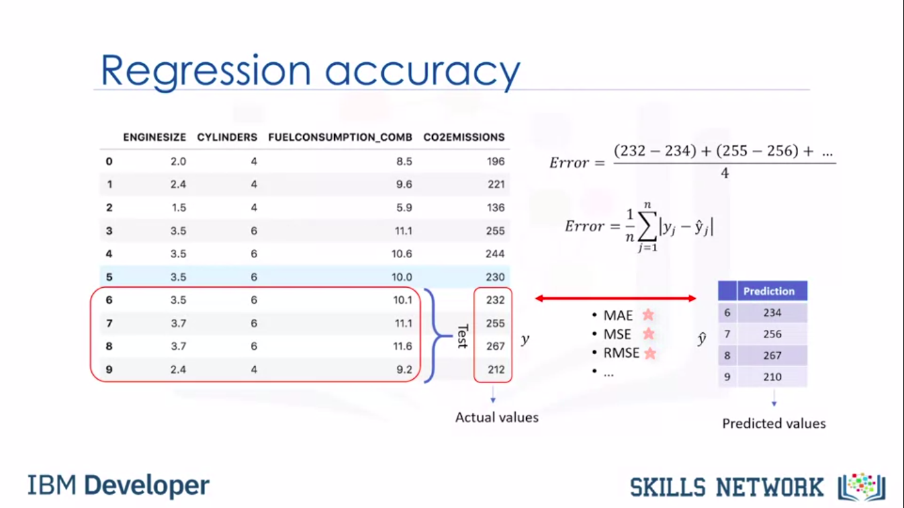

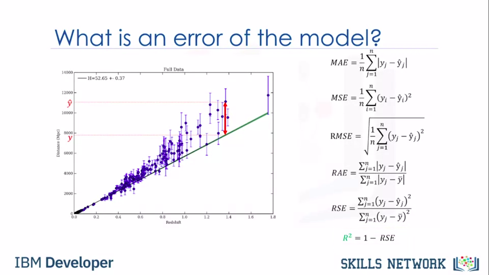

**Note**: `RMSE` and `R^2` is most Used.

#### Simple Linear Regression Code

```py
from sklearn.metrics import r2_score
import matplotlib.pyplot as plt
import pandas as pd
import numpy as np

# Read FuelConsumption.csv
df = pd.read_csv('./../code-colab/datasets/FuelConsumption.csv')

# Remove/Drop Nan cell/row
df.dropna(inplace=True)

# describe the dataset
print(df.describe())

# create new dataframe for more explorer
cdf = df[['ENGINESIZE', 'CYLINDERS', 'FUELCONSUMPTION_COMB', 'CO2EMISSIONS']]

# visualize dataset
plt.scatter(cdf.ENGINESIZE, cdf.CO2EMISSIONS)
plt.xlabel("Engine Size")
plt.ylabel('CO2 Emissions')
plt.show()

# Split dataset
mask = np.random.rand(len(cdf)) < .8

train = cdf[mask]
test = cdf[~mask]

# create model using sklearn.linear_model
from sklearn import linear_model
regr = linear_model.LinearRegression()

train_x = np.asanyarray(cdf[['ENGINESIZE']])
train_y = np.asanyarray(cdf[['CO2EMISSIONS']])

regr.fit(train_x, train_y)
print(regr.coef_)
print(regr.intercept_)

# Draw regression line
plt.scatter(cdf.ENGINESIZE, cdf.CO2EMISSIONS)
# -g for green line
plt.plot(train_x, regr.coef_[0][0] * train_x + regr.intercept_[0], '-g')
plt.xlabel("Engine Size")
plt.ylabel('CO2 Emissions')
plt.show()

# evaluate
test_x = np.asanyarray(test[['ENGINESIZE']])
test_y = np.asanyarray(test[['CO2EMISSIONS']])
test_y_ = regr.predict(test_x)

# less is better
print("Mean absolute error: %.2f" % np.mean(np.absolute(test_y_ - test_y)))
print("Residual sum of squares (MSE): %.2f" % np.mean((test_y_ - test_y) ** 2))

# high is better, maximum: 1.0
print("R2-score: %.2f" % r2_score(test_y, test_y_) )
```

#### Multiple Linear Regression

In this video, we'll be covering multiple linear regression. As you know, there are two types of linear regression models, simple regression and multiple regression.

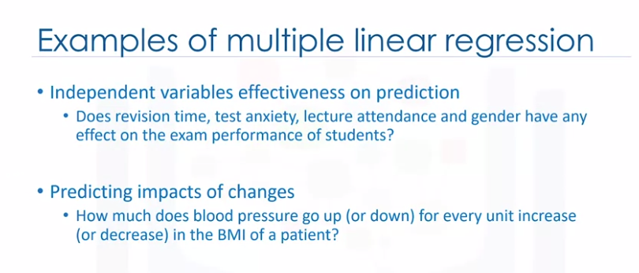

Simple linear regression is when one independent variable is used to estimate a dependent variable. For example, predicting CO_2 emission using the variable of engine size. In reality, there are multiple variables that predict the CO_2 emission. When multiple independent variables are present, the process is called multiple linear regression. For example, predicting CO_2 emission using engine size and the number of cylinders in the car's engine. Our focus in this video is on multiple linear regression. The good thing is that multiple linear regression is the extension of the simple linear regression model. So, I suggest you go through the simple linear regression video first if you haven't watched it already.

Before we dive into a sample dataset and see how multiple linear regression works, I want to tell you what kind of problems it can solve, when we should use it, and specifically, what kind of questions we can answer using it.


Basically, there are two applications for multiple linear regression. First, it can be used when we would like to identify the strength of the effect that the independent variables have on the dependent variable. For example, does revision time, test anxiety, lecture attendance and gender have any effect on exam performance of students? Second, it can be used to predict the impact of changes, that is, to understand how the dependent variable changes when we change the independent variables. For example, if we were reviewing a person's health data, a multiple linear regression can tell you how much that person's blood pressure goes up or down for every unit increase or decrease in a patient's body mass index holding other factors constant.

As is the case with simple linear regression, multiple linear regression is a method of predicting a continuous variable. It uses multiple variables called independent variables or predictors that best predict the value of the target variable which is also called the dependent variable.

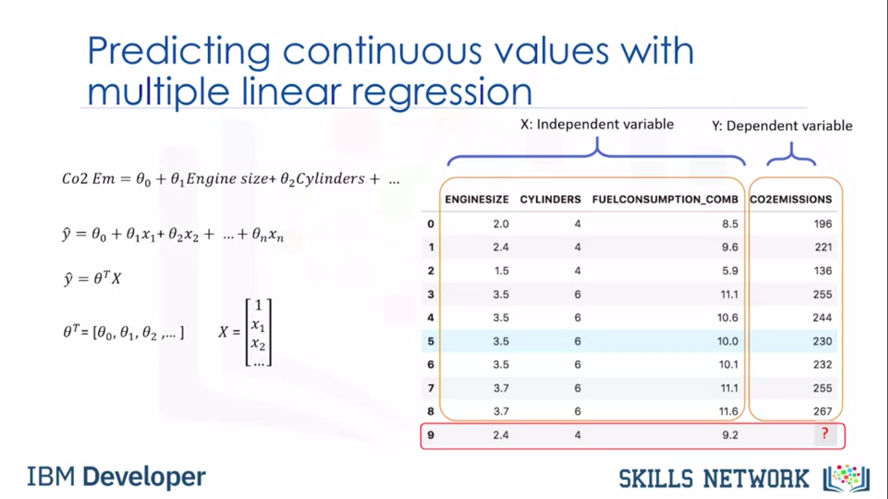

In multiple linear regression, the target value Y, is a linear combination of independent variables X. For example, you can predict how much CO_2 a car might admit due to independent variables such as the car's engine size, number of cylinders, and fuel consumption. Multiple linear regression is very useful because you can examine which variables are significant predictors of the outcome variable. Also, you can find out how each feature impacts the outcome variable. Again, as is the case in simple linear regression, if you manage to build such a regression model, you can use it to predict the emission amount of an unknown case such as record number nine. Generally, the model is of the form y hat equals theta zero, plus theta one x_1, plus theta two x_2 and so on, up to theta n x_n. Mathematically, we can show it as a vector form as well. This means it can be shown as a dot product of two vectors; the parameters vector and the feature set vector. Generally, we can show the equation for a multidimensional space as theta transpose x, where theta is an n by one vector of unknown parameters in a multi-dimensional space, and x is the vector of the featured sets, as theta is a vector of coefficients and is supposed to be multiplied by x. Conventionally, it is shown as transpose theta. Theta is also called the parameters or weight vector of the regression equation. Both these terms can be used interchangeably, and x is the feature set which represents a car. For example, x_1 for engine size or x_2 for cylinders, and so on. The first element of the feature set would be set to one, because it turns that theta zero into the intercept or biased parameter when the vector is multiplied by the parameter vector. Please notice that theta transpose x in a one-dimensional space is the equation of a line, it is what we use in simple linear regression. In higher dimensions when we have more than one input or x the line is called a plane or a hyperplane, and this is what we use for multiple linear regression. So, the whole idea is to find the best fit hyperplane for our data. To this end and as is the case in linear regression, we should estimate the values for theta vector that best predict the value of the target field in each row. To achieve this goal, we have to minimize the error of the prediction.

Now, the question is, how do we find the optimized parameters?

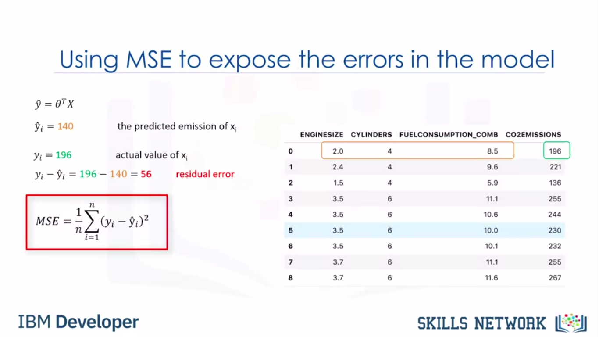

To find the optimized parameters for our model, we should first understand what the optimized parameters are, then we will find a way to optimize the parameters. In short, optimized parameters are the ones which lead to a model with the fewest errors. Let's assume for a moment that we have already found the parameter vector of our model, it means we already know the values of theta vector. Now we can use the model and the feature set of the first row of our dataset to predict the CO_2 emission for the first car, correct? If we plug the feature set values into the model equation, we find y hat. Let's say for example, it returns 140 as the predicted value for this specific row, what is the actual value? Y equals 196. How different is the predicted value from the actual value of 196? Well, we can calculate it quite simply as 196 subtract 140, which of course equals 56. This is the error of our model only for one row or one car in our case. As is the case in linear regression, we can say the error here is the distance from the data point to the fitted regression model. The mean of all residual errors shows how bad the model is representing the data set, it is called the mean squared error, or MSE. Mathematically, MSE can be shown by an equation. While this is not the only way to expose the error of a multiple linear regression model, it is one of the most popular ways to do so. The best model for our data set is the one with minimum error for all prediction values. So, the objective of multiple linear regression is to minimize the MSE equation. To minimize it, we should find the best parameters theta, but how?

Okay, how do we find the parameter or coefficients for multiple linear regression?


There are many ways to estimate the value of these coefficients. However, the most common methods are the ordinary least squares and optimization approach. Ordinary least squares tries to estimate the values of the coefficients by minimizing the mean square error. This approach uses the data as a matrix and uses linear algebra operations to estimate the optimal values for the theta. The problem with this technique is the time complexity of calculating matrix operations as it can take a very long time to finish. When the number of rows in your data set is less than 10,000, you can think of this technique as an option. However, for greater values, you should try other faster approaches. The second option is to use an optimization algorithm to find the best parameters. That is, you can use a process of optimizing the values of the coefficients by iteratively minimizing the error of the model on your training data. For example, you can use gradient descent which starts optimization with random values for each coefficient, then calculates the errors and tries to minimize it through y's changing of the coefficients in multiple iterations. Gradient descent is a proper approach if you have a large data set. Please understand however, that there are other approaches to estimate the parameters of the multiple linear regression that you can explore on your own.

After you find the best parameters for your model, you can go to the prediction phase. After we found the parameters of the linear equation, making predictions is as simple as solving the equation for a specific set of inputs.

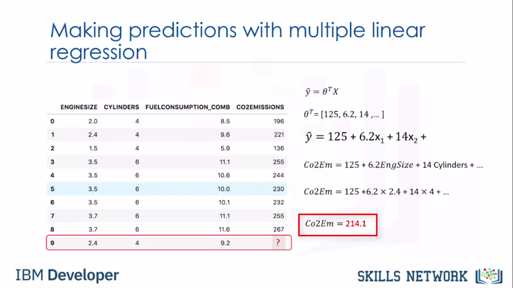

Imagine we are predicting CO_2 emission or Y from other variables for the automobile in record number nine. Our linear regression model representation for this problem would be y hat equals theta transpose x. Once we find the parameters, we can plug them into the equation of the linear model. For example, let's use theta zero equals 125, theta one equals 6.2, theta two equals 14, and so on. If we map it to our data set, we can rewrite the linear model as CO_2 emissions equals 125 plus 6.2 multiplied by engine size, plus 14 multiplied by cylinder, and so on. As you can see, multiple linear regression estimates the relative importance of predictors. For example, it shows cylinder has higher impact on CO_2 emission amounts in comparison with engine size. Now, let's plug in the ninth row of our data set and calculate the CO_2 emission for a car with the engine size of 2.4. So, CO_2 emission equals 125 plus 6.2 times 2.4, plus 14 times four, and so on. We can predict the CO_2 emission for this specific car would be 214.1.

Now, let me address some concerns that you might already be having regarding multiple linear regression.

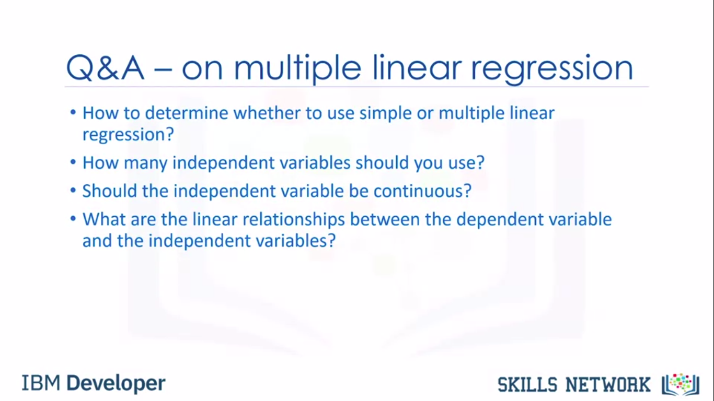

As you saw, you can use multiple independent variables to predict a target value in multiple linear regression. It sometimes results in a better model compared to using a simple linear regression which uses only one independent variable to predict the dependent variable. Now the question is how, many independent variable should we use for the prediction? Should we use all the fields in our data set? Does adding independent variables to a multiple linear regression model always increase the accuracy of the model? Basically, adding too many independent variables without any theoretical justification may result in an overfit model. An overfit model is a real problem because it is too complicated for your data set and not general enough to be used for prediction. So, it is recommended to avoid using many variables for prediction. There are different ways to avoid overfitting a model in regression, however that is outside the scope of this video. The next question is, should independent variables be continuous? Basically, categorical independent variables can be incorporated into a regression model by converting them into numerical variables. For example, given a binary variables such as car type, the code dummy zero for manual and one for automatic cars. As a last point, remember that multiple linear regression is a specific type of linear regression. So, there needs to be a linear relationship between the dependent variable and each of your independent variables. There are a number of ways to check for linear relationship. For example, you can use scatter plots and then visually checked for linearity. If the relationship displayed in your scatter plot is not linear, then you need to use non-linear regression.

#### Code Multiple Linear Regression

```py
regr = linear_model.LinearRegression()
x = np.asanyarray(train[['ENGINESIZE','CYLINDERS','FUELCONSUMPTION_CITY','FUELCONSUMPTION_HWY']])
y = np.asanyarray(train[['CO2EMISSIONS']])
regr.fit (x, y)
print ('Coefficients: ', regr.coef_)
y_= regr.predict(test[['ENGINESIZE','CYLINDERS','FUELCONSUMPTION_CITY','FUELCONSUMPTION_HWY']])
x = np.asanyarray(test[['ENGINESIZE','CYLINDERS','FUELCONSUMPTION_CITY','FUELCONSUMPTION_HWY']])
y = np.asanyarray(test[['CO2EMISSIONS']])
print("Residual sum of squares: %.2f"% np.mean((y_ - y) ** 2))
print('Variance score: %.2f' % regr.score(x, y))
```

#### Non-Linear Regression

Hello and welcome. In this video, we'll be covering non-linear regression basics. So, let's get started.

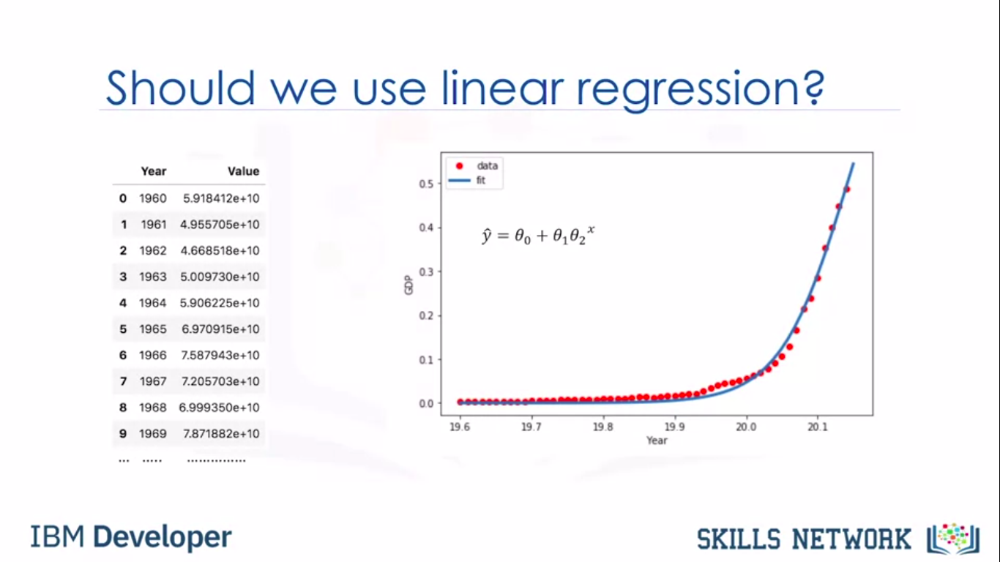

These data points correspond to China's gross domestic product or GDP from 1960-2014. The first column is the years and the second is China's corresponding annual gross domestic income in US dollars for that year. This is what the data points look like. Now, we have a couple of interesting questions. First, can GDP be predicted based on time? Second, can we use a simple linear regression to model it? Indeed. If the data shows a curvy trend, then linear regression would not produce very accurate results when compared to a non-linear regression. Simply because, as the name implies, linear regression presumes that the data is linear. The scatter plot shows that there seems to be a strong relationship between GDP and time, but the relationship is not linear. As you can see, the growth starts off slowly, then from 2005 onward, the growth is very significant. Finally, it decelerates slightly in the 2010s. It looks like either a logistical or exponential function. So, it requires a special estimation method of the non-linear regression procedure. For example, if we assume that the model for these data points are exponential functions, such as Y hat equals Theta zero plus Theta one Theta two transpose X or to the power of X, our job is to estimate the parameters of the model, i.e., Thetas, and use the fitted model to predict GDP for unknown or future cases.

In fact, many different regressions exists that can be used to fit whatever the dataset looks like.


You can see a quadratic and cubic regression lines here, and it can go on and on to infinite degrees. In essence, we can call all of these polynomial regression, where the relationship between the independent variable X and the dependent variable Y is modeled as an Nth degree polynomial in X. With many types of regression to choose from, there's a good chance that one will fit your dataset well. Remember, it's important to pick a regression that fits the data the best.

**So, what is polynomial regression?**:

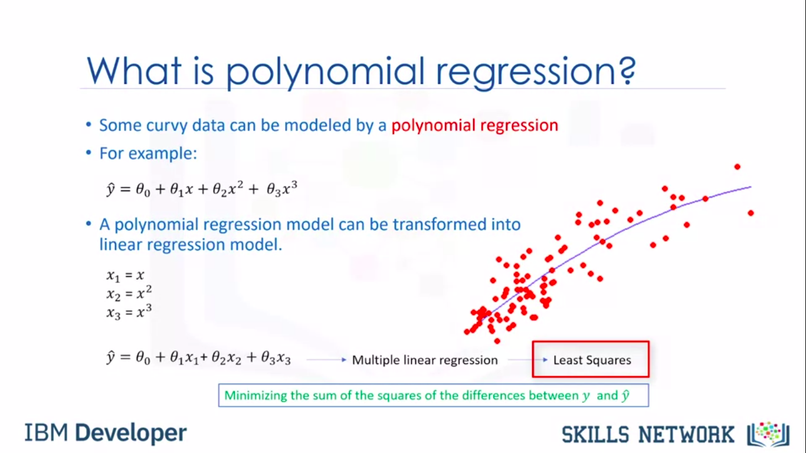

Polynomial regression fits a curve line to your data. A simple example of polynomial with degree three is shown as Y hat equals Theta zero plus Theta 1_X plus Theta 2_X squared plus Theta 3_X cubed or to the power of three, where Thetas are parameters to be estimated that makes the model fit perfectly to the underlying data. Though the relationship between X and Y is non-linear here and polynomial regression can't fit them, a polynomial regression model can still be expressed as linear regression. I know it's a bit confusing, but let's look at an example. Given the third degree polynomial equation, by defining X_1 equals X and X_2 equals X squared or X to the power of two and so on, the model is converted to a simple linear regression with new variables as Y hat equals Theta zero plus Theta one X_1 plus Theta two X_2 plus Theta three X_3. This model is linear in the parameters to be estimated, right? Therefore, this polynomial regression is considered to be a special case of traditional multiple linear regression. So, you can use the same mechanism as linear regression to solve such a problem. Therefore, polynomial regression models can fit using the model of least squares. Least squares is a method for estimating the unknown parameters in a linear regression model by minimizing the sum of the squares of the differences between the observed dependent variable in the given dataset and those predicted by the linear function.

**So, what is non-linear regression exactly?**:

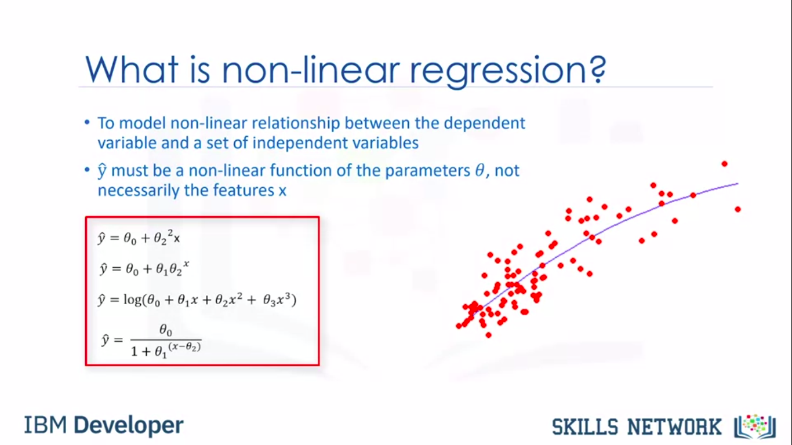

First, non-linear regression is a method to model a non-linear relationship between the dependent variable and a set of independent variables. Second, for a model to be considered non-linear, Y hat must be a non-linear function of the parameters Theta, not necessarily the features X. When it comes to non-linear equation, it can be the shape of exponential, logarithmic, and logistic, or many other types. As you can see in all of these equations, the change of Y hat depends on changes in the parameters Theta, not necessarily on X only. That is, in non-linear regression, a model is non-linear by parameters. In contrast to linear regression, we cannot use the ordinary least squares method to fit the data in non-linear regression. In general, estimation of the parameters is not easy.

Let me answer two important questions here.

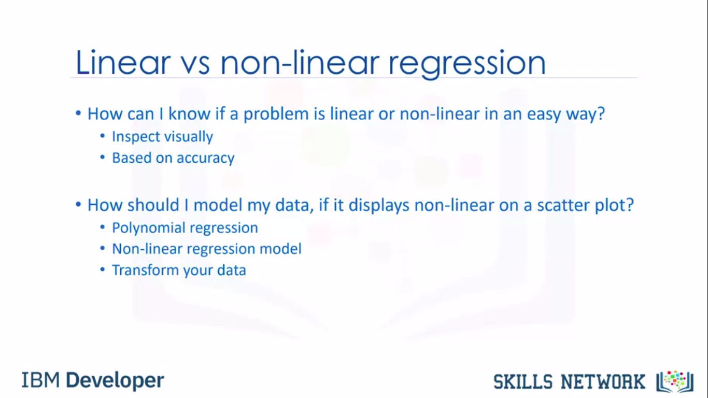

First, how can I know if a problem is linear or non-linear in an easy way? To answer this question, we have to do two things. The first is to visually figure out if the relation is linear or non-linear. It's best to plot bivariate plots of output variables with each input variable. Also, you can calculate the correlation coefficient between independent and dependent variables, and if, for all variables, it is 0.7 or higher, there is a linear tendency and thus, it's not appropriate to fit a non-linear regression. The second thing we have to do is to use non-linear regression instead of linear regression when we cannot accurately model the relationship with linear parameters. The second important question is, how should I model my data if it displays non-linear on a scatter plot? Well, to address this, you have to use either a polynomial regression, use a non-linear regression model, or transform your data, which is not in scope for this course.

**Code for Polynomial Regression**:

```py
from sklearn.preprocessing import PolynomialFeatures
from sklearn import linear_model
from sklearn.metrics import r2_score

poly3 = PolynomialFeatures(degree=2)
train_x_poly3 = poly3.fit_transform(train_x)
clf3 = linear_model.LinearRegression()
train_y3_ = clf3.fit(train_x_poly3, train_y)

# The coefficients
print ('Coefficients: ', clf3.coef_)
print ('Intercept: ',clf3.intercept_)
plt.scatter(train.ENGINESIZE, train.CO2EMISSIONS,  color='blue')
XX = np.arange(0.0, 10.0, 0.1)
yy = clf3.intercept_[0]+ clf3.coef_[0][1]*XX + clf3.coef_[0][2]*np.power(XX, 2) + clf3.coef_[0][3]*np.power(XX, 3)
plt.plot(XX, yy, '-r' )
plt.xlabel("Engine size")
plt.ylabel("Emission")
test_x_poly3 = poly3.fit_transform(test_x)
test_y3_ = clf3.predict(test_x_poly3)
print("Mean absolute error: %.2f" % np.mean(np.absolute(test_y3_ - test_y)))
print("Residual sum of squares (MSE): %.2f" % np.mean((test_y3_ - test_y) ** 2))
print("R2-score: %.2f" % r2_score(test_y,test_y3_ ) )
```

**Code for Non-Linear Regression**:

```py
# later added
```

### Classification

#### What is Classification

- A supervised learning process.
- Categorized som  unknown items into a discrete set of categories of classes.
- The target attribute is a categorical variable.

Hello, in this video, we'll give you an introduction to classification. So let's get started. In machine learning classification is a supervised learning approach which can be thought of as a means of categorizing or classifying some unknown items into a discrete set of classes. Classification attempts to learn the relationship between a set of feature variables and a target variable of interest. The target attribute in classification is a categorical variable with discrete values.

So, how does classification and classifiers work?

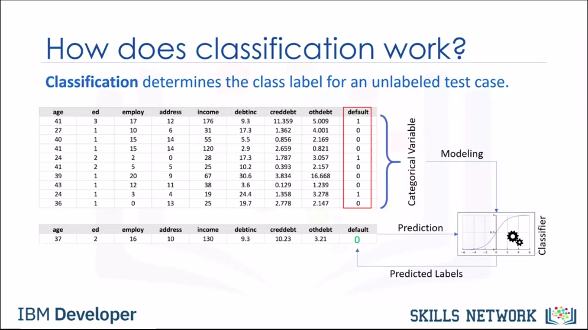

Given a set of training data points along with the target labels, classification determines the class label for an unlabeled test case. Let's explain this with an example. A good sample of classification is the loan default prediction. Suppose a bank is concerned about the potential for loans not to be repaid? If previous loan default data can be used to predict which customers are likely to have problems repaying loans, these bad risk customers can either have their loan application declined or offered alternative products. The goal of a loan default predictor is to use existing loan default data which has information about the customers such as age, income, education et cetera, to build a classifier, pass a new customer or potential future default to the model, and then label it, i.e the data points as defaulter or not defaulter. Or for example zero or one. This is how a classifier predicts an unlabeled test case. Please notice that this specific example was about a binary classifier with two values. We can also build classifier models for both binary classification and multi-class classification.

For example, imagine that you've collected data about a set of patients,

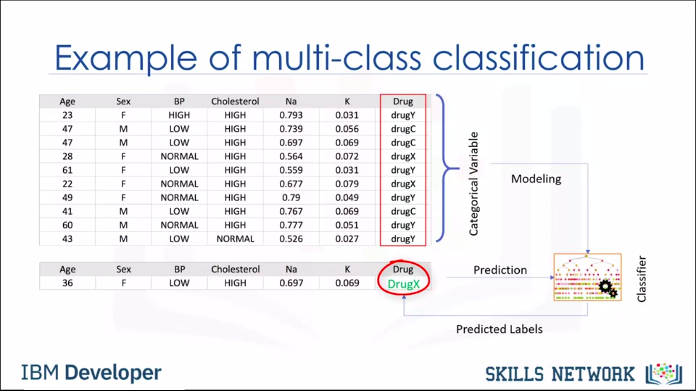

all of whom suffered from the same illness. During their course of treatment, each patient responded to one of three medications. You can use this labeled dataset with a classification algorithm to build a classification model. Then you can use it to find out which drug might be appropriate for a future patient with the same illness. As you can see, it is a sample of multi-class classification.

Classification has different business use cases as well.

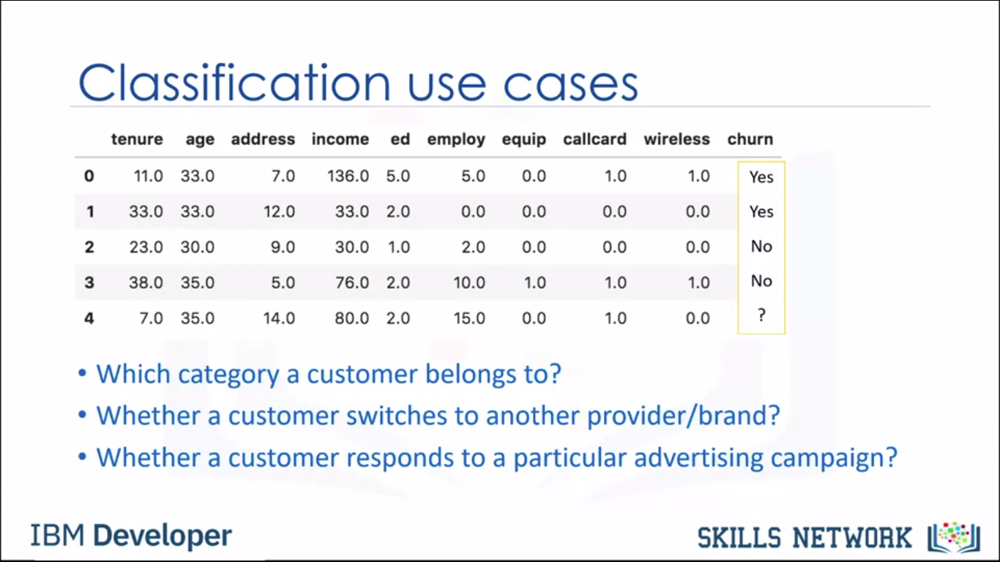

For example, to predict the category to which a customer belongs, for churn detection where we predict whether a customer switches to another provider or brand, or to predict whether or not a customer responds to a particular advertising campaign.

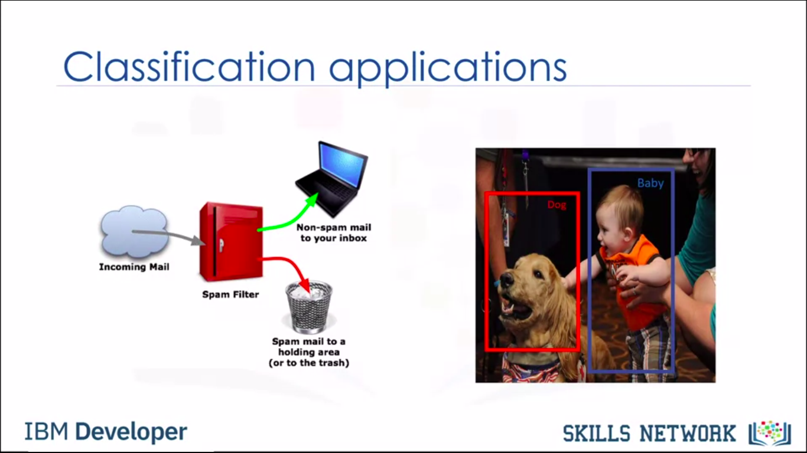

Data classification has several applications in a wide variety of industries. Essentially, many problems can be expressed as associations between feature and target variables, especially when labelled data is available. This provides a broad range of applicability for classification. For example, classification can be used for email filtering, speech recognition, handwriting recognition, biometric identification, document classification and much more.

Here we have the types of classification algorithms and machine learning.

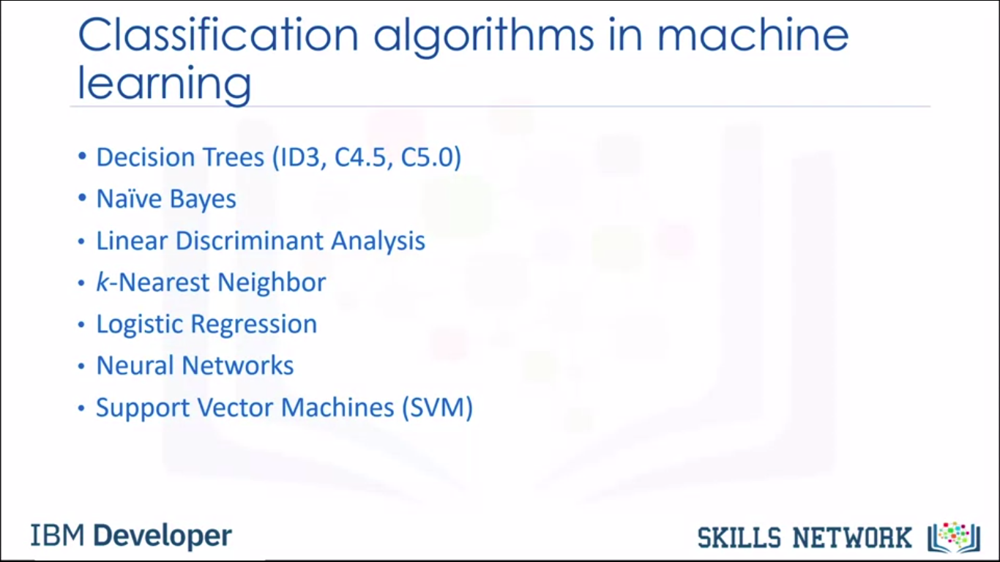

They include decision trees, naive bayes, linear discriminant analysis, k-nearest neighbor, logistic regression, neural networks, and support vector machines. There are many types of classification algorithms. We will only cover a few in this course.

#### K-Nearest Neighbours

> Also see in the lecture-videos folder: k-nearest neighbors.mp4

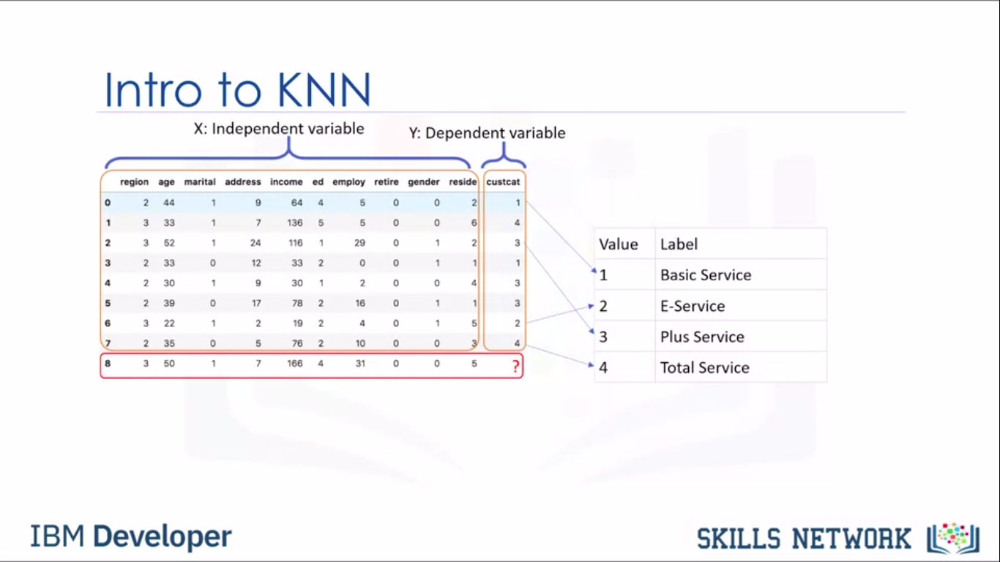

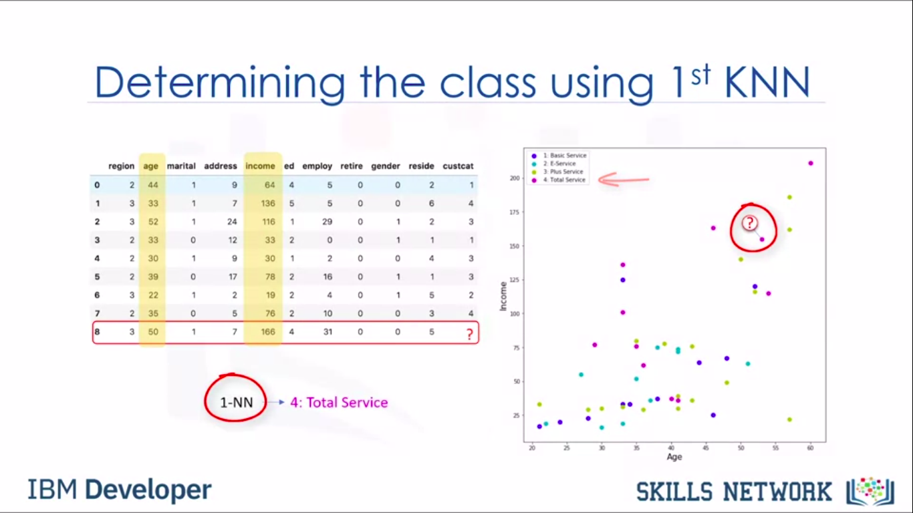

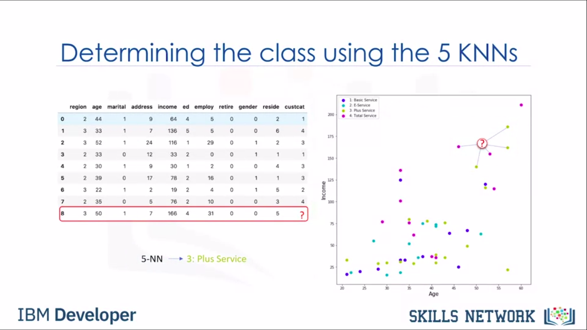

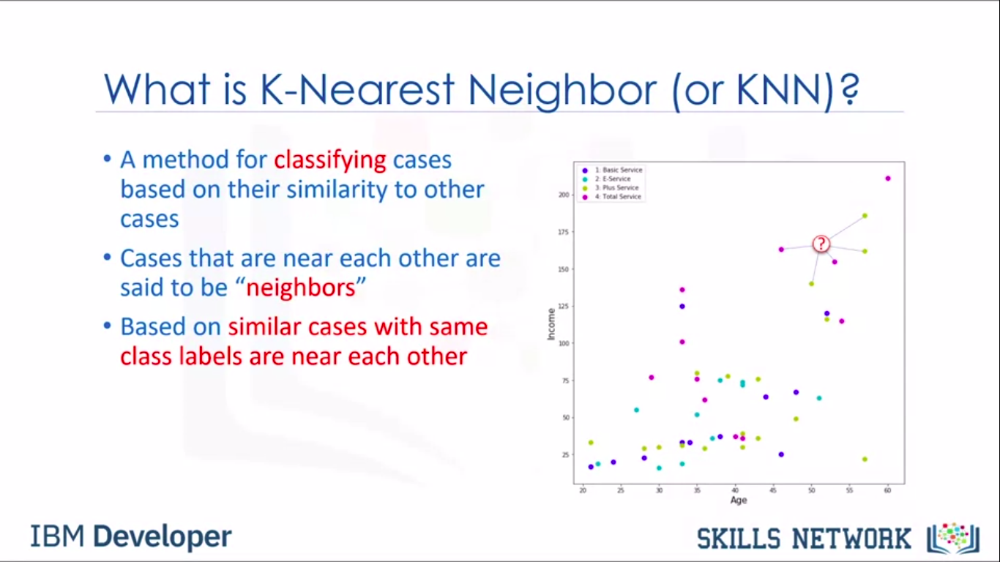


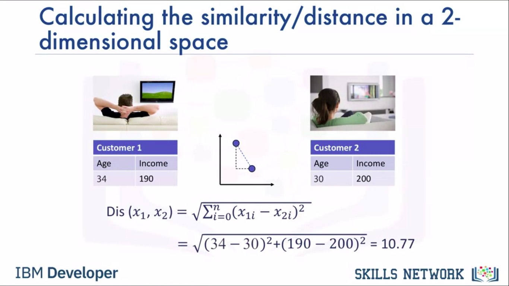

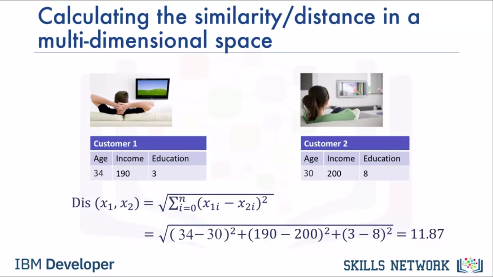

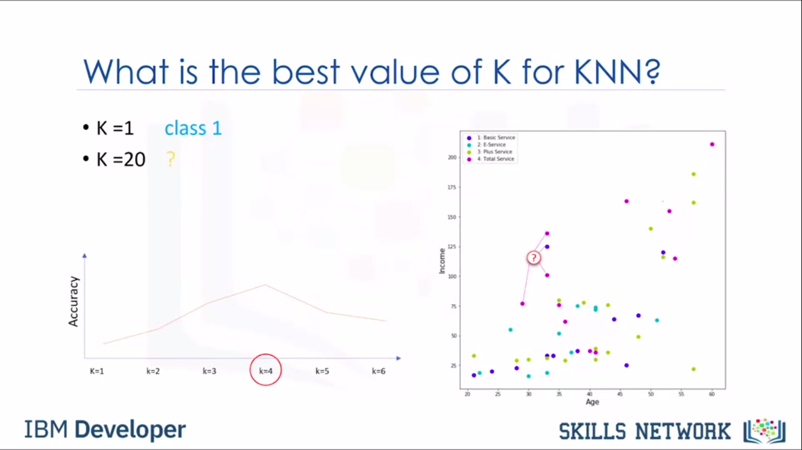

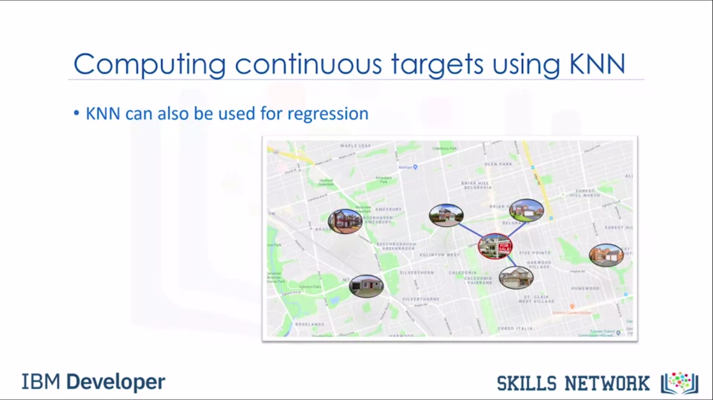

#### Evaluation Metrics in Classification

Hello, and welcome! In this video, we’ll be covering evaluation metrics for classifiers. So let’s get started. Evaluation metrics explain the performance of a model.

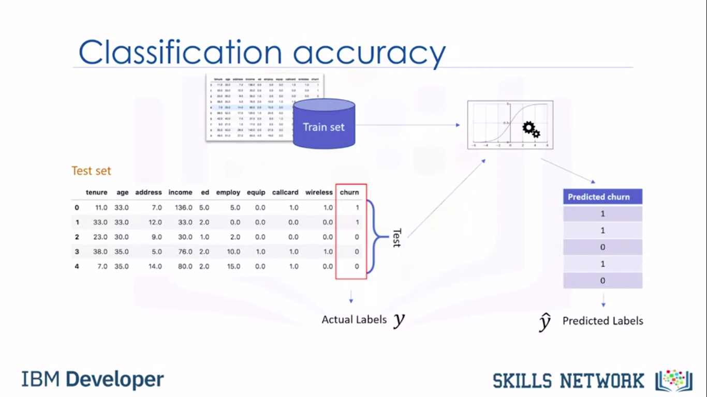

Let’s talk more about the model evaluation metrics that are used for classification. Imagine that we have an historical dataset which shows the customer churn for a telecommunication company. We have trained the model, and now we want to calculate its accuracy using the test set. We pass the test set to our model, and we find the predicted labels. Now the question is, “How accurate is this model?” Basically, we compare the actual values in the test set with the values predicted by the model, to calculate the accuracy of the model. Evaluation metrics provide a key role in the development of a model, as they provide insight to areas that might require improvement. There are different model evaluation metrics but we just talk about three of them here, specifically: `Jaccard index`, `F1-score`, and `Log Loss`.

Let’s first look at one of the simplest accuracy measurements, the Jaccard index -- also known as the Jaccard similarity coefficient.

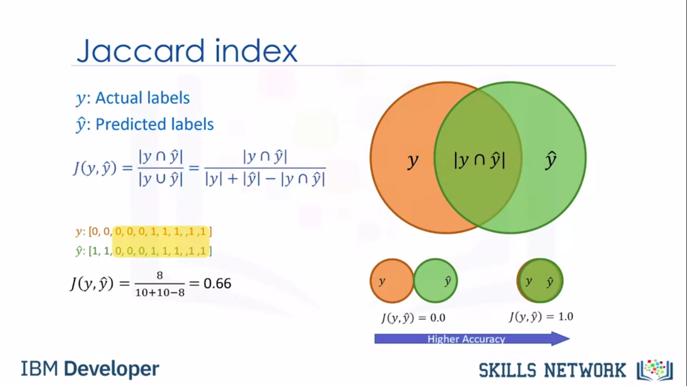

Let’s say y shows the true labels of the churn dataset. And y ̂ shows the predicted values by our classifier. Then we can define Jaccard as the size of the intersection divided by the size of the union of two label sets. For example, for a test set of size 10, with 8 correct predictions, or 8 intersections, the accuracy by the Jaccard index would be 0.66. If the entire set of predicted labels for a sample strictly matches with the true set of labels, then the subset accuracy is 1.0; otherwise it is 0.0.

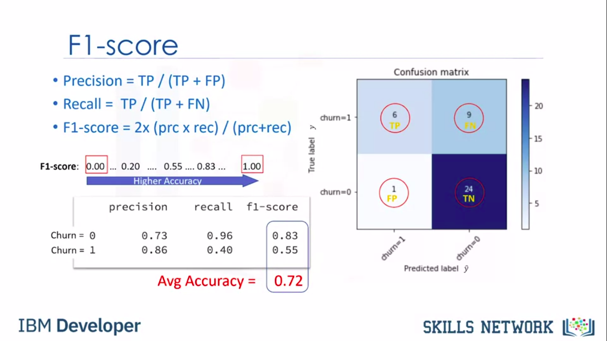

Another way of looking at accuracy of classifiers is to look at a confusion matrix. For example, let’s assume that our test set has only 40 rows. This matrix shows the corrected and wrong predictions, in comparison with the actual labels. Each confusion matrix row shows the Actual/True labels in the test set, and the columns show the predicted labels by classifier. let's Look at the first row. The first row is for customers whose actual churn value in the test set is 1. As you can calculate, out of 40 customers, the churn value of 15 of them is 1. And out of these 15, the classifier correctly predicted 6 of them as 1, and 9 of them as 0.
This means that for 6 customers, the actual churn value was 1, in the test set, and the classifier also correctly predicted those as 1. However, while the actual label of 9 customers was 1, the classifier predicted those as 0, which is not very good. We can consider this as an error of the model for the first row. What about the customers with a churn value 0? Let’s look at the second row. It looks like there were 25 customers whose churn value was 0. The classifier correctly predicted 24 of them as 0, and one of them wrongly predicted as 1.
So, it has done a good job in predicting the customers with a churn value of 0. A good thing about the confusion matrix is that it shows the model’s ability to correctly predict or separate the classes. In the specific case of a binary classifier, such as this example, we can interpret these numbers as the count of true positives, false negatives, true negatives, and false positives. Based on the count of each section, we can calculate the precision and recall of each label. Precision is a measure of the accuracy, provided that a class label has been predicted. It is defined by: precision = True Positive / (True Positive + False Positive). And Recall is the true positive rate. It is defined as: Recall = True Positive / (True Positive + False Negative). So, we can calculate the precision and recall of each class. Now we’re in the position to calculate the F1 scores for each label, based on the precision and recall of that label. The F1 score is the harmonic average of the precision and recall, where an F1 score reaches its best value at 1 (which represents perfect precision and recall) and its worst at 0. It is a good way to show that a classifier has a good value for both recall and precision. It is defined using the F1-score equation. For example, the F1-score for class 0 (i.e. churn=0), is 0.83, and the F1-score for class 1 (i.e. churn=1), is 0.55. And finally, we can tell the average accuracy for this classifier is the average of the F1-score for both labels, which is 0.72 in our case.

> Please notice that both Jaccard and F1-score can be used for multi-class classifiers as well, which is out of scope for this course.

Now let's look at another accuracy metric for classifiers. Sometimes, the output of a classifier is the probability of a class label, instead of the label.

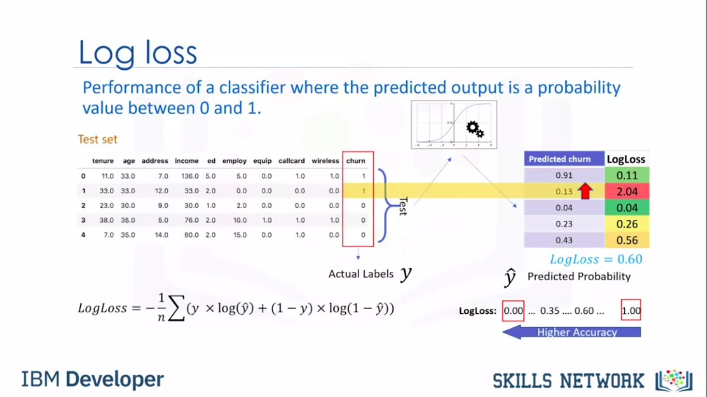

For example, in logistic regression, the output can be the probability of customer churn, i.e., yes (or equals to 1). This probability is a value between 0 and 1. Logarithmic loss (also known as Log loss) measures the performance of a classifier where the predicted output is a probability value between 0 and 1. So, for example, predicting a probability of 0.13 when the actual label is 1, would be bad and would result in a high log loss. We can calculate the log loss for each row using the log loss equation, which measures how far each prediction is, from the actual label. Then, we calculate the average log loss across all rows of the test set. It is obvious that ideal classifiers have progressively smaller values of log loss. So, the classifier with lower log loss has better accuracy.

**Simple Demo**:

```py
k = 4
neigh = KNeighborsClassifier(n_neighbors = k).fit(X_train,y_train)
yhat = neigh.predict(y_test)
```

**Find Best K**:

```py
# continuously checking k = 1 to 10
Ks = 10
mean_acc = np.zeros((Ks-1))
std_acc = np.zeros((Ks-1))

for n in range(1,Ks):

    #Train Model and Predict
    neigh = KNeighborsClassifier(n_neighbors = n).fit(X_train,y_train)
    yhat=neigh.predict(X_test)
    mean_acc[n-1] = metrics.accuracy_score(y_test, yhat)


    std_acc[n-1]=np.std(yhat==y_test)/np.sqrt(yhat.shape[0])

print(mean_acc)

# plot
plt.plot(range(1,Ks),mean_acc,'g')
plt.fill_between(range(1,Ks),mean_acc - 1 * std_acc,mean_acc + 1 * std_acc, alpha=0.10)
plt.fill_between(range(1,Ks),mean_acc - 3 * std_acc,mean_acc + 3 * std_acc, alpha=0.10,color="green")
plt.legend(('Accuracy ', '+/- 1xstd','+/- 3xstd'))
plt.ylabel('Accuracy ')
plt.xlabel('Number of Neighbors (K)')
plt.tight_layout()
plt.show()

# print best k
print( "The best accuracy was with", mean_acc.max(), "with k=", mean_acc.argmax()+1)
```
