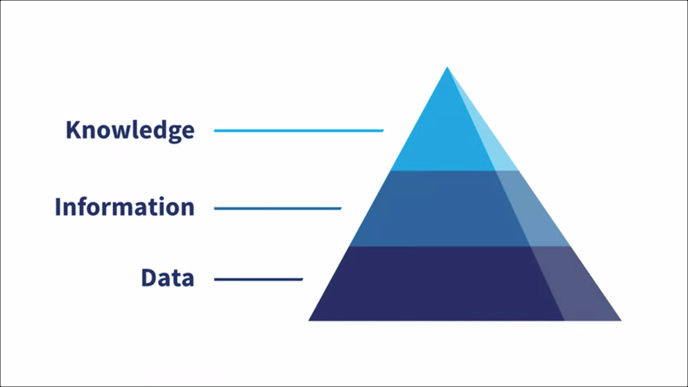

# Solve Business Problems with AI and Machine Learning

## Table of Contents

- [Solve Business Problems with AI and Machine Learning](#solve-business-problems-with-ai-and-machine-learning)
  - [Table of Contents](#table-of-contents)
    - [Apply AI and ML to Business Problems](#apply-ai-and-ml-to-business-problems)
      - [Intro](#intro)
      - [Identify Data-Driven Emerging Technologies Module Introduction](#identify-data-driven-emerging-technologies-module-introduction)
      - [The Data Hierarchy](#the-data-hierarchy)

### Apply AI and ML to Business Problems

#### Intro

Artificial intelligence and machine learning have become an essential part of the `toolset` for many organizations. When used effectively, these tools provide actionable insights that drive critical decisions and enable organizations to create exciting new and innovative products and services.

How to identify appropriate applications of AI and Machine Learning within a given business situation. You will learn how to identify and describe steps in an organized process to plan to build and apply a machine learning model, and how to formulate a machine learning approach to solve specific business problems.

#### Identify Data-Driven Emerging Technologies Module Introduction

AI is about innovation, and I think what business needs at this moment would be really innovative techniques. It's also about bringing the best solution forward and really using data to come up with solutions that are not only real time, but solutions that are built on evidence, and solutions that are built on informed decision-making. So, business intelligence is very, very sophisticated and AI delivers on that sophistication.

**Overview**:

This course is the first of four courses in the Certified Artificial Intelligence Practitioner (**CAIP**) specialization.

The lessons in the first module of this course cover the following topics:

- The artificial intelligence and machine learning solutions that can be used to solve business problems.
- A brief primer on the machine learning workflow.
- Problem formulation when it comes to machine learning applications.

#### The Data Hierarchy

The data hierarchy, making data useful. When it comes to AI and machine learning, business solutions is all about making data useful. And effective use of data means translating raw data into actionable intelligence. Intelligence that leads to solutions, intelligence that benefits the organization. This process is sometimes explained according to the data information knowledge hierarchy DIK. D for data, and data becomes meaningful when it is solutions-oriented and combined with other strategies. And of course organized to support informed decision making. That is what makes data a front runner. To get there various data points must be aggregated, organized, and interpreted to be meaningful to your organization. Therefore, you must transform data into information. Now let's talk about information.

Information is data that informs business decisions. Information that has context because it has been aggregated, organized, and Interpreted to be meaningful. Now information is still not a complete picture, but it points to action, actionable steps that should be taken to design and deploy solutions. But how do we turn information into knowledge? We do that by combining information with experience and insights that inform how information could be the greatest service to the organization. Now we have knowledge, which is knowing what to do based on the data provided. Knowledge is actionable intelligence. Knowledge may reveal that a certain pump is about to fail and should be replaced. Or it might reveal that a patient may not respond well to a particular medication and should be taken off those meds as soon as possible. Now here's the bonus. A fourth level to the data information knowledge hierarchy is wisdom. Wisdom enhances that hierarchy. Wisdom builds upon knowledge through experience over time informing subsequent decisions. The process of transforming raw data into actionable intelligence can be time-consuming. And not without error and could also be very expensive. As organizations produce large amounts of data, this process becomes even more challenging. But it is a process you must confront and overcome with confidence if your goal is solving business problems with AI and machine learning.
