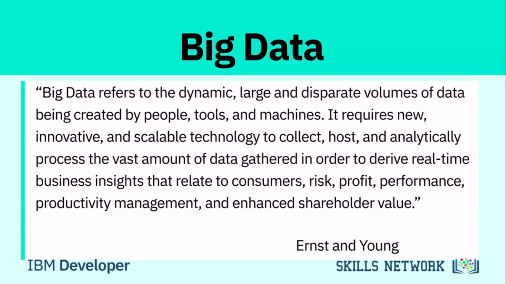
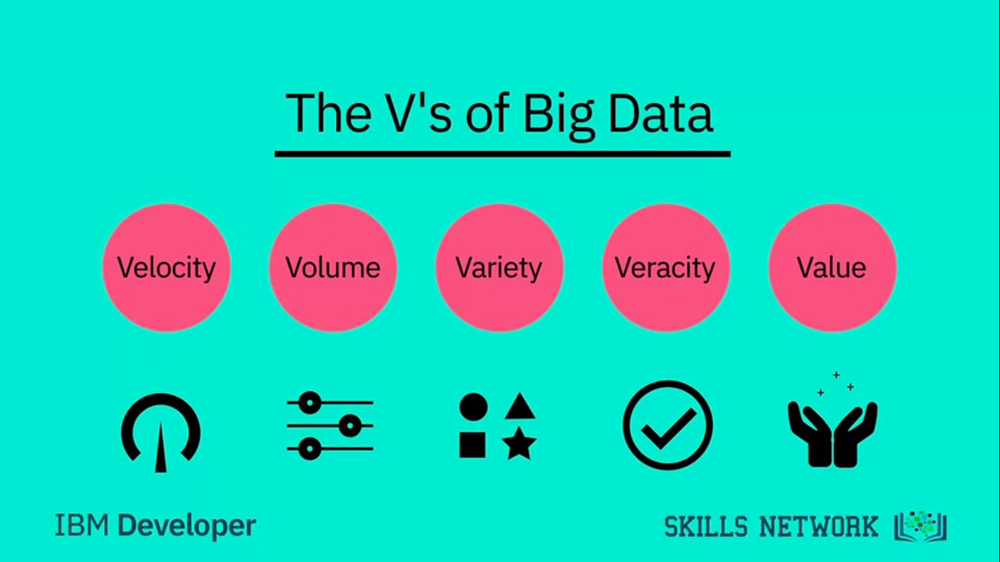
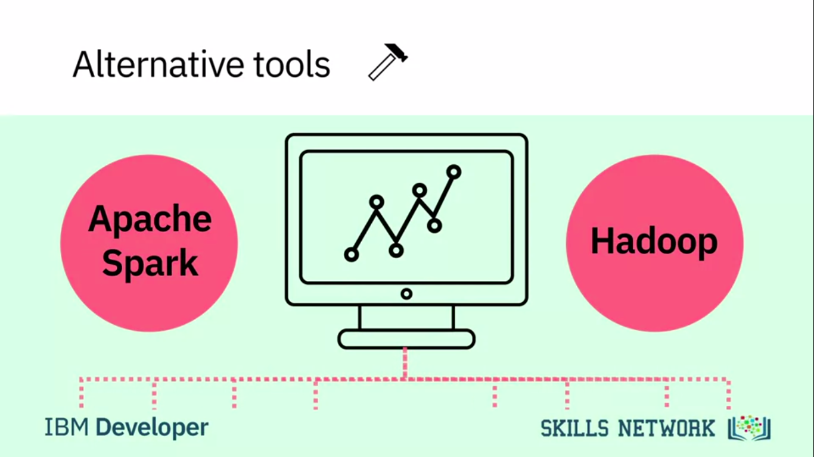

# What is Data Science

## Table of Contents

- [What is Data Science](#what-is-data-science)
  - [Table of Contents](#table-of-contents)
    - [Defining Data Science and What Data Scientists Do](#defining-data-science-and-what-data-scientists-do)
      - [What is Data Science?](#what-is-data-science-1)
      - [Fundamentals of Data Science](#fundamentals-of-data-science)
      - [The Many Paths To Data Science](#the-many-paths-to-data-science)
      - [Advice for New Data Scientist](#advice-for-new-data-scientist)
      - [A day in the Life of a Data Scientist](#a-day-in-the-life-of-a-data-scientist)
      - [Old problems, new problems, Data Science solutions](#old-problems-new-problems-data-science-solutions)
      - [Data Science Topics and Algorithms](#data-science-topics-and-algorithms)
      - [Cloud for Data Science](#cloud-for-data-science)
    - [Data Science Topics](#data-science-topics)
      - [Foundations of Big Data](#foundations-of-big-data)
      - [What is Hadoop?](#what-is-hadoop)
      - [How Big Data is Driving Digital Transformation](#how-big-data-is-driving-digital-transformation)
      - [Data Science Skills & Big Data](#data-science-skills--big-data)
      - [What is the Difference](#what-is-the-difference)
      - [Neural Networks and Deep Learning](#neural-networks-and-deep-learning)
      - [Applications of Machine Learning](#applications-of-machine-learning)
    - [Data Science in Business](#data-science-in-business)

### Defining Data Science and What Data Scientists Do

#### What is Data Science?

> Data Science is a field of exploring, manipulating and analyzing data, and using data to answer questions or make recommendations.

Click Here - To see more Data Science Definition

Data Science is a process, not an event. It is the process of using data to understand different things, to understand the world. For me is when you have a model or hypothesis of a problem, and you try to validate that hypothesis or model with your data. Data science is the art of uncovering the insights and trends that are hiding behind data. It's when you translate data into a story. So use storytelling to generate insight. And with these insights, you can make strategic choices for a company or an institution. Data science is a field about processes and systems to extract data from various forms of whether it is unstructured or structured form. Data science is the study of data. Like biological sciences is a study of biology, physical sciences, it's the study of physical reactions. Data is real, data has real properties, and we need to study them if we're going to work on them. Data Science involves data and some science. The definition or the name came up in the 80s and 90s when some professors were looking into the statistics curriculum, and they thought it would be better to call it data science. But what is Data Science? I'd see data science as one's attempt to work with data, to find answers to questions that they are exploring. In a nutshell, it's more about data than it is about science. If you have data, and you have curiosity, and you're working with data, and you're manipulating it, you're exploring it, the very exercise of going through analyzing data, trying to get some answers from it is data science. Data science is relevant today because we have tons of data available. We used to worry about lack of data. Now we have a data deluge. In the past, we didn't have algorithms, now we have algorithms. In the past, the software was expensive, now it's open source and free. In the past, we couldn't store large amounts of data, now for a fraction of the cost, we can have gazillions of datasets for a very low cost. So, the tools to work with data, the very availability of data, and the ability to store and analyze data, it's all cheap, it's all available, it's all ubiquitous, it's here. There's never been a better time to be a data scientist.

#### Fundamentals of Data Science

Everyone you ask will give you a slightly different description of what Data Science is, but most people agree that it has a significant data analysis component. Data analysis isn't new. What is new is the vast quantity of data available from massively varied sources: from log files, email, social media, sales data, patient information files, sports performance data, sensor data, security cameras, and many more besides. At the same time that there is more data available than ever, we have the computing power needed to make a useful analysis and reveal new knowledge. Data science can help organizations understand their environments, analyze existing issues, and reveal previously hidden opportunities. Data scientists use data analysis to add to the knowledge of the organization by investigating data, exploring the best way to use it to provide value to the business. So, what is the process of data science? Many organizations will use data science to focus on a specific problem, and so it's essential to clarify the question that the organization wants answered. This first and most crucial step defines how the data science project progresses. Good data scientists are curious people who ask questions to clarify the business need. The next questions are: "what data do we need to solve the problem, and where will that data come from?". Data scientists can analyze structured and unstructured data from many sources, and depending on the nature of the problem, they can choose to analyze the data in different ways. Using multiple models to explore the data reveals patterns and outliers; sometimes, this will confirm what the organization suspects, but sometimes it will be completely new knowledge, leading the organization to a new approach. When the data has revealed its insights, the role of the data scientist becomes that of a storyteller, communicating the results to the project stakeholders. Data scientists can use powerful data visualization tools to help stakeholders understand the nature of the results, and the recommended action to take. Data Science is changing the way we work; it's changing the way we use data and it’s changing the way organization's understand the world.

#### The Many Paths To Data Science

> Contemporary data scientists come from different backgrounds such as engineering, mathematics, and even psychology. The secret skill is passion for continuous learning of new tools and patience to clean and analyze data.

Details

Data science didn't really exist when I was growing up. It's not something that I ever woke up and said, I want to be a data scientist when I grow up. No, it didn't exist. I didn't know I would be working in data science. When I grew up, there isn't that field called data science. And I think it's really new. Data science didn't exist until 2009, 2011. Someone like DJ Patil or Andrew Gelman coined the term. Before that, there was statistics. And I didn't want to be any of those. I want to be in business. And then I found data science a heck of a lot more interesting. I studied statistics, that's how I started.

I went through many different stages in my life where I wanted to be a singer and then a doctor. And then I realized that I was good at math. So I chose an area that was focused on quantitative analysis. And from then I do think that I wanted to work with data. Not necessarily data science as it's known today. The first time that I had contact with data science, when I was my first year as a mechanical engineering. And strategic consulting firms, they use data science to make decisions. So it was my first contact with data science. I had a complicated problem that I needed to solve, and the usual techniques that we had at that time couldn't help with that problem. I graduated with a math degree in the worst possible time, right after the economic crisis, and you actually had to be useful to get a job. So I went and got a degree in statistics. And then I worked enough jobs that were called data scientist that I suddenly became one. My undergraduate degree was in business, and I majored in politics, philosophy, and economics. And then I did a masters in business analytics at New York University at the Stern School of Business. When I left my undergrad, the first company I joined, it turned out that they were analyzing electronic point of sale data for retail manufacturers. And what we were doing was data science. But we only really started using that term much later. In fact, I'd say four or five years ago is when we started calling it analytics and data science. I had several options for my internship here in Canada. And one of the options was to work with data science. I used to work with project development. But I think that was a good choice. And then I start my internship with data science. I'm a civil engineer by training, so all engineers work with data. I would say the conventional use of data science in my life started with transportation research. I started building large models trying to forecast traffic on streets, trying to determine congestion and greenhouse gas emissions or tailpipe emissions. So I think that's where my start was. And I started building these models when I was a graduate student at the University of Toronto. Started working with very large data sets, looking at household samples of, say, 150,000 households from half a million trips. And that, too, I'm speaking from mid 90s when this was supposed to be a very large data set, but not in today's terms. But that's how I started. I continued working with it. And then I moved to McGill University where I was a professor of transportation engineering. And I built even bigger data models that involved data and analytics. And so I would say, yes, transportation research brought me to data science.

#### Advice for New Data Scientist

My advice to an aspiring data scientist is to be `curious`, **extremely** `argumentative` and `judgmental`. Curiosity is absolute must. If you're not curious, you would not know what to do with the data. Judgmental because if you do not have preconceived notions about things you wouldn't know where to begin with. Argumentative because if you can argument and if you can plead a case, at least you can start somewhere and then you learn from data and then you modify your assumptions and hypotheses and your data would help you learn. And you may start at the wrong point. You may say that I thought I believed this, but now with data I know this. So, this allows you a learning process. So, curiosity being able to take a position, strong position, and then moving forward with it. The other thing that the data scientist would need is some `comfort and flexibility with analytics platforms`: some `software`, some `computing` platform, but that's secondary. The most important thing is curiosity and the ability to take positions. Once you have done that, once you've `analyzed`, then you've got some answers. And that's the last thing that a data scientist need, and that is the ability to tell a story. That once you have your analytics, once you have your tabulations, now you should be able to tell a `great story` from it. Because if you don't tell a great story from it, your `findings` will remain `hidden`, remain buried, nobody would know. Your rise to prominence is pretty much relying on your ability to tell great stories. A starting point would be to see what is your competitive advantage. Do you want to be a data scientist in any field or a specific field? Because, let's say you want to be a data scientist and work for an IT firm or a web-based or Internet based firm, then you need a different set of skills. And if you want to be a data scientist, for lets say, in the health industry, then you need different sets of skills. So figure out first what you're `interested`, and what is your competitive advantage. Your competitive advantage is not necessarily going to be your analytical skills. Your competitive advantage is your understanding of some aspect of life where you exceed beyond others in understanding that. Maybe it's film, maybe it's retail, maybe it's `health`, maybe it's computers. Once you've figured out where your expertise lies, then you start acquiring analytical skills. What platforms to learn and those platforms, those tools would be specific to the industry that you're interested in. And then once you have got some proficiency in the tools, the next thing would be to apply your skills to real problems, and then tell the rest of the world what you can do with it.

**Summary**:

> - Data science is the study of large quantities of data, which can reveal insights that help organizations make strategic choices.
> - There are  many paths to a career in data science; most, but not all, involve a little math, a little science, and a lot of curiosity about data.
> - New data scientists need to be curious, judgemental and argumentative.
>- Why data science is considered the sexiest job in the 21st century, paying high salaries for skilled workers.

#### A day in the Life of a Data Scientist

I've built a recommendation engine before, as part of a large organization and worked through all types of engineers and accounted for different parts of the problem. It's one of the ones I'm most happy with because ultimately, I came up with a very simple solution that was easy to understand from all levels, from the executives to the engineers and developers. Ultimately, it was just as efficient as something really complex, and they could have spent a lot more time on. Back in the university, we have a problem that we wanted to predict algae blooms. This algae blooms could cause a rise in toxicity of the water and it could cause problems through the water treatment company. We couldn't like predict with our chemical engineering background. So we use artificial neural networks to predict when these blooms will reoccur. So the water treatment companies could better handle this problem. In Toronto, the public transit is operated by Toronto Transit Commission. We call them TTC. It's one of the largest transit authorities in the region, in North America. And one day they contacted me and said, "We have a problem." And I said, "Okay, what's the problem?" They said, "Well, we have complaints data, and we would like to analyze it, and we need your help." I said, "Fine I would be very happy to help." So I said, "How many complaints do you have?" They said, "A few." I said, "How many?" Maybe half a million. I said, "Well, let's start working with it." So I got the data and I started analyzing it. So, basically, they have done a great job of keeping some data in tabular format that was unstructured data. And in that case, tabular data was when the complaint arrived, who received it, what was the type of the complaint, was it resolved, whose fault was it. And the unstructured part of it was the exchange of e-mails and faxes. So, imagine looking at how half a million exchanges of e-mails and trying to get some answers from it. So I started working with it. The first thing I wanted to know is why would people complain and is there a pattern or is there some days when there are more complaints than others? And I had looked at the data and I analyzed it in all different formats, and I couldn't find the impetus for complaints being higher on a certain day and lower on others. And it continued for maybe a month or so. And then, one day I was getting off the bus in Toronto, and I was still thinking about it. And I stepped out without looking on the ground, and I stepped into a puddle, puddle of water. And now, I was sort of ankle deep into water, and it was just one foot wet and the other dry. And I was extremely annoyed. And I was walking back and then it hit me, and I said, "Well, wait a second. Today it rained unexpectedly, and I wasn't prepared for it. That's why I'm wet, and I wasn't looking for it." What if there was a relationship between extreme weather and the type of complaints TTC receives? So I went to the environment Canada's website, and I got data on rain and precipitation, wind and the light. And there, I found something very interesting. The 10 most excessive days for complaints. The 10 days where people complain the most were the days when the weather was bad. It was unexpected rain, an extreme drop in temperature, too much snow, very windy day. So I went back to the TTC's executives and I said, "I've got good news and bad news." And the good news is, I know why people would complain excessively on certain days. I know the reason for it. The bad news is, there's nothing you can do about it.

#### Old problems, new problems, Data Science solutions

Organizations can leverage the almost unlimited amount of data now available to them in a growing number of ways. However, all organizations ultimately use data science for the same reason—to `discover optimum solutions to existing problems`. Let’s take a look at three examples of data science providing innovative solutions for old problems. In transport, Uber collects real-time user data to discover how many drivers are available, if more are needed, and if they should allow a surge charge to attract more drivers. Uber uses data to put the right number of drivers in the right place, at the right time, for a cost the rider is willing to pay. In a different transport related data science effort, the Toronto Transportation Commission has made great strides in solving an old problem with traffic flows, restructuring those flows in and around the city. Using data science tools and analysis, they have: Gathered data to better understand streetcar operations, and identify areas for interventions Analyzed customer complaints data, Used probe data to better understand traffic performance on main routes and created a team to better capitalize on big data for both planning, operations and evaluation By focusing on peak hour clearances and identifying the most congested routes, monthly hours lost for commuters due to traffic congestion dropped from 4.75 hrs. in 2010 to 3 hrs. in mid-2014. In facing issues in our environment, data science can also play a proactive role. Freshwater lakes supply a variety of human and ecological needs, such as providing drinking water and producing food. But lakes across the world are threatened by increasing incidences of harmful cyanobacterial blooms. There are many projects and studies to solve this long-existing dilemma. In the US, a team of scientists from research centers stretching from Maine to South Carolina is developing and deploying high-tech tools to explore cyanobacteria in lakes across the east coast. The team is using robotic boats, buoys, and camera-equipped drones to measure physical, chemical, and biological data in lakes where cyanobacteria are detected, collecting large volumes of data related to the lakes and the development of the harmful blooms. The project is also building new algorithmic models to assess the findings. The information collected will lead to better predictions of when and where cyanobacterial blooms take place, enabling proactive approaches to protect public health in recreational lakes and in those that supply drinking water. Such interdisciplinary training prepares the next generation of scientists to address societal issues with the proper modernized data science tools. It takes gathering a lot of data, cleaning and preparing it, and then analyzing it to gain the insight needed to develop better solutions for today's enterprises. How do you get a better solution that is efficient? You must: Identify the problem and establish a clear understanding of it. Gather the data for analysis. Identify the right tools to use, and develop a data strategy. Case studies are also helpful in customizing a potential solution. Once these conditions exist and available data is extracted, you can develop a machine learning model. It will take time for an organization to refine best practices for data strategy using data science, but the benefits are worth it.

#### Data Science Topics and Algorithms

I really enjoy `regression`. I'd say regression was maybe one of the first concepts that I, that really helped me understand data so I enjoy regression. I really like `data visualization`. I think it's a key element for people to get across their message to people that don't understand that well what data science is. `Artificial neural networks`. I'm really passionate about neural networks because we have a lot to learn with nature so when we are trying to mimic our, our brain I think that we can do some applications with this behavior with this biological behavior in algorithms. Data visualization with R. I love to do this. `Nearest neighbor`. It's the simplest but it just gets the best results so many more times than some overblown, overworked algorithm that's just as likely to `overfit` as it is to make a good fit. So structured data is more like tabular data things that you’re familiar with in Microsoft Excel format. You've got rows and columns and that's called structured data. Unstructured data is basically data that is coming from mostly from web where it's not tabular. It is not, it's not in rows and columns. It's text. It's sometimes it's video and audio, so you would have to deploy more sophisticated algorithms to extract data. And in fact, a lot of times we take unstructured data and spend a great deal of time and effort to get some structure out of it and then analyze it. So if you have something which fits nicely into tables and columns and rows, go ahead. That's your structured data. But if you see if it's a weblog or if you're trying to get information out of webpages and you've got a gazillion web pages, that's unstructured data that would require a little bit more effort to get information out of it. There are thousands of books written on regression and millions of lectures delivered on regression. And I always feel that they don’t do a good job of explaining regression because they get into data and models and `statistical distributions`. Let's forget about it. Let me explain regression in the simplest possible terms. If you have ever taken a cab ride, a taxi ride, you understand regression. Here is how it works. The moment you sit in a cab ride, in a cab, you see that there's a fixed amount there. It says $2.50. You, rather the cab, moves or you get off. This is what you owe to the driver the moment you step into a cab. That's a constant. You have to pay that amount if you have stepped into a cab. Then as it starts moving for every meter or hundred meters the fare increases by certain amount. So there's a... there's a fraction, there's a relationship between distance and the amount you would pay above and beyond that constant. And if you're not moving and you're stuck in traffic, then every additional minute you have to pay more. So as the minutes increase, your fare increases. As the distance increases, your fare increases. And while all this is happening you've already paid a base fare which is the constant. This is what regression is. Regression tells you what the base fare is and what is the relationship between time and the fare you have paid, and the distance you have traveled and the fare you've paid. Because in the absence of knowing those relationships, and just knowing how much people traveled for and how much they paid, regression allows you to compute that constant that you didn't know. That it was $2.50, and it would compute the relationship between the fare and and the distance and the fare and the time. That is regression.

#### Cloud for Data Science

Cloud is a godsend for data scientists. Primarily because you're able to take your data, take your information and put it in the Cloud, put it in a central storage system. It allows you to bypass the physical limitations of the computers and the systems you're using and it allows you to deploy the analytics and storage capacities of advanced machines that do not necessarily have to be your machine or your company's machine. Cloud allows you not just to store large amounts of data on servers somewhere in California or in Nevada, but it also allows you to deploy very advanced computing algorithms and the ability to do high-performance computing using machines that are not yours. Think of it as you have some information, you can't store it, so you send it to storage space, let's call it Cloud, and the algorithms that you need to use, you don't have them with you. But then on the Cloud, you have those algorithms available. So What you do is you deploy those algorithms on very large datasets and you're able to do it even though your own systems, your own machines, your own computing environments were not allowing you to do so. So Cloud is beautiful. The other thing that Cloud is beautiful for is that it allows multiple entities to work with same data at the same time. You can be working with the same data that your colleagues in say Germany and another team in India and another team in Ghana, they are collectively working and they're able to do so because the information, and the algorithms, and the tools, and the answers, and the results, whatever they needed is available at a central place, which we call Cloud. Cloud is beautiful. Using the Cloud enables you to get instant access to open source technologies like Apache Spark without the need to install and configure them locally. Using the Cloud also gives you access to the most up-to-date tools and libraries without the worry of maintaining them and ensuring that they are up to date. The Cloud is accessible from everywhere and in every time zone. You can use cloud-based technologies from your laptop, from your tablet, and even from your phone, enabling collaboration more easily than ever before. Multiple collaborators or teams can access the data simultaneously, working together on producing a solution. Some big tech companies offer Cloud platforms, allowing you to become familiar with cloud-based technologies in a pre-built environment. IBM offers the IBM Cloud, Amazon offers Amazon Web Services or AWS, and Google offers Google Cloud platform. IBM also provides Skills Network labs or SN labs to learners registered at any of the learning portals on the IBM Developer Skills Network, where you have access to tools like Jupyter Notebooks and Spark clusters so you can create your own data science project and develop solutions. With practice and familiarity, you will discover how the Cloud dramatically enhances productivity for data scientists.

**Summary**:

- The typical work day for a Data Scientist varies depending on what type of project they are working on.
- Many algorithms are used to bring out insights from data.
- Accessing algorithms, tools, and data through the Cloud enables Data Scientists to stay up-to-date and collaborate easily.

### Data Science Topics

#### Foundations of Big Data

In this digital world, everyone leaves a `trace`. From our travel habits to our workouts and entertainment, the increasing number of internet connected devices that we interact with on a daily basis record vast amounts of data about
us. There’s even a name for it: Big Data. Ernst and Young offers the following definition:

> “Big Data refers to the dynamic, large and disparate volumes of data being created by people, tools, and machines. It requires new, innovative, and scalable technology to collect, host, and analytically process the vast amount of data gathered in order to derive real-time business insights that relate to consumers, risk, profit, performance, productivity management, and enhanced shareholder value.”

There is no one definition of Big Data, but there are certain elements that are common across the different definitions, such as `velocity`, `volume`, `variety`, `veracity`, and `value`.

These are the V's of Big Data.

- **Velocity** is the speed at which data accumulates. Data is being generated extremely fast, in a process that never stops. Near or real-time streaming, local, and cloud-based technologies can process information very quickly.
- **Volume** is the scale of the data, or the increase in the amount of data stored. Drivers of volume are the increase in data sources, higher resolution sensors, and scalable infrastructure.
- **Variety** is the diversity of the data. Structured data fits neatly into rows and columns, in relational databases while unstructured data is not organized in a pre-defined way, like Tweets, blog posts, pictures, numbers, and video. Variety also reflects that data comes from different sources, machines, people, and processes, both internal and external to organizations. Drivers are mobile technologies, social media, wearable technologies, geo technologies, video, and many, many more.
- **Veracity** is the quality and origin of data, and its conformity to facts and accuracy. Attributes include **consistency**, **completeness**, **integrity**, and **ambiguity**. Drivers include cost and the need for traceability. With the large amount of data available, the debate rages on about the accuracy of data in the digital age. Is the information real, or is it false?
- **Value** is our ability and need to turn data into value. `Value isn't just profit`. It may have `medical` or `social benefits`, as well as customer, employee, or personal satisfaction. The main reason that people invest time to understand Big Data is to derive value from it.

Let's look at some examples of the V's in action.

- **Velocity**: Every 60 seconds, hours of footage are uploaded to YouTube which is generating data. Think about how quickly data accumulates over hours, days, and years. Volume: The world population is approximately seven billion people and the vast majority are now using digital devices; mobile phones, desktop and laptop computers, wearable devices, and so on. These devices all generate, capture, and store data -- approximately 2.5 quintillion bytes every day. That's the equivalent of 10 million Blu-ray DVDs.
- **Variety**: Let's think about the different types of data; text, pictures, film, sound, health data from wearable devices, and many different types of data from devices connected to the Internet of Things.
- **Veracity**: 80% of data is considered to be unstructured and we must devise ways to produce reliable and accurate insights. The data must be categorized, analyzed, and visualized. Data Scientists today derive insights from Big Data and cope with the challenges that these massive data sets present.
- The scale of the data being collected means that it’s not feasible to use conventional data analysis tools.
- However, alternative tools that leverage distributed computing power can overcome this problem.

- Tools such as Apache Spark, Hadoop and its ecosystem provide ways to extract, load, analyze, and process the data across distributed compute resources, providing new insights and knowledge. This gives organizations more ways to connect with their customers and enrich the services they offer. So next time you strap on your smartwatch, unlock your smartphone, or track your workout, remember your data is starting a journey that might take it all the way around the world, through big data analysis, and back to you.

#### What is Hadoop?

Hadoop is an open-source software framework for storing data and running applications on clusters of commodity hardware. It provides massive storage for any kind of data, enormous processing power and the ability to handle virtually limitless concurrent tasks or jobs.

**Diff BTW Statistics and Data Science**

According to Dr. White, most of the components of data science, such as probability, statistics, linear algebra, and programming, have been around for many decades but now we have the computational capabilities to apply combine them and come up with new techniques and learning algorithms.

#### How Big Data is Driving Digital Transformation

>   This digital change integrates digital technology into all areas of an organization resulting in fundamental changes to how it operates and delivers value to customers. It is an organizational and cultural change driven by Data Science, and especially Big Data. 

#### Data Science Skills & Big Data

- Numpy, Pandas, How to Program, Python, Jupyter Notebook etc.

**Summary**:

- How Big Data is defined by the Vs: Velocity, Volume, Variety, Veracity, and Value.
- How Hadoop and other tools, combined with distributed computing power,  are used to handle the demands of Big Data.  
- What skills are required to analyse Big Data. 
- About the process of Data Mining, and how it produces results.
  
#### What is the Difference

In data science, there are many terms that are used interchangeably, so let's explore the most common ones. The term big data refers to data sets that are so massive, so quickly built, and so varied that they defy traditional analysis methods such as you might perform with a relational database. The concurrent development of enormous compute power in distributed networks and new tools and techniques for data analysis means that organizations now have the power to analyze these vast data sets. A new knowledge and insights are becoming available to everyone. Big data is often described in terms of five V's; velocity, volume, variety, veracity, and value. Data mining is the process of automatically searching and analyzing data, discovering previously unrevealed patterns. It involves preprocessing the data to prepare it and transforming it into an appropriate format. Once this is done, insights and patterns are mined and extracted using various tools and techniques ranging from simple data visualization tools to machine learning and statistical models. Machine learning is a subset of AI that uses computer algorithms to analyze data and make intelligent decisions based on what it is learned without being explicitly programmed. Machine learning algorithms are trained with large sets of data and they learn from examples. They do not follow rules-based algorithms. Machine learning is what enables machines to solve problems on their own and make accurate predictions using the provided data. Deep learning is a specialized subset of machine learning that uses layered neural networks to simulate human decision-making. Deep learning algorithms can label and categorize information and identify patterns. It is what enables AI systems to continuously learn on the job and improve the quality and accuracy of results by determining whether decisions were correct. Artificial neural networks, often referred to simply as neural networks, take inspiration from biological neural networks, although they work quite a bit differently. A neural network in AI is a collection of small computing units called neurons that take incoming data and learn to make decisions over time. Neural networks are often layer-deep and are the reason deep learning algorithms become more efficient as the data sets increase in volume, as opposed to other machine learning algorithms that may plateau as data increases. Now that you have a broad understanding of the differences between some key AI concepts, there is one more differentiation that is important to understand that between Artificial Intelligence and Data Science. Data Science is the process and method for extracting knowledge and insights from large volumes of disparate data. It's an interdisciplinary field involving mathematics, statistical analysis, data visualization, machine learning, and more. It's what makes it possible for us to appropriate information, see patterns, find meaning from large volumes of data and use it to make decisions that drive business. Data Science can use many of the AI techniques to derive insight from data. For example, it could use machine learning algorithms and even deep learning models to extract meaning and draw inferences from data. There is some interaction between AI and Data Science, but one is not a subset of the other. Rather, Data Science is a broad term that encompasses the entire data processing methodology while AI includes everything that allows computers to learn how to solve problems and make intelligent decisions. Both AI and Data Science can involve the use of big data. That is, significantly large volumes of data.

#### Neural Networks and Deep Learning

Some application of deep learning,

- Speech Recognition
- Digit Recognition
- Image Recognition

#### Applications of Machine Learning

Everybody now deals with machine learning. But recommender systems are certainly one of the major applications. Classifications, cluster analysis, trying to find some of the marketing questions from 20 years ago, market basket analysis, what goods tend to be bought together. That was computationally a very difficult problem, I mean we're now doing that all the time with machine learning. So predictive analytics is another area of machine learning. We're using new techniques to predict things that statisticians don't particularly like. Decision trees, Bayesian Analysis, naive Bayes, lots of different techniques. The nice thing about them is that in packages like R now, you really have to understand how these techniques can be used and you don't have to know exactly how to do them but you have to understand what their meanings are. Precision versus recall and the problems of over sampling and over fitting so you can, someone who knows a little about data science can apply these techniques but they really need to know, maybe not the details of the technique as much as how, what the trade-offs are. So, some applications of machine learning in fintech are probably the - couple of different things I could talk about there. One of them is recommendations. Right, so, when you use Netflix, or you use Facebook, or a lot of different software services, the recommendations are served to you. Meaning, "Hey, you're a user, you've watched this show, so maybe you'd like to see this other show." Right, or, you follow this person, so maybe you should follow this other person. It's actually kind of the same thing in fintech, right. Because you've looked at - if you're an investment professional, right, and because you've looked at this investment idea, it might be really cool for you to look at this other investment idea, which is kind of similar. Right, it's a similar kind of asset, it's a similar kind of company. Or it's a similar kind of technique for doing the investment. So, We can apply recommendations using machine learning throughout a lot of different parts of fintech. Another one that people talk about, and is important especially on retail, in the retail aspects of banking and finance is fraud detection. Trying to determine whether a charge that comes a credit card is fraudulent or not, in real time, is a machine learning problem. Right, you have to learn from all of the transactions that have happened previously and build a model, and when the charge comes through you have to compute all this stuff and say, "Yeah we think that's ok," or "hmm, that's not so good. Let's route it to, you know, our fraud people to check."

**Summary**:

- The differences between some common Data Science terms, including Deep Learning and Machine Learning.
- Deep Learning is a type of Machine Learning that simulates human decision-making using neural networks.
- Machine Learning has many applications, from recommender systems that provide relevant choices for customers on commercial websites, to detailed analysis of financial markets.
- How to use regression to analyze data.
  
### Data Science in Business
